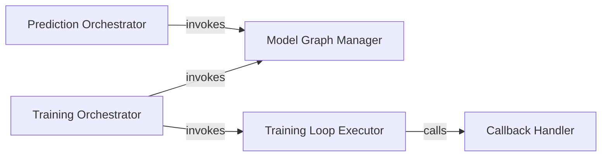

## Details

The `Training & Prediction Orchestration` subsystem encompasses components responsible for initiating and overseeing the training processes of text classification models and handling inference (making predictions on new data). It acts as the operational core for the lifecycle of these models.

### Training Orchestrator
Manages the overall training workflow for various text classification models. This includes preparing data, configuring training parameters, and initiating the training process. It abstracts the model-specific training logic into a unified interface.

**Related Classes/Methods**:

- <a href="https://github.com/yongzhuo/Keras-TextClassification/blob/master/keras_textclassification/m00_Albert/train.py" target="_blank" rel="noopener noreferrer">`AlbertTrainOrchestrator`</a>
- <a href="https://github.com/yongzhuo/Keras-TextClassification/blob/master/keras_textclassification/m00_Bert/train.py" target="_blank" rel="noopener noreferrer">`BertTrainOrchestrator`</a>

### Prediction Orchestrator
Oversees the inference process for trained text classification models. This involves handling input data, loading the appropriate model, and generating predictions. It provides a consistent interface for making predictions across different models.

**Related Classes/Methods**:

- <a href="https://github.com/yongzhuo/Keras-TextClassification/blob/master/keras_textclassification/m00_Albert/predict.py" target="_blank" rel="noopener noreferrer">`AlbertPredictOrchestrator`</a>
- <a href="https://github.com/yongzhuo/Keras-TextClassification/blob/master/keras_textclassification/m00_Bert/predict.py" target="_blank" rel="noopener noreferrer">`BertPredictOrchestrator`</a>

### Model Graph Manager
Centralized component responsible for creating, compiling, and initializing the Keras model graph. It provides the foundational structure and configuration (e.g., optimizer, loss function) required for both training and prediction.

**Related Classes/Methods**:

- <a href="https://github.com/yongzhuo/Keras-TextClassification/blob/master/keras_textclassification/text_classification_api.py" target="_blank" rel="noopener noreferrer">`graph`</a>
- <a href="https://github.com/yongzhuo/Keras-TextClassification/blob/master/keras_textclassification/base/graph.py#L69-L94" target="_blank" rel="noopener noreferrer">`create_model`:69-94</a>
- <a href="https://github.com/yongzhuo/Keras-TextClassification/blob/master/keras_textclassification/base/graph.py#L107-L127" target="_blank" rel="noopener noreferrer">`create_compile`:107-127</a>

### Training Loop Executor
Executes the core training iterations, fitting the model to provided data. It handles both direct data input (`fit`) and data provided via generators (`fit_generator`), managing the progression of the training process.

**Related Classes/Methods**:

- <a href="https://github.com/yongzhuo/Keras-TextClassification/blob/master/keras_textclassification/base/graph.py#L129-L154" target="_blank" rel="noopener noreferrer">`fit`:129-154</a>
- <a href="https://github.com/yongzhuo/Keras-TextClassification/blob/master/keras_textclassification/base/graph.py#L156-L198" target="_blank" rel="noopener noreferrer">`fit_generator`:156-198</a>

### Callback Handler
Manages and dispatches callback functions during the model training process. This enables custom actions such as logging, model saving, early stopping, or learning rate scheduling without modifying the core training loop.

**Related Classes/Methods**:

- <a href="https://github.com/yongzhuo/Keras-TextClassification/blob/master/keras_textclassification/base/graph.py#L96-L105" target="_blank" rel="noopener noreferrer">`callback`:96-105</a>

### [FAQ](https://github.com/CodeBoarding/GeneratedOnBoardings/tree/main?tab=readme-ov-file#faq)