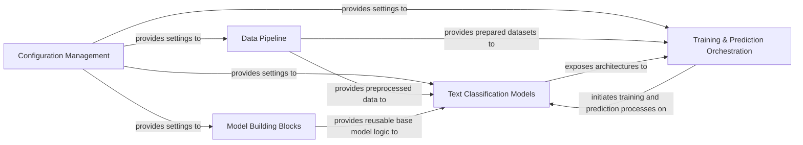

## Details

The `Keras-TextClassification` project is architected as a comprehensive Machine Learning Toolkit, primarily focused on Natural Language Processing (NLP) for text classification. Its core strength lies in its "Model Zoo" approach, offering a wide array of distinct text classification algorithms. The overall data flow begins with the **Configuration Management** module, which centralizes all project settings, guiding the subsequent stages. The **Data Pipeline** then processes raw text data and pre-trained embeddings, transforming them into a model-ready format. These preprocessed inputs are fed into the various **Text Classification Models (Model Zoo)**, which are constructed using foundational elements from the **Model Building Blocks** (reusable Keras layers and base utilities). Finally, the **Training & Prediction Orchestration** component manages the lifecycle of these models, handling their training with the prepared data and facilitating predictions on new inputs, effectively completing the end-to-end machine learning pipeline.

### Configuration Management
Centralizes and manages all project-wide settings, including logging, file paths for datasets and models, and general operational parameters.

**Related Classes/Methods**:

- <a href="https://github.com/yongzhuo/Keras-TextClassification/blob/master/keras_textclassification/conf/logger_config.py" target="_blank" rel="noopener noreferrer">`keras_textclassification.conf.logger_config`</a>
- <a href="https://github.com/yongzhuo/Keras-TextClassification/blob/master/keras_textclassification/conf/path_config.py" target="_blank" rel="noopener noreferrer">`keras_textclassification.conf.path_config`</a>

### Data Pipeline [[Expand]](./Data_Pipeline.md)
Handles the entire data lifecycle from raw input to model-ready format, including loading, cleaning, tokenization, numerical conversion, and splitting data into training, validation, and test sets.

**Related Classes/Methods**:

- <a href="https://github.com/yongzhuo/Keras-TextClassification/blob/master/keras_textclassification/data_preprocess/data_split.py" target="_blank" rel="noopener noreferrer">`keras_textclassification.data_preprocess.data_split`</a>
- <a href="https://github.com/yongzhuo/Keras-TextClassification/blob/master/keras_textclassification/data_preprocess/generator_preprocess.py" target="_blank" rel="noopener noreferrer">`keras_textclassification.data_preprocess.generator_preprocess`</a>
- <a href="https://github.com/yongzhuo/Keras-TextClassification/blob/master/keras_textclassification/data_preprocess/text_preprocess.py" target="_blank" rel="noopener noreferrer">`keras_textclassification.data_preprocess.text_preprocess`</a>

### Model Building Blocks [[Expand]](./Model_Building_Blocks.md)
Provides foundational Keras utilities, base graph definitions, embedding layer handling, and a collection of specialized custom Keras layers (e.g., attention mechanisms, transformer components, custom optimizers) that are reused across various text classification models.

**Related Classes/Methods**:

- <a href="https://github.com/yongzhuo/Keras-TextClassification/blob/master/keras_textclassification/base/embedding.py" target="_blank" rel="noopener noreferrer">`keras_textclassification.base.embedding`</a>
- <a href="https://github.com/yongzhuo/Keras-TextClassification/blob/master/keras_textclassification/base/graph.py" target="_blank" rel="noopener noreferrer">`keras_textclassification.base.graph`</a>
- <a href="https://github.com/yongzhuo/Keras-TextClassification/blob/master/keras_textclassification/keras_layers/albert/albert.py" target="_blank" rel="noopener noreferrer">`keras_textclassification.keras_layers.albert.albert`</a>
- <a href="https://github.com/yongzhuo/Keras-TextClassification/blob/master/keras_textclassification/keras_layers/transformer.py" target="_blank" rel="noopener noreferrer">`keras_textclassification.keras_layers.transformer`</a>
- <a href="https://github.com/yongzhuo/Keras-TextClassification/blob/master/keras_textclassification/keras_layers/capsule.py" target="_blank" rel="noopener noreferrer">`keras_textclassification.keras_layers.capsule`</a>
- <a href="https://github.com/yongzhuo/Keras-TextClassification/blob/master/keras_textclassification/keras_layers/attention_self.py" target="_blank" rel="noopener noreferrer">`keras_textclassification.keras_layers.attention_self`</a>
- <a href="https://github.com/yongzhuo/Keras-TextClassification/blob/master/keras_textclassification/keras_layers/attention_dot.py" target="_blank" rel="noopener noreferrer">`keras_textclassification.keras_layers.attention_dot`</a>
- <a href="https://github.com/yongzhuo/Keras-TextClassification/blob/master/keras_textclassification/keras_layers/highway.py" target="_blank" rel="noopener noreferrer">`keras_textclassification.keras_layers.highway`</a>
- <a href="https://github.com/yongzhuo/Keras-TextClassification/blob/master/keras_textclassification/keras_layers/k_max_pooling.py" target="_blank" rel="noopener noreferrer">`keras_textclassification.keras_layers.k_max_pooling`</a>
- <a href="https://github.com/yongzhuo/Keras-TextClassification/blob/master/keras_textclassification/keras_layers/keras_lookahead.py" target="_blank" rel="noopener noreferrer">`keras_textclassification.keras_layers.keras_lookahead`</a>
- <a href="https://github.com/yongzhuo/Keras-TextClassification/blob/master/keras_textclassification/keras_layers/keras_radam.py" target="_blank" rel="noopener noreferrer">`keras_textclassification.keras_layers.keras_radam`</a>
- <a href="https://github.com/yongzhuo/Keras-TextClassification/blob/master/keras_textclassification/keras_layers/non_mask_layer.py" target="_blank" rel="noopener noreferrer">`keras_textclassification.keras_layers.non_mask_layer`</a>

### Text Classification Models
The core collection of diverse text classification model architectures (e.g., Albert, BERT, FastText, TextCNN, HAN). Each model is encapsulated within its own module, primarily defining its specific graph structure by leveraging components from 'Model Building Blocks'.

**Related Classes/Methods**:

- <a href="https://github.com/yongzhuo/Keras-TextClassification/blob/master/keras_textclassification/m00_Albert/graph.py" target="_blank" rel="noopener noreferrer">`keras_textclassification.m00_Albert.graph`</a>
- <a href="https://github.com/yongzhuo/Keras-TextClassification/blob/master/keras_textclassification/m00_Bert/graph.py" target="_blank" rel="noopener noreferrer">`keras_textclassification.m00_Bert.graph`</a>
- <a href="https://github.com/yongzhuo/Keras-TextClassification/blob/master/keras_textclassification/m00_Xlnet/graph.py" target="_blank" rel="noopener noreferrer">`keras_textclassification.m00_Xlnet.graph`</a>
- <a href="https://github.com/yongzhuo/Keras-TextClassification/blob/master/keras_textclassification/m01_FastText/graph.py" target="_blank" rel="noopener noreferrer">`keras_textclassification.m01_FastText.graph`</a>
- <a href="https://github.com/yongzhuo/Keras-TextClassification/blob/master/keras_textclassification/m02_TextCNN/graph.py" target="_blank" rel="noopener noreferrer">`keras_textclassification.m02_TextCNN.graph`</a>
- <a href="https://github.com/yongzhuo/Keras-TextClassification/blob/master/keras_textclassification/m06_TextDCNN/graph.py" target="_blank" rel="noopener noreferrer">`keras_textclassification.m06_TextDCNN.graph`</a>
- <a href="https://github.com/yongzhuo/Keras-TextClassification/blob/master/keras_textclassification/m07_TextDPCNN/graph.py" target="_blank" rel="noopener noreferrer">`keras_textclassification.m07_TextDPCNN.graph`</a>
- <a href="https://github.com/yongzhuo/Keras-TextClassification/blob/master/keras_textclassification/m08_TextVDCNN/graph.py" target="_blank" rel="noopener noreferrer">`keras_textclassification.m08_TextVDCNN.graph`</a>
- <a href="https://github.com/yongzhuo/Keras-TextClassification/blob/master/keras_textclassification/m10_DeepMoji/graph.py" target="_blank" rel="noopener noreferrer">`keras_textclassification.m10_DeepMoji.graph`</a>
- <a href="https://github.com/yongzhuo/Keras-TextClassification/blob/master/keras_textclassification/m12_HAN/graph.py" target="_blank" rel="noopener noreferrer">`keras_textclassification.m12_HAN.graph`</a>

### Training & Prediction Orchestration [[Expand]](./Training_Prediction_Orchestration.md)
Manages the operational lifecycle of the text classification models, including initiating and overseeing the training processes (fitting models with preprocessed data) and handling inference (making predictions on new, unseen data). This component interacts directly with specific models from the 'Model Zoo'.

**Related Classes/Methods**:

- <a href="https://github.com/yongzhuo/Keras-TextClassification/blob/master/keras_textclassification/m00_Albert/train.py" target="_blank" rel="noopener noreferrer">`keras_textclassification.m00_Albert.train`</a>
- <a href="https://github.com/yongzhuo/Keras-TextClassification/blob/master/keras_textclassification/m00_Albert/predict.py" target="_blank" rel="noopener noreferrer">`keras_textclassification.m00_Albert.predict`</a>
- <a href="https://github.com/yongzhuo/Keras-TextClassification/blob/master/keras_textclassification/m00_Bert/train.py" target="_blank" rel="noopener noreferrer">`keras_textclassification.m00_Bert.train`</a>
- <a href="https://github.com/yongzhuo/Keras-TextClassification/blob/master/keras_textclassification/m00_Bert/predict.py" target="_blank" rel="noopener noreferrer">`keras_textclassification.m00_Bert.predict`</a>

### [FAQ](https://github.com/CodeBoarding/GeneratedOnBoardings/tree/main?tab=readme-ov-file#faq)