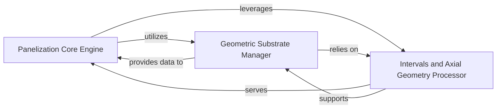

## Details

The Panelization Core Engine subsystem is defined by the core logic responsible for transforming individual PCB designs into manufacturing panels. It encompasses the central panelization orchestration, geometric management of substrates, and precise interval-based geometric calculations. This subsystem is primarily composed of the kikit.panelize, kikit.substrate, and kikit.intervals modules.

### Panelization Core Engine [[Expand]](./Panelization_Core_Engine.md)
The central processing unit for all panelization logic. It orchestrates the entire panelization workflow, taking individual board designs and applying various panelization features (e.g., V-cuts, tabs, frames) to create a single manufacturing panel. This component embodies the "Core Logic/Engine" pattern, serving as the primary orchestrator of the panelization process.

**Related Classes/Methods**:

- <a href="https://github.com/yaqwsx/KiKit/blob/master/kikit/panelize.py" target="_blank" rel="noopener noreferrer">`kikit.panelize`</a>

### Geometric Substrate Manager
Manages the geometric outlines and properties of both individual PCBs and the final panel substrate. It provides the foundational geometric data and structures upon which the panelization process operates. Its architectural importance lies in abstracting and managing the physical layout, crucial for an "Automation Utility" dealing with physical designs.

**Related Classes/Methods**:

- <a href="https://github.com/yaqwsx/KiKit/blob/master/kikit/substrate.py" target="_blank" rel="noopener noreferrer">`kikit.substrate`</a>

### Intervals and Axial Geometry Processor
Performs precise geometric calculations, including determining cut paths, clearances, and overlaps. This component provides low-level, fundamental geometric utilities essential for accurate panelization. Its role is critical for the precision required in an "Automation Utility" for EDA, ensuring correct physical outputs.

**Related Classes/Methods**:

- <a href="https://github.com/yaqwsx/KiKit/blob/master/kikit/intervals.py" target="_blank" rel="noopener noreferrer">`kikit.intervals`</a>

### [FAQ](https://github.com/CodeBoarding/GeneratedOnBoardings/tree/main?tab=readme-ov-file#faq)