```mermaid
graph LR
    KiCAD_GUI_Plugin_Interface["KiCAD GUI & Plugin Interface"]
    Configuration_Preset_Management["Configuration & Preset Management"]
    Panelization_Core_Engine["Panelization Core Engine"]
    KiCAD_Data_Abstraction_Utilities["KiCAD Data Abstraction & Utilities"]
    Manufacturing_Data_Export_Stencil_Generation["Manufacturing Data Export & Stencil Generation"]
    KiCAD_GUI_Plugin_Interface -- "initiates panelization with user input and board data" --> Panelization_Core_Engine
    KiCAD_GUI_Plugin_Interface -- "passes user-defined settings" --> Configuration_Preset_Management
    Configuration_Preset_Management -- "provides validated panelization presets" --> Panelization_Core_Engine
    Panelization_Core_Engine -- "requests KiCAD data parsing and manipulation" --> KiCAD_Data_Abstraction_Utilities
    Panelization_Core_Engine -- "returns panelized board data" --> KiCAD_GUI_Plugin_Interface
    Panelization_Core_Engine -- "forwards panelized board for output generation" --> Manufacturing_Data_Export_Stencil_Generation
    KiCAD_Data_Abstraction_Utilities -- "provides parsed KiCAD data and manipulation services" --> Panelization_Core_Engine
    KiCAD_Data_Abstraction_Utilities -- "provides KiCAD data for export formatting" --> Manufacturing_Data_Export_Stencil_Generation
    Manufacturing_Data_Export_Stencil_Generation -- "utilizes KiCAD data utilities for output formatting" --> KiCAD_Data_Abstraction_Utilities
    click Panelization_Core_Engine href "https://github.com/CodeBoarding/GeneratedOnBoardings/blob/main/KiKit/Panelization_Core_Engine.md" "Details"
```

## Details

The KiKit project implements a modular, workflow-oriented architecture designed to automate PCB panelization and manufacturing data generation within the KiCAD ecosystem. At its core, the KiCAD GUI & Plugin Interface initiates operations, passing user inputs and board data to the Configuration & Preset Management and the Panelization Core Engine. The Panelization Core Engine then processes the board data, leveraging the KiCAD Data Abstraction & Utilities for all KiCAD-specific data interactions and manipulations. Upon successful panelization, the results are returned to the GUI and forwarded to the Manufacturing Data Export & Stencil Generation component, which, again, utilizes the KiCAD Data Abstraction & Utilities to produce various manufacturing-ready files. This clear separation of concerns facilitates extensibility, allowing for easy integration of new panelization features, output formats, or KiCAD versions, while providing a robust and efficient automation pipeline for PCB design and manufacturing.

### KiCAD GUI & Plugin Interface
Manages user interaction within the KiCAD environment, providing the graphical interface for panelization and other utility functions. It acts as the entry point for most user-driven operations.

**Related Classes/Methods**:

- <a href="https://github.com/yaqwsx/KiKit/blob/master/kikit/actionPlugins/panelize.py" target="_blank" rel="noopener noreferrer">`kikit.actionPlugins.panelize`</a>
- <a href="https://github.com/yaqwsx/KiKit/blob/master/kikit/actionPlugins/hideReferences.py" target="_blank" rel="noopener noreferrer">`kikit.actionPlugins.hideReferences`</a>
- <a href="https://github.com/yaqwsx/KiKit/blob/master/kikit/panelize_ui.py" target="_blank" rel="noopener noreferrer">`kikit.panelize_ui`</a>
- <a href="https://github.com/yaqwsx/KiKit/blob/master/kikit/panelize_ui_sections.py" target="_blank" rel="noopener noreferrer">`kikit.panelize_ui_sections`</a>

### Configuration & Preset Management
Handles the loading, saving, validation, and application of panelization presets and project-specific configurations, ensuring consistent and reproducible results.

**Related Classes/Methods**:

- <a href="https://github.com/yaqwsx/KiKit/blob/master/kikit/panelize_ui_impl.py" target="_blank" rel="noopener noreferrer">`kikit.panelize_ui_impl`</a>
- <a href="https://github.com/yaqwsx/KiKit/blob/master/kikit/project.py" target="_blank" rel="noopener noreferrer">`kikit.project`</a>

### Panelization Core Engine [[Expand]](./Panelization_Core_Engine.md)
The central processing unit for all panelization logic. It takes individual board designs and applies various panelization features to create a single manufacturing panel.

**Related Classes/Methods**:

- <a href="https://github.com/yaqwsx/KiKit/blob/master/kikit/panelize.py" target="_blank" rel="noopener noreferrer">`kikit.panelize`</a>
- <a href="https://github.com/yaqwsx/KiKit/blob/master/kikit/substrate.py" target="_blank" rel="noopener noreferrer">`kikit.substrate`</a>
- <a href="https://github.com/yaqwsx/KiKit/blob/master/kikit/intervals.py" target="_blank" rel="noopener noreferrer">`kikit.intervals`</a>

### KiCAD Data Abstraction & Utilities
Provides a robust abstraction layer for interacting with KiCAD's internal data structures (e.g., board files, schematics, annotations, design rules), offering functionalities to read, parse, manipulate, and write KiCAD-specific data.

**Related Classes/Methods**:

- <a href="https://github.com/yaqwsx/KiKit/blob/master/kikit/eeschema.py" target="_blank" rel="noopener noreferrer">`kikit.eeschema`</a>
- <a href="https://github.com/yaqwsx/KiKit/blob/master/kikit/eeschema_v6.py" target="_blank" rel="noopener noreferrer">`kikit.eeschema_v6`</a>
- <a href="https://github.com/yaqwsx/KiKit/blob/master/kikit/annotations.py" target="_blank" rel="noopener noreferrer">`kikit.annotations`</a>
- <a href="https://github.com/yaqwsx/KiKit/blob/master/kikit/common.py" target="_blank" rel="noopener noreferrer">`kikit.common`</a>
- <a href="https://github.com/yaqwsx/KiKit/blob/master/kikit/sexpr.py" target="_blank" rel="noopener noreferrer">`kikit.sexpr`</a>
- <a href="https://github.com/yaqwsx/KiKit/blob/master/kikit/drc.py" target="_blank" rel="noopener noreferrer">`kikit.drc`</a>
- <a href="https://github.com/yaqwsx/KiKit/blob/master/kikit/kicadUtil.py" target="_blank" rel="noopener noreferrer">`kikit.kicadUtil`</a>

### Manufacturing Data Export & Stencil Generation
Responsible for generating various output files required for PCB manufacturing and assembly, including Gerber files, DXF, Bill of Materials (BOM), Pick-and-Place (POS) data, and specialized stencil designs.

**Related Classes/Methods**:

- <a href="https://github.com/yaqwsx/KiKit/blob/master/kikit/export.py" target="_blank" rel="noopener noreferrer">`kikit.export`</a>
- <a href="https://github.com/yaqwsx/KiKit/blob/master/kikit/fab/common.py" target="_blank" rel="noopener noreferrer">`kikit.fab.common`</a>
- <a href="https://github.com/yaqwsx/KiKit/blob/master/kikit/fab/jlcpcb.py" target="_blank" rel="noopener noreferrer">`kikit.fab.jlcpcb`</a>
- <a href="https://github.com/yaqwsx/KiKit/blob/master/kikit/fab/neodenyy1.py" target="_blank" rel="noopener noreferrer">`kikit.fab.neodenyy1`</a>
- <a href="https://github.com/yaqwsx/KiKit/blob/master/kikit/fab/openpnp.py" target="_blank" rel="noopener noreferrer">`kikit.fab.openpnp`</a>
- <a href="https://github.com/yaqwsx/KiKit/blob/master/kikit/fab/pcbway.py" target="_blank" rel="noopener noreferrer">`kikit.fab.pcbway`</a>
- <a href="https://github.com/yaqwsx/KiKit/blob/master/kikit/stencil.py" target="_blank" rel="noopener noreferrer">`kikit.stencil`</a>

### [FAQ](https://github.com/CodeBoarding/GeneratedOnBoardings/tree/main?tab=readme-ov-file#faq)