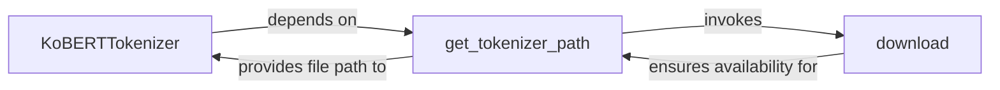

## Details

The `KoBERT Tokenizer` subsystem is a critical part of the KoBERT project, focusing on preparing raw text for the KoBERT model. It adheres to the "Modular Design" and "Pipeline" architectural patterns, common in ML Toolkits/Libraries, by clearly separating concerns related to tokenization logic, model file management, and external resource acquisition.

### KoBERTTokenizer
The primary interface for text tokenization. It encapsulates the core logic for converting raw text into tokenized input sequences, including loading and utilizing the SentencePiece model. It serves as the main entry point for users to tokenize text for the KoBERT model.

**Related Classes/Methods**:

- <a href="https://github.com/SKTBrain/KoBERT/blob/master/kobert_hf/kobert_tokenizer/kobert_tokenizer.py#L22-L169" target="_blank" rel="noopener noreferrer">`KoBERTTokenizer`:22-169</a>
- <a href="https://github.com/SKTBrain/KoBERT/blob/master/kobert/utils/utils.py#L45-L54" target="_blank" rel="noopener noreferrer">`get_tokenizer_path`:45-54</a>

### get_tokenizer_path
Manages the lifecycle and local availability of the tokenizer model files. Its key role is to determine the correct path to the tokenizer model, initiating a download via the `download` utility if the model is not found locally. This ensures the `KoBERTTokenizer` always has access to the necessary model files.

**Related Classes/Methods**:

- <a href="https://github.com/SKTBrain/KoBERT/blob/master/kobert/utils/utils.py#L45-L54" target="_blank" rel="noopener noreferrer">`get_tokenizer_path`:45-54</a>
- <a href="https://github.com/SKTBrain/KoBERT/blob/master/kobert/utils/utils.py#L21-L42" target="_blank" rel="noopener noreferrer">`download`:21-42</a>

### download
A utility component solely responsible for handling the actual downloading of files (e.g., SentencePiece model files) from remote sources to the local file system. It provides a generic mechanism for fetching external resources required by other components.

**Related Classes/Methods**:

- <a href="https://github.com/SKTBrain/KoBERT/blob/master/kobert/utils/utils.py#L21-L42" target="_blank" rel="noopener noreferrer">`download`:21-42</a>

### [FAQ](https://github.com/CodeBoarding/GeneratedOnBoardings/tree/main?tab=readme-ov-file#faq)