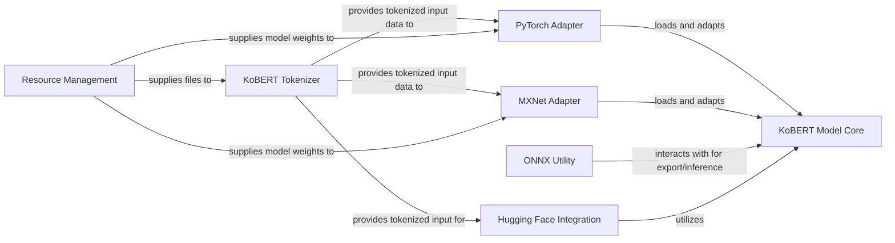

## Details

The KoBERT project is architected as a modular NLP toolkit, designed to provide a reusable KoBERT model across various deep learning frameworks. At its heart lies the KoBERT Model Core, representing the fundamental pre-trained model. The data flow initiates with raw text, which is transformed into model-ready input by the KoBERT Tokenizer. This tokenized data then flows into framework-specific PyTorch and MXNet Adapters, which are responsible for loading and integrating the KoBERT Model Core into their respective environments. For broader deployment, an ONNX Utility facilitates model export and inference, while Hugging Face Integration ensures compatibility with the popular Transformers library. All these operational components are supported by a Resource Management utility, which handles the acquisition of necessary model and tokenizer assets, thereby enabling a clear separation of concerns and promoting extensibility for diverse NLP applications.

### KoBERT Model Core
The central, framework-agnostic representation of the KoBERT model architecture and pre-trained weights.

**Related Classes/Methods**:

- <a href="https://github.com/SKTBrain/KoBERT/blob/master/kobert/pytorch_kobert.py#L26-L34" target="_blank" rel="noopener noreferrer">`kobert.pytorch_kobert.get_kobert_model`:26-34</a>
- <a href="https://github.com/SKTBrain/KoBERT/blob/master/kobert/mxnet_kobert.py#L30-L83" target="_blank" rel="noopener noreferrer">`kobert.mxnet_kobert.get_kobert_model`:30-83</a>

### KoBERT Tokenizer [[Expand]](./KoBERT_Tokenizer.md)
Responsible for converting raw text into tokenized input sequences suitable for the KoBERT model, including handling SentencePiece models.

**Related Classes/Methods**:

- <a href="https://github.com/SKTBrain/KoBERT/blob/master/kobert/utils/utils.py#L45-L54" target="_blank" rel="noopener noreferrer">`kobert.utils.utils.get_tokenizer_path`:45-54</a>
- <a href="https://github.com/SKTBrain/KoBERT/blob/master/kobert_hf/kobert_tokenizer/kobert_tokenizer.py#L22-L169" target="_blank" rel="noopener noreferrer">`kobert_hf.kobert_tokenizer.kobert_tokenizer.KoBERTTokenizer`:22-169</a>

### PyTorch Adapter
Integrates and adapts the KoBERT Model Core for use within the PyTorch deep learning framework.

**Related Classes/Methods**:

- <a href="https://github.com/SKTBrain/KoBERT/blob/master/kobert/pytorch_kobert.py#L25-L52" target="_blank" rel="noopener noreferrer">`kobert.pytorch_kobert.get_pytorch_kobert_model`:25-52</a>

### MXNet Adapter
Integrates and adapts the KoBERT Model Core for use within the MXNet/Gluon deep learning framework.

**Related Classes/Methods**:

- <a href="https://github.com/SKTBrain/KoBERT/blob/master/kobert/mxnet_kobert.py#L23-L99" target="_blank" rel="noopener noreferrer">`kobert.mxnet_kobert.get_mxnet_kobert_model`:23-99</a>

### ONNX Utility
Provides functionalities for preparing input data and facilitating the export or inference of the KoBERT model within the ONNX runtime environment.

**Related Classes/Methods**:

- <a href="https://github.com/SKTBrain/KoBERT/blob/master/kobert/onnx_kobert.py#L33-L41" target="_blank" rel="noopener noreferrer">`kobert.onnx_kobert.make_dummy_input`:33-41</a>
- <a href="https://github.com/SKTBrain/KoBERT/blob/master/kobert/onnx_kobert.py#L34-L35" target="_blank" rel="noopener noreferrer">`kobert.onnx_kobert.do_pad`:34-35</a>

### Hugging Face Integration
Enables seamless compatibility and usage of KoBERT within the Hugging Face Transformers ecosystem.

**Related Classes/Methods**:

- <a href="https://github.com/SKTBrain/KoBERT/blob/master/kobert_hf/kobert_tokenizer/kobert_tokenizer.py#L22-L169" target="_blank" rel="noopener noreferrer">`kobert_hf.kobert_tokenizer.kobert_tokenizer.KoBERTTokenizer`:22-169</a>

### Resource Management
Handles the downloading and management of essential assets such as model weights and tokenizer files.

**Related Classes/Methods**:

- <a href="https://github.com/SKTBrain/KoBERT/blob/master/kobert/utils/utils.py#L21-L42" target="_blank" rel="noopener noreferrer">`kobert.utils.utils.download`:21-42</a>

### [FAQ](https://github.com/CodeBoarding/GeneratedOnBoardings/tree/main?tab=readme-ov-file#faq)