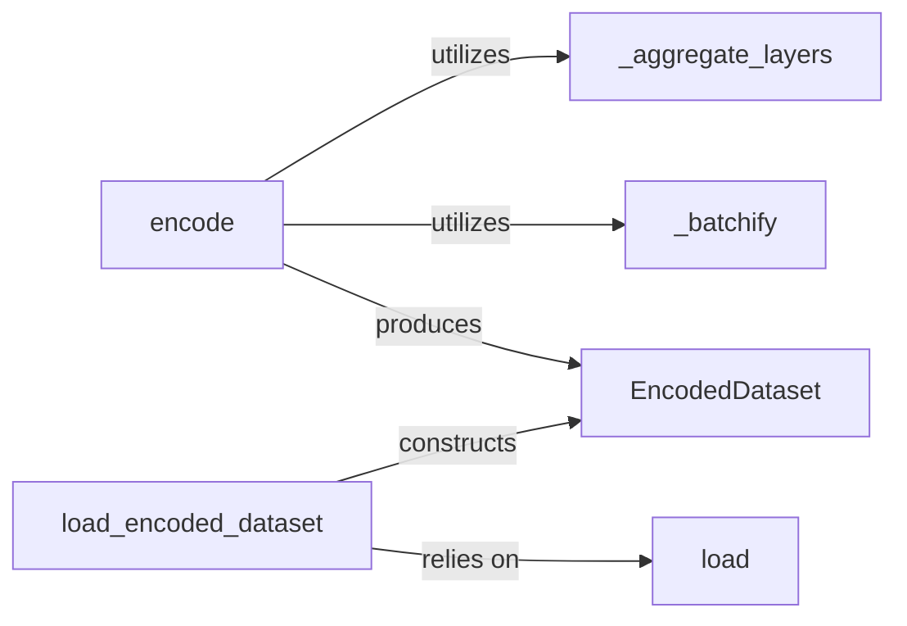

## Details

The core of this subsystem revolves around the `EncodedDataset`, a standardized data structure representing preprocessed data. The `encode` component acts as the primary pipeline, orchestrating the transformation of raw input into this `EncodedDataset` by utilizing helper functions like `_aggregate_layers` for data structuring and `_batchify` for optimizing data for model consumption. Complementing this, the `load_encoded_dataset` component provides functionality to retrieve existing `EncodedDataset` instances from storage, relying on the low-level `load` utility for file I/O. This design ensures a clear separation between data encoding, data loading, and the resulting data representation, facilitating efficient and reproducible data handling within the toolkit.

### encode
This is the primary orchestrator for transforming raw input data into the `EncodedDataset` format. It represents the core data preprocessing pipeline, handling the sequence of operations required to prepare data for model consumption. This aligns with the "Pipeline/Workflow" pattern.

**Related Classes/Methods**:

- <a href="https://github.com/facebookresearch/LAMA/blob/main/lama/build_encoded_dataset.py#L81-L111" target="_blank" rel="noopener noreferrer">`encode`:81-111</a>

### load_encoded_dataset
Manages the loading of pre-encoded datasets from persistent storage. It ensures that loaded data is correctly instantiated as `EncodedDataset` objects, providing a consistent interface for already processed data. This is crucial for reproducibility and efficient experimentation, fitting the "Data Management Module" pattern.

**Related Classes/Methods**:

- <a href="https://github.com/facebookresearch/LAMA/blob/main/lama/build_encoded_dataset.py#L61-L64" target="_blank" rel="noopener noreferrer">`load_encoded_dataset`:61-64</a>

### EncodedDataset
Serves as the standardized data representation for datasets after they have undergone the encoding process. It acts as the crucial data structure that ensures consistency and provides a uniform interface for all downstream components that consume processed data. This is a fundamental data abstraction for the entire toolkit.

**Related Classes/Methods**:

- <a href="https://github.com/facebookresearch/LAMA/blob/main/lama/build_encoded_dataset.py#L26-L58" target="_blank" rel="noopener noreferrer">`EncodedDataset`:26-58</a>

### load
A low-level utility function dedicated to reading data from a specified source (e.g., a file path). It abstracts the underlying file I/O operations, providing a foundational service for data retrieval within the subsystem.

**Related Classes/Methods**:

- <a href="https://github.com/facebookresearch/LAMA/blob/main/lama/build_encoded_dataset.py#L52-L58" target="_blank" rel="noopener noreferrer">`load`:52-58</a>

### _aggregate_layers
Performs specific data aggregation or structuring operations during the encoding process. This is a specialized helper function for complex transformations, potentially combining different data dimensions or features, essential for preparing data for specific model architectures.

**Related Classes/Methods**:

- <a href="https://github.com/facebookresearch/LAMA/blob/main/lama/build_encoded_dataset.py#L74-L78" target="_blank" rel="noopener noreferrer">`_aggregate_layers`:74-78</a>

### _batchify
Organizes the processed data into optimized batches. This step is critical for efficient consumption by machine learning models, leveraging hardware acceleration and memory management, directly supporting the performance requirements of an ML toolkit.

**Related Classes/Methods**:

- <a href="https://github.com/facebookresearch/LAMA/blob/main/lama/build_encoded_dataset.py#L67-L71" target="_blank" rel="noopener noreferrer">`_batchify`:67-71</a>

### [FAQ](https://github.com/CodeBoarding/GeneratedOnBoardings/tree/main?tab=readme-ov-file#faq)