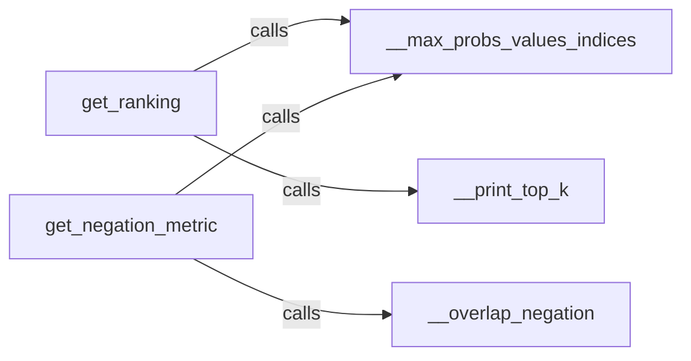

## Details

The `evaluation_metrics` subsystem in LAMA is primarily responsible for evaluating language model predictions, focusing on ranking and negation-specific metrics. The core flow involves two main metric calculation components: `get_ranking` and `get_negation_metric`. Both rely on the `__max_probs_values_indices` utility to preprocess raw model log probabilities, extracting the most probable predictions and their corresponding indices and values. `get_ranking` utilizes `__max_probs_values_indices` to obtain top predictions and then uses `__print_top_k` for formatted output, likely for debugging or detailed analysis of ranking performance. `get_negation_metric` also uses `__max_probs_values_indices` for initial prediction processing and then specifically calls `__overlap_negation` to compute a metric related to negation understanding, indicating a specialized linguistic evaluation. The `__max_probs_values_indices` component acts as a central data preparation utility, abstracting the common task of extracting top-k predictions from model outputs. `__overlap_negation` and `__print_top_k` serve as specialized helpers, with the former focusing on a specific linguistic phenomenon (negation) and the latter on result visualization. The `evaluation_metrics` subsystem provides core functionalities for assessing language model performance, particularly in terms of prediction ranking and negation comprehension. It is structured around two primary metric calculation components, `get_ranking` and `get_negation_metric`, which both depend on the `__max_probs_values_indices` utility for initial processing of model outputs. `get_ranking` further leverages `__print_top_k` for detailed output visualization, while `get_negation_metric` employs `__overlap_negation` for specialized negation analysis. This design promotes modularity, allowing for distinct evaluation concerns to be handled by dedicated components while sharing common data processing utilities.

### get_ranking
Calculates and returns metrics related to the ranking of predictions, essential for tasks where the order of output matters. This component is crucial for evaluating models on tasks like fill-in-the-blank or cloze tests where the position of the correct answer among alternatives is important.

**Related Classes/Methods**:

- <a href="https://github.com/facebookresearch/LAMA/blob/main/lama/evaluation_metrics.py#L12-L24" target="_blank" rel="noopener noreferrer">`lama.evaluation_metrics.__max_probs_values_indices`:12-24</a>
- <a href="https://github.com/facebookresearch/LAMA/blob/main/lama/evaluation_metrics.py#L27-L51" target="_blank" rel="noopener noreferrer">`lama.evaluation_metrics.__print_top_k`:27-51</a>

### get_negation_metric
Computes specific metrics to evaluate a model's understanding and generation of negation, allowing for targeted linguistic probes. This component addresses a specific linguistic phenomenon, highlighting the system's capability for fine-grained linguistic analysis.

**Related Classes/Methods**:

- <a href="https://github.com/facebookresearch/LAMA/blob/main/lama/evaluation_metrics.py#L12-L24" target="_blank" rel="noopener noreferrer">`lama.evaluation_metrics.__max_probs_values_indices`:12-24</a>
- <a href="https://github.com/facebookresearch/LAMA/blob/main/lama/evaluation_metrics.py#L112-L115" target="_blank" rel="noopener noreferrer">`lama.evaluation_metrics.__overlap_negation`:112-115</a>

### __max_probs_values_indices
Extracts the highest probabilities, their corresponding values, and indices from model outputs using `torch.topk`. This serves as a common data preparation utility, abstracting the low-level details of processing raw model predictions for various metric calculations.

**Related Classes/Methods**:

- <a href="https://github.com/facebookresearch/LAMA/blob/main/lama/evaluation_metrics.py#L12-L24" target="_blank" rel="noopener noreferrer">`lama.evaluation_metrics.__max_probs_values_indices`:12-24</a>

### __overlap_negation
Calculates the degree of overlap in negation-related predictions by comparing the first ranked prediction of affirmative and negated statements. This is a specialized helper function that encapsulates the specific logic for measuring negation overlap, supporting the `get_negation_metric` component.

**Related Classes/Methods**:

- <a href="https://github.com/facebookresearch/LAMA/blob/main/lama/evaluation_metrics.py#L112-L115" target="_blank" rel="noopener noreferrer">`lama.evaluation_metrics.__overlap_negation`:112-115</a>

### __print_top_k
Formats and prints the top-k predictions or relevant data, including token indices, log probabilities, and word forms from a vocabulary. This utility is primarily for debugging and immediate inspection of results during the experimentation phase, aiding researchers in understanding model behavior.

**Related Classes/Methods**:

- <a href="https://github.com/facebookresearch/LAMA/blob/main/lama/evaluation_metrics.py#L27-L51" target="_blank" rel="noopener noreferrer">`lama.evaluation_metrics.__print_top_k`:27-51</a>

### [FAQ](https://github.com/CodeBoarding/GeneratedOnBoardings/tree/main?tab=readme-ov-file#faq)