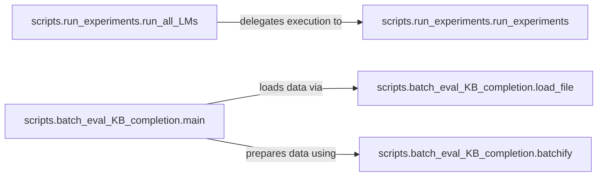

## Details

The Experiment Orchestrator subsystem is the central control unit for the LAMA project's experimental workflows. It manages the entire lifecycle of experiments, from initial configuration and setup to the execution of language model evaluations and specialized tasks like Knowledge Base completion. This subsystem embodies the "Experimentation/Evaluation Engine" and aspects of the "Configuration/CLI Interface" architectural patterns, driving the experimental process based on defined parameters and ensuring reproducibility.

### scripts.run_experiments.run_all_LMs
High-level orchestration for initiating and managing the execution of multiple Language Model experiments. It acts as the primary entry point for comprehensive LM evaluations.

**Related Classes/Methods**:

- <a href="https://github.com/facebookresearch/LAMA/blob/main/scripts/run_experiments.py#L204-L207" target="_blank" rel="noopener noreferrer">`scripts.run_experiments.run_all_LMs`:204-207</a>

### scripts.run_experiments.run_experiments
Manages the lifecycle of a single, specific Language Model experiment run. This includes handling its configuration, executing the evaluation logic, and potentially coordinating with other modules for data processing and result collection.

**Related Classes/Methods**:

- <a href="https://github.com/facebookresearch/LAMA/blob/main/scripts/run_experiments.py#L62-L157" target="_blank" rel="noopener noreferrer">`scripts.run_experiments.run_experiments`:62-157</a>

### scripts.batch_eval_KB_completion.main
The central control unit specifically for the Knowledge Base completion batch evaluation workflow. It orchestrates the entire process, from initial setup (logging, directory creation) to data loading, parsing, batching, and filtering, before likely initiating the core evaluation.

**Related Classes/Methods**:

- <a href="https://github.com/facebookresearch/LAMA/blob/main/scripts/batch_eval_KB_completion.py#L302-L698" target="_blank" rel="noopener noreferrer">`scripts.batch_eval_KB_completion.main`:302-698</a>

### scripts.batch_eval_KB_completion.load_file
Helper function to load necessary input data or configurations for the Knowledge Base completion experiments.

**Related Classes/Methods**:

- <a href="https://github.com/facebookresearch/LAMA/blob/main/scripts/batch_eval_KB_completion.py#L27-L32" target="_blank" rel="noopener noreferrer">`scripts.batch_eval_KB_completion.load_file`:27-32</a>

### scripts.batch_eval_KB_completion.batchify
Helper function for efficient data processing, specifically for batching data for the Knowledge Base completion experiments.

**Related Classes/Methods**:

- <a href="https://github.com/facebookresearch/LAMA/blob/main/scripts/batch_eval_KB_completion.py#L89-L117" target="_blank" rel="noopener noreferrer">`scripts.batch_eval_KB_completion.batchify`:89-117</a>

### [FAQ](https://github.com/CodeBoarding/GeneratedOnBoardings/tree/main?tab=readme-ov-file#faq)