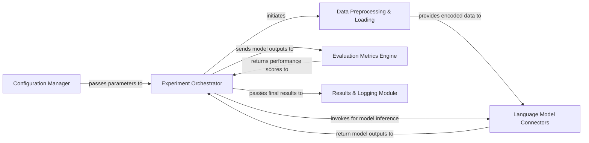

## Details

The LAMA project implements a robust architecture for evaluating language models, centered around an Experiment Orchestrator. This orchestrator coordinates the flow, starting with the Configuration Manager for setup. It then directs Data Preprocessing & Loading to prepare datasets, which are subsequently processed by various Language Model Connectors that abstract interactions with different language models. The results are then fed into the Evaluation Metrics Engine for performance assessment, with all experimental outcomes systematically managed by the Results & Logging Module. This design promotes clear separation of concerns, facilitating extensibility and maintainability for research and development in language model evaluation.

### Experiment Orchestrator [[Expand]](./Experiment_Orchestrator.md)
The central control unit managing the entire experimental workflow, from configuration parsing to result logging.

**Related Classes/Methods**:

- <a href="https://github.com/facebookresearch/LAMA/blob/main/scripts/run_experiments.py" target="_blank" rel="noopener noreferrer">`scripts/run_experiments.py`</a>
- <a href="https://github.com/facebookresearch/LAMA/blob/main/scripts/batch_eval_KB_completion.py" target="_blank" rel="noopener noreferrer">`scripts/batch_eval_KB_completion.py`</a>

### Configuration Manager
Responsible for parsing command-line arguments and configuration files, providing structured parameters.

**Related Classes/Methods**:

- <a href="https://github.com/facebookresearch/LAMA/blob/main/lama/options.py" target="_blank" rel="noopener noreferrer">`lama/options.py`</a>

### Data Preprocessing & Loading [[Expand]](./Data_Preprocessing_Loading.md)
Handles ingestion, cleaning, and transformation of raw datasets into an encoded format for language model input.

**Related Classes/Methods**:

- <a href="https://github.com/facebookresearch/LAMA/blob/main/lama/build_encoded_dataset.py" target="_blank" rel="noopener noreferrer">`lama/build_encoded_dataset.py`</a>

### Language Model Connectors
A modular set of adapters providing a standardized interface for interacting with specific pre-trained language models.

**Related Classes/Methods**:

- <a href="https://github.com/facebookresearch/LAMA/blob/main/lama/modules/base_connector.py" target="_blank" rel="noopener noreferrer">`lama/modules/base_connector.py`</a>
- <a href="https://github.com/facebookresearch/LAMA/blob/main/lama/modules/bert_connector.py" target="_blank" rel="noopener noreferrer">`lama/modules/bert_connector.py`</a>
- <a href="https://github.com/facebookresearch/LAMA/blob/main/lama/modules/gpt_connector.py" target="_blank" rel="noopener noreferrer">`lama/modules/gpt_connector.py`</a>
- <a href="https://github.com/facebookresearch/LAMA/blob/main/lama/modules/elmo_connector.py" target="_blank" rel="noopener noreferrer">`lama/modules/elmo_connector.py`</a>
- <a href="https://github.com/facebookresearch/LAMA/blob/main/lama/modules/roberta_connector.py" target="_blank" rel="noopener noreferrer">`lama/modules/roberta_connector.py`</a>
- <a href="https://github.com/facebookresearch/LAMA/blob/main/lama/modules/transformerxl_connector.py" target="_blank" rel="noopener noreferrer">`lama/modules/transformer_xl_connector.py`</a>

### Evaluation Metrics Engine [[Expand]](./Evaluation_Metrics_Engine.md)
Implements various quantitative metrics and statistical analyses to assess language model performance.

**Related Classes/Methods**:

- <a href="https://github.com/facebookresearch/LAMA/blob/main/lama/evaluation_metrics.py" target="_blank" rel="noopener noreferrer">`lama/evaluation_metrics.py`</a>

### Results & Logging Module
Manages the storage, formatting, and output of experimental results, logs, and intermediate data.

**Related Classes/Methods**:

- <a href="https://github.com/facebookresearch/LAMA/blob/main/lama/utils.py" target="_blank" rel="noopener noreferrer">`lama/utils.py`</a>

### [FAQ](https://github.com/CodeBoarding/GeneratedOnBoardings/tree/main?tab=readme-ov-file#faq)