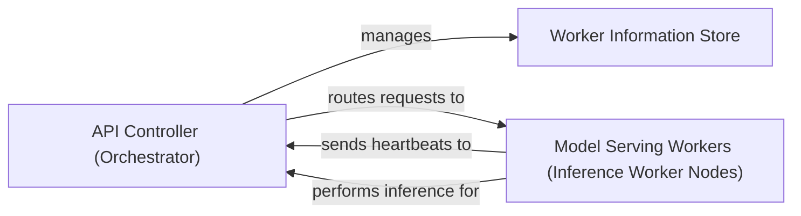

## Details

The LLaVA serving subsystem is orchestrated by the `API Controller`, which acts as the central hub for managing distributed model inference. It maintains a `Worker Information Store` to keep track of registered `Model Serving Workers`, enabling intelligent routing of inference requests. `Model Serving Workers` are responsible for executing the actual model inference and periodically sending heartbeats to the `API Controller` to report their status and availability. This architecture ensures efficient distribution of inference tasks and robust management of worker nodes.

### API Controller (Orchestrator)
The primary component responsible for managing the registration, health, and intelligent routing of incoming inference requests to available Model Serving Workers. It acts as the central hub for distributed model inference.

**Related Classes/Methods**:

- <a href="https://github.com/haotian-liu/LLaVA/blob/main/llava/serve/controller.py" target="_blank" rel="noopener noreferrer">`llava.serve.controller.Controller`</a>
- <a href="https://github.com/haotian-liu/LLaVA/blob/main/llava/serve/controller.py" target="_blank" rel="noopener noreferrer">`Controller:register_worker`</a>
- <a href="https://github.com/haotian-liu/LLaVA/blob/main/llava/serve/controller.py" target="_blank" rel="noopener noreferrer">`Controller:refresh_all_workers`</a>
- <a href="https://github.com/haotian-liu/LLaVA/blob/main/llava/serve/controller.py" target="_blank" rel="noopener noreferrer">`Controller:receive_heart_beat`</a>
- <a href="https://github.com/haotian-liu/LLaVA/blob/main/llava/serve/controller.py" target="_blank" rel="noopener noreferrer">`Controller:get_worker_address`</a>
- <a href="https://github.com/haotian-liu/LLaVA/blob/main/llava/serve/controller.py" target="_blank" rel="noopener noreferrer">`Controller:worker_api_generate_stream`</a>
- <a href="https://github.com/haotian-liu/LLaVA/blob/main/llava/serve/controller.py" target="_blank" rel="noopener noreferrer">`Controller:list_models`</a>

### Worker Information Store
An internal data structure or mechanism within the API Controller that stores metadata and state for each registered worker node, including their addresses, last heartbeat times, and available models. This enables the Controller to make informed routing decisions.

**Related Classes/Methods**:

- <a href="https://github.com/haotian-liu/LLaVA/blob/main/llava/serve/controller.py#L42-L48" target="_blank" rel="noopener noreferrer">`llava.serve.controller.WorkerInfo`:42-48</a>

### Model Serving Workers (Inference Worker Nodes)
Distributed computational units responsible for executing the actual model inference tasks and sending their status (heartbeats) back to the Controller.

**Related Classes/Methods**:

- <a href="https://github.com/haotian-liu/LLaVA/blob/main/llava/serve/model_worker.py#L44-L219" target="_blank" rel="noopener noreferrer">`llava.serve.model_worker.ModelWorker`:44-219</a>

### [FAQ](https://github.com/CodeBoarding/GeneratedOnBoardings/tree/main?tab=readme-ov-file#faq)