```mermaid
graph LR
    Data_Preparation_Formatting_Component["Data Preparation & Formatting Component"]
    Evaluation_Orchestration_Component["Evaluation Orchestration Component"]
    Evaluation_Data_Management_Component["Evaluation Data Management Component"]
    Benchmark_Specific_Evaluation_Component["Benchmark-Specific Evaluation Component"]
    Evaluation_Utilities_Component["Evaluation Utilities Component"]
    Data_Preparation_Formatting_Component -- "provides formatted data to" --> Evaluation_Data_Management_Component
    Evaluation_Orchestration_Component -- "coordinates with" --> Evaluation_Data_Management_Component
    Evaluation_Orchestration_Component -- "delegates evaluation tasks to" --> Benchmark_Specific_Evaluation_Component
    Evaluation_Orchestration_Component -- "utilizes" --> Evaluation_Utilities_Component
    Evaluation_Data_Management_Component -- "supplies data to" --> Evaluation_Orchestration_Component
    Evaluation_Data_Management_Component -- "supplies data to" --> Benchmark_Specific_Evaluation_Component
    Evaluation_Data_Management_Component -- "receives data from" --> Data_Preparation_Formatting_Component
    Benchmark_Specific_Evaluation_Component -- "receives data from" --> Evaluation_Data_Management_Component
    Benchmark_Specific_Evaluation_Component -- "uses" --> Evaluation_Utilities_Component
    Benchmark_Specific_Evaluation_Component -- "provides results to" --> Evaluation_Orchestration_Component
    Evaluation_Utilities_Component -- "supports" --> Evaluation_Orchestration_Component
    Evaluation_Utilities_Component -- "supports" --> Benchmark_Specific_Evaluation_Component
```

## Details

The `Data & Evaluation Module` is a critical subsystem within the LLaVA project, focusing on preparing datasets for the LLaVA model and rigorously assessing its performance.

### Data Preparation & Formatting Component
Responsible for transforming raw datasets (e.g., SQA) into the LLaVA-specific JSONL format, including the construction and formatting of chatbot-style prompts. This component ensures data consistency and proper structuring for subsequent training or evaluation.

**Related Classes/Methods**:

- <a href="https://github.com/haotian-liu/LLaVA/blob/main/scripts/convert_sqa_to_llava.py#L8-L46" target="_blank" rel="noopener noreferrer">`scripts.convert_sqa_to_llava.convert_to_llava`:8-46</a>
- <a href="https://github.com/haotian-liu/LLaVA/blob/main/scripts/convert_sqa_to_llava_base_prompt.py#L221-L241" target="_blank" rel="noopener noreferrer">`scripts.convert_sqa_to_llava_base_prompt.build_prompt_chatbot`:221-241</a>

### Evaluation Orchestration Component
Serves as the primary driver for general LLaVA model evaluation. It coordinates the overall assessment process, including data loading, model inference, and result aggregation across various benchmarks.

**Related Classes/Methods**:

- <a href="https://github.com/haotian-liu/LLaVA/blob/main/llava/eval/run_llava.py#L50-L128" target="_blank" rel="noopener noreferrer">`llava.eval.run_llava.eval_model`:50-128</a>

### Evaluation Data Management Component
Handles the preparation, loading, and batching of evaluation datasets. It provides flexibility for diverse datasets by managing custom data loading mechanisms, ensuring data is efficiently supplied to evaluation routines.

**Related Classes/Methods**:

- <a href="https://github.com/haotian-liu/LLaVA/blob/main/llava/eval/model_vqa_loader.py#L79-L126" target="_blank" rel="noopener noreferrer">`llava.eval.model_vqa_loader.eval_model`:79-126</a>
- <a href="https://github.com/haotian-liu/LLaVA/blob/main/llava/eval/model_vqa_loader.py#L72-L76" target="_blank" rel="noopener noreferrer">`llava.eval.model_vqa_loader.create_data_loader`:72-76</a>

### Benchmark-Specific Evaluation Component
Implements the specific evaluation logic, metrics, and procedures tailored for individual benchmarks (e.g., MMBench, general VQA, ScienceQA, M4C, TextVQA). These modules apply domain-specific rules and scoring mechanisms to assess model performance accurately.

**Related Classes/Methods**:

- <a href="https://github.com/haotian-liu/LLaVA/blob/main/llava/eval/model_vqa_mmbench.py#L54-L140" target="_blank" rel="noopener noreferrer">`llava.eval.model_vqa_mmbench.eval_model`:54-140</a>
- <a href="https://github.com/haotian-liu/LLaVA/blob/main/llava/eval/model_vqa.py#L29-L84" target="_blank" rel="noopener noreferrer">`llava.eval.model_vqa.eval_model`:29-84</a>
- <a href="https://github.com/haotian-liu/LLaVA/blob/main/llava/eval/model_vqa_science.py#L29-L94" target="_blank" rel="noopener noreferrer">`llava.eval.model_vqa_science.eval_model`:29-94</a>
- <a href="https://github.com/haotian-liu/LLaVA/blob/main/llava/eval/m4c_evaluator.py" target="_blank" rel="noopener noreferrer">`llava.eval.m4c_evaluator`</a>
- <a href="https://github.com/haotian-liu/LLaVA/blob/main/llava/eval/eval_textvqa.py#L35-L51" target="_blank" rel="noopener noreferrer">`llava.eval.eval_textvqa.eval_single`:35-51</a>

### Evaluation Utilities Component
Provides common utility functions for image processing (parsing, loading), text processing (normalization, formatting), and metric computation (e.g., ANLS, accuracy) used across various evaluation benchmarks. These utilities ensure consistent data handling and metric calculation.

**Related Classes/Methods**:

- <a href="https://github.com/haotian-liu/LLaVA/blob/main/llava/eval/run_llava.py#L28-L30" target="_blank" rel="noopener noreferrer">`image_parser`:28-30</a>
- <a href="https://github.com/haotian-liu/LLaVA/blob/main/llava/eval/run_llava.py#L42-L47" target="_blank" rel="noopener noreferrer">`load_images`:42-47</a>
- <a href="https://github.com/haotian-liu/LLaVA/blob/main/predict.py#L148-L154" target="_blank" rel="noopener noreferrer">`load_image`:148-154</a>
- <a href="https://github.com/haotian-liu/LLaVA/blob/main/llava/eval/m4c_evaluator.py#L181-L184" target="_blank" rel="noopener noreferrer">`word_tokenize`:181-184</a>
- <a href="https://github.com/haotian-liu/LLaVA/blob/main/llava/eval/m4c_evaluator.py#L198-L211" target="_blank" rel="noopener noreferrer">`process_digit_article`:198-211</a>
- <a href="https://github.com/haotian-liu/LLaVA/blob/main/llava/eval/m4c_evaluator.py#L186-L196" target="_blank" rel="noopener noreferrer">`process_punctuation`:186-196</a>
- <a href="https://github.com/haotian-liu/LLaVA/blob/main/llava/eval/eval_textvqa.py#L17-L32" target="_blank" rel="noopener noreferrer">`prompt_processor`:17-32</a>
- <a href="https://github.com/haotian-liu/LLaVA/blob/main/llava/eval/m4c_evaluator.py#L282-L287" target="_blank" rel="noopener noreferrer">`get_anls`:282-287</a>
- <a href="https://github.com/haotian-liu/LLaVA/blob/main/llava/eval/m4c_evaluator.py#L225-L246" target="_blank" rel="noopener noreferrer">`_compute_answer_scores`:225-246</a>

### [FAQ](https://github.com/CodeBoarding/GeneratedOnBoardings/tree/main?tab=readme-ov-file#faq)