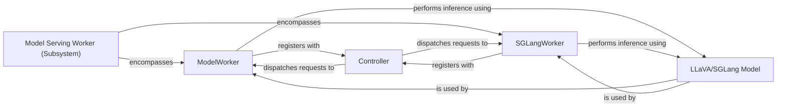

## Details

The Model Serving Worker Subsystem in LLaVA operates on a Controller-Worker pattern, designed for efficient and scalable multimodal model inference. The `Controller` acts as the central orchestrator, managing the registration and health of various `Model Serving Workers`. These workers, specifically `ModelWorker` and `SGLangWorker`, are responsible for loading the `LLaVA/SGLang Model` and executing inference requests. The `Controller` dispatches incoming requests to available workers, which then process the data, perform the forward pass using the loaded model, and stream back responses. This architecture ensures load balancing, fault tolerance, and optimized performance, particularly with the integration of SGLang for enhanced inference.

### Model Serving Worker (Subsystem)
A unified component encompassing both standard and SGLang optimized model serving workers. It represents the collective responsibility of loading the LLaVA model and executing actual inference, processing requests from the API Controller, performing the forward pass, and generating responses within a distributed system following a Controller-Worker pattern.

**Related Classes/Methods**:

- <a href="https://github.com/haotian-liu/LLaVA/blob/main/llava/serve/model_worker.py#L44-L219" target="_blank" rel="noopener noreferrer">`llava.serve.model_worker.ModelWorker`:44-219</a>
- <a href="https://github.com/haotian-liu/LLaVA/blob/main/llava/serve/sglang_worker.py" target="_blank" rel="noopener noreferrer">`llava.serve.sglang_worker.SGLangWorker`</a>

### ModelWorker
Handles standard LLaVA model serving and inference. Its responsibilities include loading the LLaVA model, registering with the `Controller`, reporting its status, processing incoming inference requests, managing an internal request queue, and generating streaming responses.

**Related Classes/Methods**:

- <a href="https://github.com/haotian-liu/LLaVA/blob/main/llava/serve/model_worker.py#L44-L219" target="_blank" rel="noopener noreferrer">`llava.serve.model_worker.ModelWorker`:44-219</a>

### SGLangWorker
Manages LLaVA model serving specifically optimized for SGLang. Similar to `ModelWorker`, it handles model loading, `Controller` registration, status reporting, inference request processing, queue management, and streaming response generation, but leverages SGLang for enhanced performance.

**Related Classes/Methods**:

- <a href="https://github.com/haotian-liu/LLaVA/blob/main/llava/serve/sglang_worker.py" target="_blank" rel="noopener noreferrer">`llava.serve.sglang_worker.SGLangWorker`</a>

### Controller
Orchestrates and dispatches inference requests to available model serving workers (`ModelWorker` and `SGLangWorker`). It also monitors their health and availability to ensure efficient load balancing and fault tolerance.

**Related Classes/Methods**:

- <a href="https://github.com/haotian-liu/LLaVA/blob/main/llava/serve/controller.py" target="_blank" rel="noopener noreferrer">`llava.serve.controller.Controller`</a>

### LLaVA/SGLang Model
The core multimodal model (LLaVA, potentially optimized for SGLang) that performs the actual vision-language inference. It is loaded and utilized by both `ModelWorker` and `SGLangWorker` to generate predictions based on input data.

**Related Classes/Methods**: _None_

### [FAQ](https://github.com/CodeBoarding/GeneratedOnBoardings/tree/main?tab=readme-ov-file#faq)