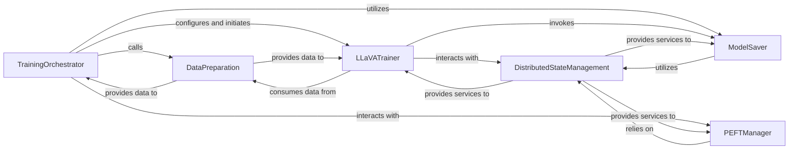

## Details

The `Model Training Module` subsystem is responsible for orchestrating and executing the entire training pipeline for LLaVA models. This encompasses data handling, model initialization, application of optimization techniques like LoRA, and the persistence of model checkpoints, with robust support for distributed training environments. Its core functionality is encapsulated within the `llava.train` package, specifically centered around the `llava.train.train.train` function and the `llava.train.llava_trainer.LLaVATrainer` class.

### TrainingOrchestrator
This component serves as the primary entry point and high-level coordinator for the training process. It is responsible for setting up the training environment, initializing the model, applying optimization techniques (like PEFT/LoRA), and orchestrating the final model saving process. It acts as the central control flow for a training run.

**Related Classes/Methods**:

- <a href="https://github.com/haotian-liu/LLaVA/blob/main/llava/train/train.py#L788-L987" target="_blank" rel="noopener noreferrer">`llava.train.train.train`:788-987</a>
- <a href="https://github.com/haotian-liu/LLaVA/blob/main/llava/train/llava_trainer.py#L133-L255" target="_blank" rel="noopener noreferrer">`llava.train.llava_trainer.LLaVATrainer`:133-255</a>

### LLaVATrainer
Extends a base trainer (likely Hugging Face's `Trainer`) to implement LLaVA-specific training logic. This involves handling multimodal data, optimizing for distributed training environments, and ensuring efficient data loading through custom samplers. It encapsulates the core training loop.

**Related Classes/Methods**:

- <a href="https://github.com/haotian-liu/LLaVA/blob/main/llava/train/llava_trainer.py#L133-L255" target="_blank" rel="noopener noreferrer">`llava.train.llava_trainer.LLaVATrainer`:133-255</a>

### DataPreparation
Handles the preparation and transformation of raw data into a format suitable for model training. This includes creating datasets, defining data collators, and performing necessary preprocessing steps for both text and image modalities.

**Related Classes/Methods**:

- <a href="https://github.com/haotian-liu/LLaVA/blob/main/llava/train/train.py#L776-L785" target="_blank" rel="noopener noreferrer">`llava.train.train.make_supervised_data_module`:776-785</a>
- <a href="https://github.com/haotian-liu/LLaVA/blob/main/llava/train/train.py#L658-L739" target="_blank" rel="noopener noreferrer">`llava.train.train.LazySupervisedDataset`:658-739</a>
- <a href="https://github.com/haotian-liu/LLaVA/blob/main/llava/train/train.py#L610-L655" target="_blank" rel="noopener noreferrer">`llava.train.train.preprocess`:610-655</a>
- <a href="https://github.com/haotian-liu/LLaVA/blob/main/llava/train/train.py#L308-L329" target="_blank" rel="noopener noreferrer">`llava.train.train.preprocess_multimodal`:308-329</a>

### PEFTManager
Manages the identification and application of Parameter-Efficient Fine-Tuning (PEFT) techniques, such as LoRA. This includes retrieving and handling PEFT-specific states, especially in distributed training settings, to optimize model training.

**Related Classes/Methods**:

- <a href="https://github.com/haotian-liu/LLaVA/blob/main/llava/train/train.py#L169-L182" target="_blank" rel="noopener noreferrer">`llava.train.train.find_all_linear_names`:169-182</a>
- <a href="https://github.com/haotian-liu/LLaVA/blob/main/llava/train/train.py#L130-L152" target="_blank" rel="noopener noreferrer">`llava.train.train.get_peft_state_maybe_zero_3`:130-152</a>
- <a href="https://github.com/haotian-liu/LLaVA/blob/main/llava/train/train.py#L155-L160" target="_blank" rel="noopener noreferrer">`llava.train.train.get_peft_state_non_lora_maybe_zero_3`:155-160</a>

### DistributedStateManagement
Manages the state of the model and adapters, particularly in distributed training environments (e.g., DeepSpeed Zero-3). It ensures efficient memory usage and proper synchronization of states across multiple devices, which is critical for large-scale training.

**Related Classes/Methods**:

- <a href="https://github.com/haotian-liu/LLaVA/blob/main/llava/train/llava_trainer.py#L18-L29" target="_blank" rel="noopener noreferrer">`llava.train.llava_trainer.maybe_zero_3`:18-29</a>
- <a href="https://github.com/haotian-liu/LLaVA/blob/main/llava/train/llava_trainer.py#L32-L35" target="_blank" rel="noopener noreferrer">`llava.train.llava_trainer.get_mm_adapter_state_maybe_zero_3`:32-35</a>
- <a href="https://github.com/haotian-liu/LLaVA/blob/main/llava/train/train.py#L130-L152" target="_blank" rel="noopener noreferrer">`llava.train.train.get_peft_state_maybe_zero_3`:130-152</a>

### ModelSaver
Manages the persistence of model checkpoints throughout and after the training process. This includes specific handling for LLaVA's multimodal adapters to ensure correct saving in various configurations, crucial for resuming training or deploying the final model.

**Related Classes/Methods**:

- <a href="https://github.com/haotian-liu/LLaVA/blob/main/llava/train/train.py#L185-L221" target="_blank" rel="noopener noreferrer">`llava.train.train.safe_save_model_for_hf_trainer`:185-221</a>
- <a href="https://github.com/haotian-liu/LLaVA/blob/main/llava/train/llava_trainer.py#L230-L249" target="_blank" rel="noopener noreferrer">`llava.train.llava_trainer._save_checkpoint`:230-249</a>

### [FAQ](https://github.com/CodeBoarding/GeneratedOnBoardings/tree/main?tab=readme-ov-file#faq)