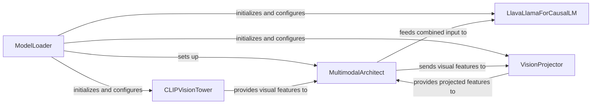

## Details

The LLaVA model architecture is centered around a multimodal approach, integrating visual and linguistic understanding. The `ModelLoader` acts as the initial orchestrator, responsible for loading and configuring the core components: the `LlavaLlamaForCausalLM` for language processing, the `CLIPVisionTower` for visual feature extraction, and the `VisionProjector` which transforms visual features for language model compatibility. The `MultimodalArchitect` then serves as the central hub, coordinating the flow of information. It receives visual features from the `CLIPVisionTower`, directs them through the `VisionProjector` for transformation, and finally integrates these projected visual features with textual inputs before feeding the combined sequence to the `LlavaLlamaForCausalLM` for multimodal reasoning and generation.

### LlavaLlamaForCausalLM
The specialized LLaMA-based language model responsible for processing textual inputs and generating text, adapted to handle multimodal contexts. It forms the generative backbone of the LLaVA model, receiving integrated visual features.

**Related Classes/Methods**:

- <a href="https://github.com/haotian-liu/LLaVA/blob/main/llava/model/language_model/llava_llama.py#L41-L155" target="_blank" rel="noopener noreferrer">`LlavaLlamaForCausalLM`:41-155</a>

### CLIPVisionTower
The vision encoder component, based on CLIP, tasked with extracting meaningful high-level visual features from input images. It provides the visual understanding capabilities to the multimodal system.

**Related Classes/Methods**:

- <a href="https://github.com/haotian-liu/LLaVA/blob/main/llava/model/multimodal_encoder/clip_encoder.py#L7-L88" target="_blank" rel="noopener noreferrer">`CLIPVisionTower`:7-88</a>

### VisionProjector
The `VisionProjector` is a conceptual component responsible for transforming high-dimensional visual features from the `CLIPVisionTower` into a latent representation compatible with the `LlavaLlamaForCausalLM`. Its implementation is handled by the `build_vision_projector` function, which dynamically constructs the appropriate projection layer (e.g., linear, MLP) based on configuration.

**Related Classes/Methods**:

- <a href="https://github.com/haotian-liu/LLaVA/blob/main/llava/model/multimodal_projector/builder.py#L33-L51" target="_blank" rel="noopener noreferrer">`build_vision_projector`:33-51</a>

### MultimodalArchitect
Serves as the architectural backbone for multimodal integration. It manages the `CLIPVisionTower` for feature extraction, utilizes the `VisionProjector` for feature transformation, and prepares the combined multimodal input sequence for the `LlavaLlamaForCausalLM`. This component embodies the core multimodal fusion logic.

**Related Classes/Methods**:

- <a href="https://github.com/haotian-liu/LLaVA/blob/main/llava/model/llava_arch.py" target="_blank" rel="noopener noreferrer">`MultimodalArchitect`</a>

### ModelLoader
The `ModelLoader` is a conceptual component that serves as the primary entry point for loading and initializing the entire LLaVA multimodal model. Its functionality is encapsulated within the `load_pretrained_model` function, which orchestrates the loading of pre-trained weights and the instantiation of the language model, vision encoder, and projection layers, preparing the complete system for operation.

**Related Classes/Methods**:

- <a href="https://github.com/haotian-liu/LLaVA/blob/main/llava/model/builder.py#L26-L167" target="_blank" rel="noopener noreferrer">`load_pretrained_model`:26-167</a>

### [FAQ](https://github.com/CodeBoarding/GeneratedOnBoardings/tree/main?tab=readme-ov-file#faq)