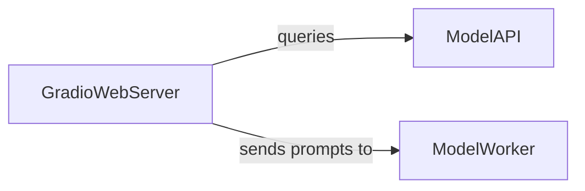

## Details

The LLaVA system's web interface is primarily managed by the GradioWebServer component. This component is responsible for all user interactions, from displaying the UI and handling inputs to managing model selection and logging conversation data. It interacts with a ModelAPI to retrieve available models and a ModelWorker to process user queries and generate responses. All user interactions and system responses are logged internally by the GradioWebServer for analysis and improvement.

### GradioWebServer
This is the primary user-facing component, orchestrating the Gradio web application. It sets up the UI, manages user interactions (text and image inputs), displays model-generated responses, handles model selection, and logs conversation data. It acts as the main entry point for users to interact with the LLaVA system.

**Related Classes/Methods**:

- <a href="https://github.com/haotian-liu/LLaVA/blob/main/llava/serve/gradio_web_server.py" target="_blank" rel="noopener noreferrer">`llava/serve/gradio_web_server.py`</a>
- <a href="https://github.com/haotian-liu/LLaVA/blob/main/llava/serve/gradio_web_server.py" target="_blank" rel="noopener noreferrer">`llava/serve/gradio_web_server.py:get_model_list`</a>
- <a href="https://github.com/haotian-liu/LLaVA/blob/main/llava/serve/gradio_web_server.py" target="_blank" rel="noopener noreferrer">`llava/serve/gradio_web_server.py:vote_last_response`</a>
- <a href="https://github.com/haotian-liu/LLaVA/blob/main/llava/serve/gradio_web_server.py" target="_blank" rel="noopener noreferrer">`llava/serve/gradio_web_server.py:get_conv_log_filename`</a>
- <a href="https://github.com/haotian-liu/LLaVA/blob/main/llava/serve/gradio_web_server.py" target="_blank" rel="noopener noreferrer">`llava/serve/gradio_web_server.py:http_bot`</a>

### ModelAPI
This component acts as an interface to retrieve the list of available models. It communicates with the backend controller to get up-to-date model information.

**Related Classes/Methods**:

- <a href="https://github.com/haotian-liu/LLaVA/blob/main/llava/serve/gradio_web_server.py" target="_blank" rel="noopener noreferrer">`requests.post`</a>

### ModelWorker
This component is responsible for processing user queries and generating responses using the selected language model. It receives prompts and images from the GradioWebServer and streams back the generated output.

**Related Classes/Methods**:

- <a href="https://github.com/haotian-liu/LLaVA/blob/main/llava/serve/gradio_web_server.py" target="_blank" rel="noopener noreferrer">`requests.post`</a>

### [FAQ](https://github.com/CodeBoarding/GeneratedOnBoardings/tree/main?tab=readme-ov-file#faq)