```mermaid
graph LR
    User_Interface_Gradio_Web_Server_["User Interface (Gradio Web Server)"]
    API_Controller_Orchestrator["API Controller/Orchestrator"]
    Model_Serving_Worker["Model Serving Worker"]
    Multimodal_Core_Model["Multimodal Core Model"]
    Model_Training_Module["Model Training Module"]
    Data_Evaluation_Module["Data & Evaluation Module"]
    User_Interface_Gradio_Web_Server_ -- "User Query Submission" --> API_Controller_Orchestrator
    API_Controller_Orchestrator -- "Inference Response Delivery" --> User_Interface_Gradio_Web_Server_
    API_Controller_Orchestrator -- "Inference Request Routing" --> Model_Serving_Worker
    Model_Serving_Worker -- "Worker Status & Heartbeat" --> API_Controller_Orchestrator
    Model_Serving_Worker -- "Model Inference Execution" --> Multimodal_Core_Model
    Multimodal_Core_Model -- "Inference Response" --> Model_Serving_Worker
    Data_Evaluation_Module -- "Training Data Supply" --> Model_Training_Module
    Model_Training_Module -- "Model Optimization & Update" --> Multimodal_Core_Model
    Model_Training_Module -- "Trained Model for Evaluation" --> Data_Evaluation_Module
    Data_Evaluation_Module -- "Inference for Evaluation" --> Multimodal_Core_Model
    click User_Interface_Gradio_Web_Server_ href "https://github.com/CodeBoarding/GeneratedOnBoardings/blob/main/LLaVA/User_Interface_Gradio_Web_Server_.md" "Details"
    click API_Controller_Orchestrator href "https://github.com/CodeBoarding/GeneratedOnBoardings/blob/main/LLaVA/API_Controller_Orchestrator.md" "Details"
    click Model_Serving_Worker href "https://github.com/CodeBoarding/GeneratedOnBoardings/blob/main/LLaVA/Model_Serving_Worker.md" "Details"
    click Multimodal_Core_Model href "https://github.com/CodeBoarding/GeneratedOnBoardings/blob/main/LLaVA/Multimodal_Core_Model.md" "Details"
    click Model_Training_Module href "https://github.com/CodeBoarding/GeneratedOnBoardings/blob/main/LLaVA/Model_Training_Module.md" "Details"
    click Data_Evaluation_Module href "https://github.com/CodeBoarding/GeneratedOnBoardings/blob/main/LLaVA/Data_Evaluation_Module.md" "Details"
```

## Details

The LLaVA project's architecture is designed for efficient multimodal AI serving and continuous model improvement. The User Interface (Gradio Web Server) provides the primary interaction point, allowing users to submit queries to the API Controller/Orchestrator. This controller intelligently routes inference requests to available Model Serving Workers, which in turn execute the core Multimodal Core Model to generate responses. For model development, the Data & Evaluation Module prepares datasets for the Model Training Module, which optimizes and updates the Multimodal Core Model. The Data & Evaluation Module also leverages the Multimodal Core Model for performance assessment, ensuring a feedback loop for model refinement. This modular design facilitates clear separation of concerns, enabling independent scaling and development of serving, training, and evaluation components.

### User Interface (Gradio Web Server) [[Expand]](./User_Interface_Gradio_Web_Server_.md)
The primary user-facing component, providing an interactive web interface built with Gradio. It enables users to submit multimodal queries (text and images) and visualize the model's generated responses.

**Related Classes/Methods**:

- <a href="https://github.com/haotian-liu/LLaVA/blob/main/llava/serve/gradio_web_server.py" target="_blank" rel="noopener noreferrer">`llava.serve.gradio_web_server.GradioWebServer`</a>

### API Controller/Orchestrator [[Expand]](./API_Controller_Orchestrator.md)
Acts as the central coordination point for model serving. It manages the registration and health of worker nodes, intelligently routes incoming inference requests to available Model Serving Workers, and aggregates responses.

**Related Classes/Methods**:

- <a href="https://github.com/haotian-liu/LLaVA/blob/main/llava/serve/controller.py" target="_blank" rel="noopener noreferrer">`llava.serve.controller.Controller`</a>

### Model Serving Worker [[Expand]](./Model_Serving_Worker.md)
Individual processes or nodes responsible for loading the LLaVA model and executing the actual inference. These workers process requests from the API Controller, perform the forward pass of the multimodal model, and generate responses. This includes both standard and SGLang workers.

**Related Classes/Methods**:

- <a href="https://github.com/haotian-liu/LLaVA/blob/main/llava/serve/model_worker.py#L44-L219" target="_blank" rel="noopener noreferrer">`llava.serve.model_worker.ModelWorker`:44-219</a>
- <a href="https://github.com/haotian-liu/LLaVA/blob/main/llava/serve/sglang_worker.py" target="_blank" rel="noopener noreferrer">`llava.serve.sglang_worker`</a>

### Multimodal Core Model [[Expand]](./Multimodal_Core_Model.md)
Encapsulates the fundamental LLaVA model architecture. This component integrates a language model (based on LLaMA) with a vision encoder (based on CLIP) to enable comprehensive multimodal understanding and text generation from visual inputs.

**Related Classes/Methods**:

- <a href="https://github.com/haotian-liu/LLaVA/blob/main/llava/model/language_model/llava_llama.py#L41-L155" target="_blank" rel="noopener noreferrer">`llava.model.language_model.llava_llama.LlavaLlamaForCausalLM`:41-155</a>
- <a href="https://github.com/haotian-liu/LLaVA/blob/main/llava/model/multimodal_encoder/clip_encoder.py#L7-L88" target="_blank" rel="noopener noreferrer">`llava.model.multimodal_encoder.clip_encoder.CLIPVisionTower`:7-88</a>
- <a href="https://github.com/haotian-liu/LLaVA/blob/main/llava/model/builder.py#L26-L167" target="_blank" rel="noopener noreferrer">`llava.model.builder.load_pretrained_model`:26-167</a>

### Model Training Module [[Expand]](./Model_Training_Module.md)
Manages the entire training pipeline for LLaVA models. This includes data loading, model initialization, optimization (e.g., using LoRA), and saving model checkpoints. It supports distributed training environments.

**Related Classes/Methods**:

- <a href="https://github.com/haotian-liu/LLaVA/blob/main/llava/train/train.py#L788-L987" target="_blank" rel="noopener noreferrer">`llava.train.train.train`:788-987</a>
- <a href="https://github.com/haotian-liu/LLaVA/blob/main/llava/train/llava_trainer.py#L133-L255" target="_blank" rel="noopener noreferrer">`llava.train.llava_trainer.LLaVATrainer`:133-255</a>

### Data & Evaluation Module [[Expand]](./Data_Evaluation_Module.md)
Responsible for transforming raw datasets into the LLaVA-specific format for training and evaluation, and for assessing the performance of trained LLaVA models across various benchmarks.

**Related Classes/Methods**:

- <a href="https://github.com/haotian-liu/LLaVA/blob/main/scripts/convert_sqa_to_llava.py#L8-L46" target="_blank" rel="noopener noreferrer">`scripts.convert_sqa_to_llava.convert_to_llava`:8-46</a>
- <a href="https://github.com/haotian-liu/LLaVA/blob/main/llava/eval/run_llava.py#L50-L128" target="_blank" rel="noopener noreferrer">`llava.eval.run_llava.eval_model`:50-128</a>

### [FAQ](https://github.com/CodeBoarding/GeneratedOnBoardings/tree/main?tab=readme-ov-file#faq)