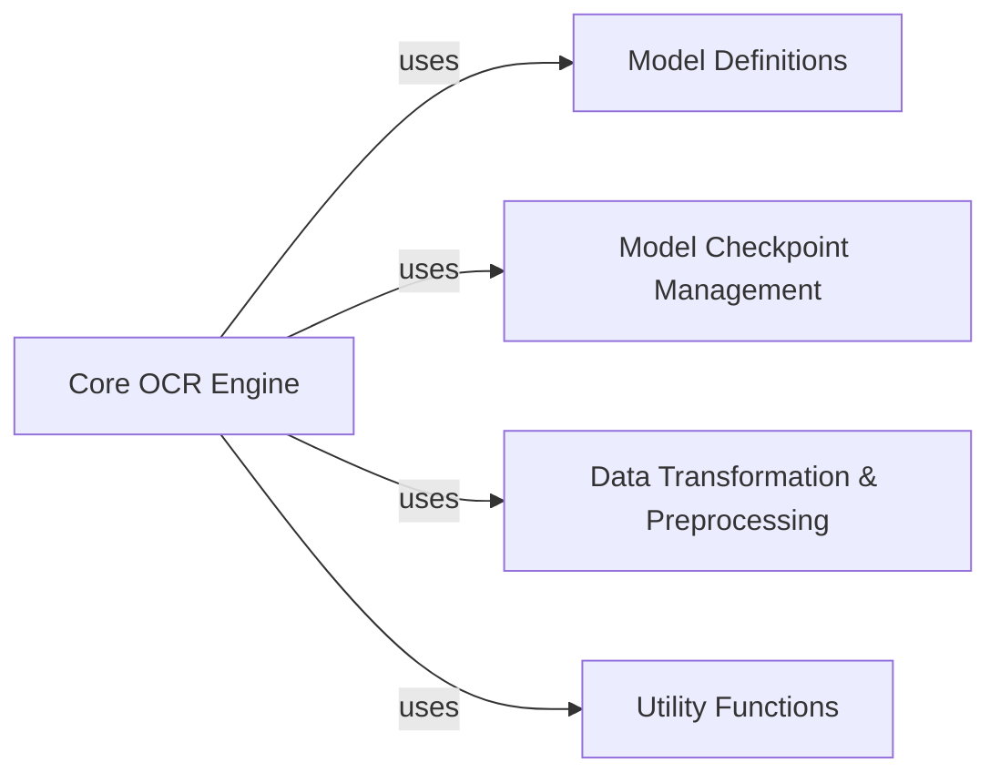

## Component Details

This analysis details the 'Core OCR Engine', the central component for LaTeX OCR, outlining its responsibilities and interactions with other key components such as Model Definitions, Model Checkpoint Management, Data Transformation & Preprocessing, and various Utility Functions.

### Core OCR Engine
This is the central component responsible for executing the LaTeX OCR process. It orchestrates the loading of the main OCR model, manages its state, handles input image preparation and transformation, performs the actual LaTeX prediction using the defined models, and post-processes the raw model output into a usable LaTeX string. It acts as the primary interface for performing OCR inference.

**Related Classes/Methods**:

- <a href="https://github.com/lukas-blecher/LaTeX-OCR/blob/master/pix2tex/cli.py#L57-L139" target="_blank" rel="noopener noreferrer">`pix2tex.cli.LatexOCR` (57:139)</a>

### Model Definitions
Responsible for defining and providing neural network architectures for the OCR process.

**Related Classes/Methods**:

- `pix2tex.models.get_model` (1:1)
- `timm.models.resnetv2.ResNetV2` (1:1)

### Model Checkpoint Management
Responsible for handling the downloading and loading of pre-trained model weights.

**Related Classes/Methods**:

- <a href="https://github.com/lukas-blecher/LaTeX-OCR/blob/master/pix2tex/model/checkpoints/get_latest_checkpoint.py#L36-L44" target="_blank" rel="noopener noreferrer">`pix2tex.model.checkpoints.get_latest_checkpoint.download_checkpoints` (36:44)</a>
- `torch.load` (1:1)

### Data Transformation & Preprocessing
Responsible for preparing input images for the neural network models, including resizing, padding, and normalization.

**Related Classes/Methods**:

- <a href="https://github.com/lukas-blecher/LaTeX-OCR/blob/master/pix2tex/dataset/transforms.py#L1-L1" target="_blank" rel="noopener noreferrer">`pix2tex.dataset.transforms.test_transform` (1:1)</a>
- `minmax_size` (1:1)
- `pad` (1:1)

### Utility Functions
Provides common utility functions such as argument parsing, path management, and post-processing of model predictions.

**Related Classes/Methods**:

- `pix2tex.utils.parse_args` (1:1)
- `pix2tex.utils.in_model_path` (1:1)
- `pix2tex.utils.post_process` (1:1)
- `pix2tex.utils.token2str` (1:1)

### [FAQ](https://github.com/CodeBoarding/GeneratedOnBoardings/tree/main?tab=readme-ov-file#faq)