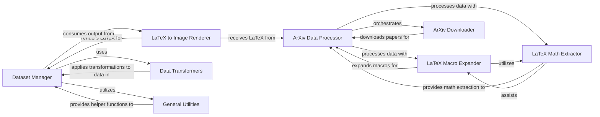

## Component Details

This subsystem is crucial for handling all data aspects required by the OCR models, from raw data acquisition to final preparation for training and evaluation. It ensures that LaTeX expressions are correctly processed, converted into images, and presented in a usable format for the neural network.

### Dataset Manager
This component, primarily the `Im2LatexDataset` class, is the central unit for managing and preparing image-equation pairs. It handles loading, tokenization of equations, resizing and padding of images, and provides functionalities for combining and updating datasets, making it the direct interface for the model's data input.

**Related Classes/Methods**:

- `Im2LatexDataset` (1:1)

### ArXiv Data Processor
This component is responsible for acquiring and parsing LaTeX papers from the arXiv repository. It orchestrates the download of papers and then processes them to extract mathematical expressions, acting as a pipeline manager for arXiv-specific data.

**Related Classes/Methods**:

- <a href="https://github.com/lukas-blecher/LaTeX-OCR/blob/master/pix2tex/dataset/arxiv.py#L1-L1" target="_blank" rel="noopener noreferrer">`pix2tex.dataset.arxiv` (1:1)</a>

### LaTeX Math Extractor
This component specializes in identifying and extracting mathematical expressions from raw text or LaTeX documents. It uses regular expressions to find various forms of inline and display math, providing a clean stream of mathematical content for further processing.

**Related Classes/Methods**:

- <a href="https://github.com/lukas-blecher/LaTeX-OCR/blob/master/pix2tex/dataset/extract_latex.py#L1-L1" target="_blank" rel="noopener noreferrer">`pix2tex.dataset.extract_latex` (1:1)</a>

### LaTeX Macro Expander
This component is responsible for expanding custom LaTeX commands (macros) within a LaTeX document. This process standardizes the LaTeX input by replacing user-defined shortcuts with their full definitions, which is crucial for consistent parsing and rendering.

**Related Classes/Methods**:

- <a href="https://github.com/lukas-blecher/LaTeX-OCR/blob/master/pix2tex/dataset/demacro.py#L1-L1" target="_blank" rel="noopener noreferrer">`pix2tex.dataset.demacro` (1:1)</a>

### LaTeX to Image Renderer
This component converts LaTeX mathematical expressions into image format (PIL Image objects). This is a critical step as the OCR model requires image input. It handles the rendering process, ensuring that LaTeX strings are accurately transformed into visual representations.

**Related Classes/Methods**:

- <a href="https://github.com/lukas-blecher/LaTeX-OCR/blob/master/pix2tex/dataset/latex2png.py#L1-L1" target="_blank" rel="noopener noreferrer">`pix2tex.dataset.latex2png` (1:1)</a>

### Data Transformers
This component provides a collection of utility functions for applying various transformations to both images and text data. These transformations, such as resizing, padding, and tokenization, are essential for preparing the raw data into a format suitable for input into the neural network models.

**Related Classes/Methods**:

- <a href="https://github.com/lukas-blecher/LaTeX-OCR/blob/master/pix2tex/dataset/transforms.py#L1-L1" target="_blank" rel="noopener noreferrer">`pix2tex.dataset.transforms` (1:1)</a>

### ArXiv Downloader
This component is specifically designed for the task of downloading papers from the arXiv repository. It handles the low-level details of fetching the raw LaTeX source files, which are then passed to the `ArXiv Data Processor` for further processing.

**Related Classes/Methods**:

- <a href="https://github.com/lukas-blecher/LaTeX-OCR/blob/master/pix2tex/dataset/scraping.py#L1-L1" target="_blank" rel="noopener noreferrer">`pix2tex.dataset.scraping` (1:1)</a>

### General Utilities
This component contains general-purpose utility functions that are reused across different parts of the `pix2tex` project, including the dataset management subsystem. These functions provide common helper functionalities that support various operations.

**Related Classes/Methods**:

- <a href="https://github.com/lukas-blecher/LaTeX-OCR/blob/master/pix2tex/utils/utils.py#L1-L1" target="_blank" rel="noopener noreferrer">`pix2tex.utils.utils` (1:1)</a>

### [FAQ](https://github.com/CodeBoarding/GeneratedOnBoardings/tree/main?tab=readme-ov-file#faq)