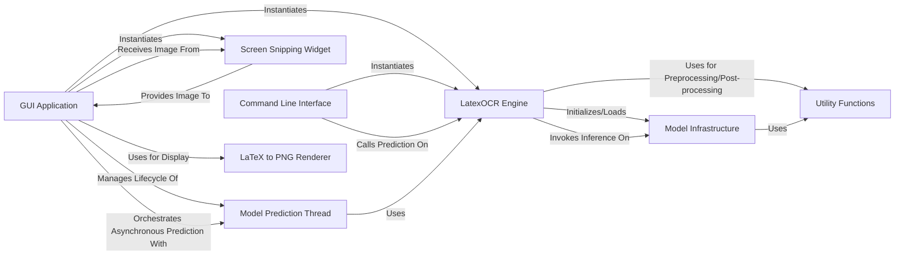

## Component Details

One paragraph explaining the functionality which is represented by this graph. What the main flow is and what is its purpose.

### LatexOCR Engine
This is the core component responsible for the end-to-end image-to-LaTeX conversion. It orchestrates the loading of the deep learning model, handles image preprocessing, performs the prediction inference, and manages post-processing of the generated LaTeX output.

**Related Classes/Methods**:

- <a href="https://github.com/lukas-blecher/LaTeX-OCR/blob/master/pix2tex/cli.py#L57-L139" target="_blank" rel="noopener noreferrer">`pix2tex.cli.LatexOCR` (57:139)</a>

### GUI Application
The main class for the graphical user user interface. It manages user interactions, including image snipping, displaying prediction results, and integrating with the LatexOCR Engine for image processing. It uses a separate thread to prevent UI freezing during model inference.

**Related Classes/Methods**:

- <a href="https://github.com/lukas-blecher/LaTeX-OCR/blob/master/pix2tex/gui.py#L48-L383" target="_blank" rel="noopener noreferrer">`pix2tex.gui.App` (48:383)</a>

### Command Line Interface
This function serves as the primary entry point for command-line users. It parses command-line arguments, initializes the LatexOCR Engine, and orchestrates the image-to-LaTeX prediction process for non-GUI interactions.

**Related Classes/Methods**:

- <a href="https://github.com/lukas-blecher/LaTeX-OCR/blob/master/pix2tex/cli.py#L210-L289" target="_blank" rel="noopener noreferrer">`pix2tex.cli.main` (210:289)</a>

### Utility Functions
A collection of general-purpose helper functions used across various parts of the system. This includes functionalities like argument parsing, path handling, image manipulation (e.g., padding), and post-processing of model outputs.

**Related Classes/Methods**:

- <a href="https://github.com/lukas-blecher/LaTeX-OCR/blob/master/pix2tex/utils/utils.py#L36-L48" target="_blank" rel="noopener noreferrer">`pix2tex.utils.utils.seed_everything` (36:48)</a>
- <a href="https://github.com/lukas-blecher/LaTeX-OCR/blob/master/pix2tex/utils/utils.py#L51-L62" target="_blank" rel="noopener noreferrer">`pix2tex.utils.utils.parse_args` (51:62)</a>
- <a href="https://github.com/lukas-blecher/LaTeX-OCR/blob/master/pix2tex/utils/utils.py#L65-L73" target="_blank" rel="noopener noreferrer">`pix2tex.utils.utils.get_device` (65:73)</a>
- <a href="https://github.com/lukas-blecher/LaTeX-OCR/blob/master/pix2tex/utils/utils.py#L100-L134" target="_blank" rel="noopener noreferrer">`pix2tex.utils.utils.pad` (100:134)</a>
- <a href="https://github.com/lukas-blecher/LaTeX-OCR/blob/master/pix2tex/utils/utils.py#L137-L159" target="_blank" rel="noopener noreferrer">`pix2tex.utils.utils.post_process` (137:159)</a>

### Model Infrastructure
This component is responsible for defining the neural network architectures used in the project (e.g., the main OCR model, image resizer). It provides utilities to instantiate these models and handles the downloading, loading, and saving of pre-trained model weights (checkpoints).

**Related Classes/Methods**:

- <a href="https://github.com/lukas-blecher/LaTeX-OCR/blob/master/pix2tex/models/utils.py#L8-L36" target="_blank" rel="noopener noreferrer">`pix2tex.models.utils.Model` (8:36)</a>
- <a href="https://github.com/lukas-blecher/LaTeX-OCR/blob/master/pix2tex/models/utils.py#L39-L54" target="_blank" rel="noopener noreferrer">`pix2tex.models.utils.get_model` (39:54)</a>
- <a href="https://github.com/lukas-blecher/LaTeX-OCR/blob/master/pix2tex/model/checkpoints/get_latest_checkpoint.py#L9-L45" target="_blank" rel="noopener noreferrer">`pix2tex.model.checkpoints.get_latest_checkpoint` (9:45)</a>
- <a href="https://github.com/lukas-blecher/LaTeX-OCR/blob/master/pix2tex/models/vit.py#L7-L58" target="_blank" rel="noopener noreferrer">`pix2tex.models.vit.ViTransformerWrapper` (7:58)</a>
- <a href="https://github.com/lukas-blecher/LaTeX-OCR/blob/master/pix2tex/models/vit.py#L61-L73" target="_blank" rel="noopener noreferrer">`pix2tex.models.vit.get_encoder` (61:73)</a>
- <a href="https://github.com/lukas-blecher/LaTeX-OCR/blob/master/pix2tex/models/hybrid.py#L9-L32" target="_blank" rel="noopener noreferrer">`pix2tex.models.hybrid.CustomVisionTransformer` (9:32)</a>
- <a href="https://github.com/lukas-blecher/LaTeX-OCR/blob/master/pix2tex/models/hybrid.py#L35-L55" target="_blank" rel="noopener noreferrer">`pix2tex.models.hybrid.get_encoder` (35:55)</a>
- <a href="https://github.com/lukas-blecher/LaTeX-OCR/blob/master/pix2tex/models/transformer.py#L6-L51" target="_blank" rel="noopener noreferrer">`pix2tex.models.transformer.CustomARWrapper` (6:51)</a>
- <a href="https://github.com/lukas-blecher/LaTeX-OCR/blob/master/pix2tex/models/transformer.py#L54-L65" target="_blank" rel="noopener noreferrer">`pix2tex.models.transformer.get_decoder` (54:65)</a>

### Screen Snipping Widget
A dedicated GUI component that enables users to select and capture a specific region of their screen. This captured image is then used as input for the OCR process.

**Related Classes/Methods**:

- <a href="https://github.com/lukas-blecher/LaTeX-OCR/blob/master/pix2tex/gui.py#L406-L509" target="_blank" rel="noopener noreferrer">`pix2tex.gui.SnipWidget` (406:509)</a>

### Model Prediction Thread
A separate thread used by the GUI Application to execute the LatexOCR Engine's prediction process asynchronously. This prevents the main UI thread from freezing during potentially long inference times, ensuring a responsive user experience.

**Related Classes/Methods**:

- <a href="https://github.com/lukas-blecher/LaTeX-OCR/blob/master/pix2tex/gui.py#L386-L403" target="_blank" rel="noopener noreferrer">`pix2tex.gui.ModelThread` (386:403)</a>

### LaTeX to PNG Renderer
This component provides functionality to convert LaTeX strings into rendered PNG images. It is primarily used by the GUI Application to visually display the mathematical expressions generated by the OCR model.

**Related Classes/Methods**:

- <a href="https://github.com/lukas-blecher/LaTeX-OCR/blob/master/pix2tex/dataset/latex2png.py#L14-L133" target="_blank" rel="noopener noreferrer">`pix2tex.dataset.latex2png.Latex` (14:133)</a>
- <a href="https://github.com/lukas-blecher/LaTeX-OCR/blob/master/pix2tex/dataset/latex2png.py#L139-L142" target="_blank" rel="noopener noreferrer">`pix2tex.dataset.latex2png.tex2png` (139:142)</a>
- <a href="https://github.com/lukas-blecher/LaTeX-OCR/blob/master/pix2tex/dataset/latex2png.py#L145-L148" target="_blank" rel="noopener noreferrer">`pix2tex.dataset.latex2png.tex2pil` (145:148)</a>

### [FAQ](https://github.com/CodeBoarding/GeneratedOnBoardings/tree/main?tab=readme-ov-file#faq)