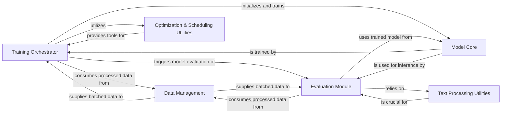

## Component Details

This component manages the entire lifecycle of developing and assessing the OCR model. It orchestrates the training process, including data loading, model optimization, and performance metric calculation. It also handles the evaluation of trained models against test datasets.

### Training Orchestrator
This component is the central control unit for the model training process. It orchestrates data loading, model initialization, optimization, and the execution of training epochs. It also manages periodic evaluations and the saving of model checkpoints.

**Related Classes/Methods**:

- <a href="https://github.com/lukas-blecher/LaTeX-OCR/blob/master/pix2tex/train.py#L0-L0" target="_blank" rel="noopener noreferrer">`pix2tex/train.py` (0:0)</a>

### Evaluation Module
Responsible for assessing the performance of the trained OCR model. It takes a model and a dataset, generates predictions, and calculates various metrics such as BLEU score, edit distance, and token accuracy. It also handles logging of these results, potentially to external tools like Weights & Biases.

**Related Classes/Methods**:

- <a href="https://github.com/lukas-blecher/LaTeX-OCR/blob/master/pix2tex/eval.py#L0-L0" target="_blank" rel="noopener noreferrer">`pix2tex/eval.py` (0:0)</a>

### Data Management
This component handles the entire pipeline for preparing data for training and evaluation. This includes loading raw image-to-LaTeX datasets, performing necessary preprocessing steps (e.g., image transformations, tokenization of LaTeX), and batching the data for efficient consumption by the training and evaluation processes.

**Related Classes/Methods**:

- <a href="https://github.com/lukas-blecher/LaTeX-OCR/blob/master/pix2tex/dataset/dataset.py#L0-L0" target="_blank" rel="noopener noreferrer">`pix2tex/dataset/dataset.py` (0:0)</a>
- <a href="https://github.com/lukas-blecher/LaTeX-OCR/blob/master/pix2tex/dataset/transforms.py#L0-L0" target="_blank" rel="noopener noreferrer">`pix2tex/dataset/transforms.py` (0:0)</a>

### Model Core
Encapsulates the neural network architecture responsible for the image-to-LaTeX translation. This component includes the definition of the model, its various sub-modules (e.g., Vision Transformer, Transformer decoder), and utilities for instantiating and potentially distributing the model across multiple GPUs.

**Related Classes/Methods**:

- <a href="https://github.com/lukas-blecher/LaTeX-OCR/blob/master/pix2tex/models/utils.py#L0-L0" target="_blank" rel="noopener noreferrer">`pix2tex/models/utils.py` (0:0)</a>
- <a href="https://github.com/lukas-blecher/LaTeX-OCR/blob/master/pix2tex/models/transformer.py#L0-L0" target="_blank" rel="noopener noreferrer">`pix2tex/models/transformer.py` (0:0)</a>
- <a href="https://github.com/lukas-blecher/LaTeX-OCR/blob/master/pix2tex/models/vit.py#L0-L0" target="_blank" rel="noopener noreferrer">`pix2tex/models/vit.py` (0:0)</a>
- <a href="https://github.com/lukas-blecher/LaTeX-OCR/blob/master/pix2tex/models/hybrid.py#L0-L0" target="_blank" rel="noopener noreferrer">`pix2tex/models/hybrid.py` (0:0)</a>

### Text Processing Utilities
A collection of utility functions essential for handling text-based operations within the OCR pipeline. This includes converting numerical token IDs back into human-readable LaTeX strings, cleaning up generated text (e.g., removing redundant spaces or special tokens), and preparing ground truth LaTeX for accurate metric calculations.

**Related Classes/Methods**:

- <a href="https://github.com/lukas-blecher/LaTeX-OCR/blob/master/pix2tex/utils/utils.py#L0-L0" target="_blank" rel="noopener noreferrer">`pix2tex/utils/utils.py` (0:0)</a>

### Optimization & Scheduling Utilities
This component provides functions to initialize and manage the optimization algorithms (e.g., Adam, SGD) and learning rate schedules (e.g., ReduceLROnPlateau, CosineAnnealing) used during model training. It ensures that the model's parameters are updated effectively to minimize the loss function.

**Related Classes/Methods**:

- <a href="https://github.com/lukas-blecher/LaTeX-OCR/blob/master/pix2tex/utils/utils.py#L0-L0" target="_blank" rel="noopener noreferrer">`pix2tex/utils/utils.py` (0:0)</a>

### [FAQ](https://github.com/CodeBoarding/GeneratedOnBoardings/tree/main?tab=readme-ov-file#faq)