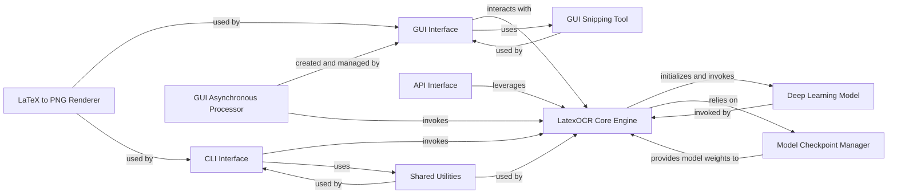

## Component Details

This subsystem provides the various entry points for users and other applications to interact with the LaTeX OCR system. It is designed to offer flexibility, from direct command-line execution to an interactive graphical interface and a programmatic web API. These components are fundamental because they collectively form the complete operational pipeline of the LaTeX OCR system, from user interaction to the core OCR processing and result presentation. User Interfaces (CLI, GUI, API) are crucial as they provide the necessary entry points for users and other applications to interact with the system. LatexOCR Core Engine is the heart of the system, embodying the primary business logic. Deep Learning Model & Model Checkpoint Manager are inseparable and fundamental to the OCR process itself. GUI Snipping Tool & GUI Asynchronous Processor are fundamental for the GUI's usability and responsiveness. LaTeX to PNG Renderer is vital for visualizing the OCR output. Shared Utilities are fundamental for maintaining code quality, reducing redundancy, and ensuring consistent behavior across different parts of the system. Together, these components represent a well-structured architecture that separates concerns, allows for different interaction methods, and ensures the efficient and effective operation of the LaTeX OCR system.

### CLI Interface
This component provides a command-line interface for direct execution of the LaTeX OCR system. It is responsible for parsing user arguments, initializing the core OCR engine, and orchestrating the prediction process for command-line users. It also handles input from files or direct console input and displays the OCR results.

**Related Classes/Methods**:

- <a href="https://github.com/lukas-blecher/LaTeX-OCR/blob/master/pix2tex/cli.py#L0-L0" target="_blank" rel="noopener noreferrer">`pix2tex.cli` (0:0)</a>

### GUI Interface
This component offers a graphical user interface for interactive use of the LaTeX OCR system. It manages user interactions, integrates with the `GUI Snipping Tool` for image capture, displays predictions, and utilizes an asynchronous processor to ensure the UI remains responsive during OCR operations.

**Related Classes/Methods**:

- <a href="https://github.com/lukas-blecher/LaTeX-OCR/blob/master/pix2tex/gui.py#L48-L383" target="_blank" rel="noopener noreferrer">`pix2tex.gui.App` (48:383)</a>
- <a href="https://github.com/lukas-blecher/LaTeX-OCR/blob/master/pix2tex/gui.py#L406-L509" target="_blank" rel="noopener noreferrer">`pix2tex.gui.SnipWidget` (406:509)</a>
- <a href="https://github.com/lukas-blecher/LaTeX-OCR/blob/master/pix2tex/gui.py#L386-L403" target="_blank" rel="noopener noreferrer">`pix2tex.gui.ModelThread` (386:403)</a>

### API Interface
This component exposes a web API, allowing other applications and services to programmatically access the LaTeX OCR functionality. It handles incoming requests, passes image data to the core engine, and returns the OCR results in a structured format.

**Related Classes/Methods**:

- <a href="https://github.com/lukas-blecher/LaTeX-OCR/blob/master/pix2tex/api/app.py#L0-L0" target="_blank" rel="noopener noreferrer">`pix2tex.api.app` (0:0)</a>
- <a href="https://github.com/lukas-blecher/LaTeX-OCR/blob/master/pix2tex/api/run.py#L0-L0" target="_blank" rel="noopener noreferrer">`pix2tex.api.run` (0:0)</a>
- <a href="https://github.com/lukas-blecher/LaTeX-OCR/blob/master/pix2tex/api/streamlit.py#L0-L0" target="_blank" rel="noopener noreferrer">`pix2tex.api.streamlit` (0:0)</a>

### LatexOCR Core Engine
This is the central component responsible for the actual image-to-LaTeX conversion. It encapsulates the deep learning model, manages the prediction workflow, and orchestrates the necessary pre-processing and post-processing steps. It serves as the primary OCR service consumed by all user interfaces.

**Related Classes/Methods**:

- <a href="https://github.com/lukas-blecher/LaTeX-OCR/blob/master/pix2tex/cli.py#L57-L139" target="_blank" rel="noopener noreferrer">`pix2tex.cli.LatexOCR` (57:139)</a>

### Deep Learning Model
This component represents the underlying deep learning architecture (e.g., Transformer, ViT) responsible for the image-to-sequence translation. Its `generate` method performs the actual inference, converting image features into a LaTeX string.

**Related Classes/Methods**:

- <a href="https://github.com/lukas-blecher/LaTeX-OCR/blob/master/pix2tex/models/utils.py#L8-L36" target="_blank" rel="noopener noreferrer">`pix2tex.models.utils.Model` (8:36)</a>
- <a href="https://github.com/lukas-blecher/LaTeX-OCR/blob/master/pix2tex/models/transformer.py#L0-L0" target="_blank" rel="noopener noreferrer">`pix2tex.models.transformer` (0:0)</a>
- <a href="https://github.com/lukas-blecher/LaTeX-OCR/blob/master/pix2tex/models/vit.py#L0-L0" target="_blank" rel="noopener noreferrer">`pix2tex.models.vit` (0:0)</a>
- <a href="https://github.com/lukas-blecher/LaTeX-OCR/blob/master/pix2tex/models/hybrid.py#L0-L0" target="_blank" rel="noopener noreferrer">`pix2tex.models.hybrid` (0:0)</a>

### Model Checkpoint Manager
This component is responsible for handling the downloading, caching, and loading of pre-trained model checkpoints. It ensures that the `LatexOCR Core Engine` has access to the necessary model weights to perform accurate predictions.

**Related Classes/Methods**:

- <a href="https://github.com/lukas-blecher/LaTeX-OCR/blob/master/pix2tex/model/checkpoints/get_latest_checkpoint.py#L0-L0" target="_blank" rel="noopener noreferrer">`pix2tex.model.checkpoints.get_latest_checkpoint` (0:0)</a>

### GUI Snipping Tool
A specialized GUI component that enables users to select and capture a specific region of their screen as an image. This captured image then serves as input for the OCR process.

**Related Classes/Methods**:

- <a href="https://github.com/lukas-blecher/LaTeX-OCR/blob/master/pix2tex/gui.py#L406-L509" target="_blank" rel="noopener noreferrer">`pix2tex.gui.SnipWidget` (406:509)</a>

### GUI Asynchronous Processor
This component operates as a separate thread within the GUI, specifically designed to execute the potentially long-running `LatexOCR Core Engine` prediction process asynchronously. This prevents the user interface from freezing, ensuring a smooth user experience.

**Related Classes/Methods**:

- <a href="https://github.com/lukas-blecher/LaTeX-OCR/blob/master/pix2tex/gui.py#L386-L403" target="_blank" rel="noopener noreferrer">`pix2tex.gui.ModelThread` (386:403)</a>

### LaTeX to PNG Renderer
This component provides the functionality to convert LaTeX strings into high-quality PNG images. It is primarily used by the GUI to display rendered mathematical expressions, offering a visual representation of the OCR output, and can also be used by the CLI for similar purposes.

**Related Classes/Methods**:

- <a href="https://github.com/lukas-blecher/LaTeX-OCR/blob/master/pix2tex/dataset/latex2png.py#L0-L0" target="_blank" rel="noopener noreferrer">`pix2tex.dataset.latex2png` (0:0)</a>

### Shared Utilities
This component is a collection of common helper functions and utilities that are used across various parts of the system. This includes functionalities such as argument parsing, path handling, image manipulation (e.g., padding), and post-processing of model outputs, promoting code reusability.

**Related Classes/Methods**:

- <a href="https://github.com/lukas-blecher/LaTeX-OCR/blob/master/pix2tex/utils/utils.py#L0-L0" target="_blank" rel="noopener noreferrer">`pix2tex.utils.utils` (0:0)</a>

### [FAQ](https://github.com/CodeBoarding/GeneratedOnBoardings/tree/main?tab=readme-ov-file#faq)