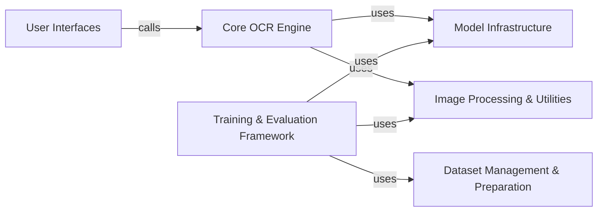

## Component Details

The `LaTeX-OCR` project's architecture can be effectively understood through six fundamental components, each playing a critical role in the system's operation, from data preparation and model training to inference and user interaction. These components are chosen for their distinct responsibilities and their essential contribution to the overall functionality of the LaTeX OCR system.

### Core OCR Engine
This is the central component responsible for executing the LaTeX OCR process. It initializes the main OCR model, manages its state, handles input image preparation, performs the actual LaTeX prediction, and post-processes the raw model output into a usable LaTeX string. It acts as the primary interface for performing OCR.

**Related Classes/Methods**:

- <a href="https://github.com/lukas-blecher/LaTeX-OCR/blob/master/pix2tex/cli.py#L57-L139" target="_blank" rel="noopener noreferrer">`pix2tex.cli.LatexOCR` (57:139)</a>

### Model Infrastructure
This component is responsible for defining the neural network architectures used in the project (e.g., the main OCR model, image resizer). It provides utilities to instantiate these models and handles the downloading, loading, and saving of pre-trained model weights (checkpoints).

**Related Classes/Methods**:

- <a href="https://github.com/lukas-blecher/LaTeX-OCR/blob/master/pix2tex/models/utils.py#L8-L36" target="_blank" rel="noopener noreferrer">`pix2tex.models.utils.Model` (8:36)</a>
- <a href="https://github.com/lukas-blecher/LaTeX-OCR/blob/master/pix2tex/models/utils.py#L39-L54" target="_blank" rel="noopener noreferrer">`pix2tex.models.utils.get_model` (39:54)</a>
- <a href="https://github.com/lukas-blecher/LaTeX-OCR/blob/master/pix2tex/model/checkpoints/get_latest_checkpoint.py#L36-L44" target="_blank" rel="noopener noreferrer">`pix2tex.model.checkpoints.get_latest_checkpoint.download_checkpoints` (36:44)</a>

### Image Processing & Utilities
This component encompasses all functionalities related to preparing images for the OCR model and refining the model's raw output. This includes image resizing, padding, normalization, and the conversion of model-predicted tokens back into a human-readable and syntactically correct LaTeX string. It also includes the training and application of a dedicated image resizer model and general utility functions.

**Related Classes/Methods**:

- <a href="https://github.com/lukas-blecher/LaTeX-OCR/blob/master/pix2tex/train_resizer.py#L108-L159" target="_blank" rel="noopener noreferrer">`pix2tex.train_resizer.main` (108:159)</a>
- <a href="https://github.com/lukas-blecher/LaTeX-OCR/blob/master/pix2tex/utils/utils.py#L0-L0" target="_blank" rel="noopener noreferrer">`pix2tex.utils.utils` (0:0)</a>
- <a href="https://github.com/lukas-blecher/LaTeX-OCR/blob/master/pix2tex/utils/utils.py#L0-L0" target="_blank" rel="noopener noreferrer">`pix2tex.utils.utils:minmax_size` (0:0)</a>
- <a href="https://github.com/lukas-blecher/LaTeX-OCR/blob/master/pix2tex/utils/utils.py#L100-L134" target="_blank" rel="noopener noreferrer">`pix2tex.utils.utils:pad` (100:134)</a>
- <a href="https://github.com/lukas-blecher/LaTeX-OCR/blob/master/pix2tex/utils/utils.py#L93-L97" target="_blank" rel="noopener noreferrer">`pix2tex.utils.utils:token2str` (93:97)</a>
- <a href="https://github.com/lukas-blecher/LaTeX-OCR/blob/master/pix2tex/utils/utils.py#L137-L159" target="_blank" rel="noopener noreferrer">`pix2tex.utils.utils:post_process` (137:159)</a>

### User Interfaces
This component provides various entry points for users and other applications to interact with the LaTeX OCR system. It includes a command-line interface for direct execution, a graphical user interface for interactive use, and a web API for programmatic access. Each interface handles user input and displays/returns the OCR results.

**Related Classes/Methods**:

- <a href="https://github.com/lukas-blecher/LaTeX-OCR/blob/master/pix2tex/cli.py#L0-L0" target="_blank" rel="noopener noreferrer">`pix2tex.cli` (0:0)</a>
- <a href="https://github.com/lukas-blecher/LaTeX-OCR/blob/master/pix2tex/gui.py#L48-L383" target="_blank" rel="noopener noreferrer">`pix2tex.gui.App` (48:383)</a>
- <a href="https://github.com/lukas-blecher/LaTeX-OCR/blob/master/pix2tex/api/app.py#L18-L21" target="_blank" rel="noopener noreferrer">`pix2tex.api.app.load_model` (18:21)</a>

### Training & Evaluation Framework
This component manages the entire lifecycle of developing and assessing the OCR model. It orchestrates the training process, including data loading, model optimization, and performance metric calculation. It also handles the evaluation of trained models against test datasets.

**Related Classes/Methods**:

- <a href="https://github.com/lukas-blecher/LaTeX-OCR/blob/master/pix2tex/train.py#L17-L78" target="_blank" rel="noopener noreferrer">`pix2tex.train.train` (17:78)</a>
- <a href="https://github.com/lukas-blecher/LaTeX-OCR/blob/master/pix2tex/eval.py#L30-L95" target="_blank" rel="noopener noreferrer">`pix2tex.eval.evaluate` (30:95)</a>

### Dataset Management & Preparation
This component is responsible for all aspects of handling the data required for training and evaluating the OCR models. This includes loading datasets, converting LaTeX expressions to images, parsing and processing large text corpora like arXiv for mathematical expressions, expanding LaTeX macros, and extracting math content from raw text.

**Related Classes/Methods**:

- <a href="https://github.com/lukas-blecher/LaTeX-OCR/blob/master/pix2tex/dataset/dataset.py#L20-L218" target="_blank" rel="noopener noreferrer">`pix2tex.dataset.dataset.Im2LatexDataset` (20:218)</a>
- <a href="https://github.com/lukas-blecher/LaTeX-OCR/blob/master/pix2tex/dataset/latex2png.py#L145-L148" target="_blank" rel="noopener noreferrer">`pix2tex.dataset.latex2png.tex2pil` (145:148)</a>
- <a href="https://github.com/lukas-blecher/LaTeX-OCR/blob/master/pix2tex/dataset/arxiv.py#L101-L108" target="_blank" rel="noopener noreferrer">`pix2tex.dataset.arxiv.parse_arxiv` (101:108)</a>
- <a href="https://github.com/lukas-blecher/LaTeX-OCR/blob/master/pix2tex/dataset/demacro.py#L122-L132" target="_blank" rel="noopener noreferrer">`pix2tex.dataset.demacro.pydemacro` (122:132)</a>
- <a href="https://github.com/lukas-blecher/LaTeX-OCR/blob/master/pix2tex/dataset/extract_latex.py#L76-L99" target="_blank" rel="noopener noreferrer">`pix2tex.dataset.extract_latex.find_math` (76:99)</a>

### [FAQ](https://github.com/CodeBoarding/GeneratedOnBoardings/tree/main?tab=readme-ov-file#faq)