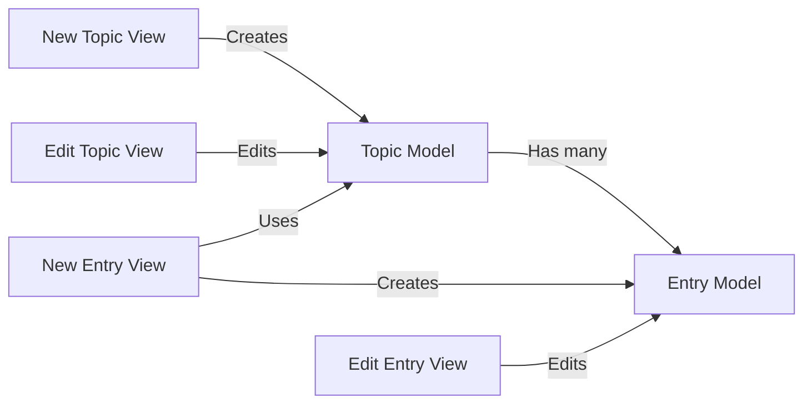

## Component Details

The Data Models component defines the structure and behavior of the data stored in the learning journals application. It includes the Topic and Entry models, which represent the topics and entries within the journal. These models provide an abstraction layer for interacting with the database, ensuring data integrity and defining relationships between topics and entries. The views interact with these models to create, retrieve, update, and delete data.

### Topic Model
Represents a topic in the learning journal. Stores information such as the topic's title and potentially other metadata. It interacts with the Entry model through a foreign key relationship, as a topic can have multiple entries. It is used by views to create, edit, and display topics.
- **Related Classes/Methods**: `learning_journals.models.Topic`

### Entry Model
Represents an entry in the learning journal, associated with a specific topic. Stores the entry's content, creation date, and any other relevant information. It interacts with the Topic model through a foreign key relationship, belonging to one specific topic. It is used by views to create, edit, and display entries.
- **Related Classes/Methods**: `learning_journals.models.Entry`

### New Topic View
Handles the creation of new topics. It presents a form to the user, validates the input, and saves the new topic to the database using the Topic model.
- **Related Classes/Methods**: `learning_journals.views.new_topic`

### Edit Topic View
Responsible for editing existing topics. It retrieves the topic data from the database using the Topic model, populates a form with it, allows the user to modify the data, validates the input, and updates the topic in the database.
- **Related Classes/Methods**: `learning_journals.views.edit_topic`

### New Entry View
Handles the creation of new entries for a specific topic. It presents a form to the user, validates the input, associates the entry with the correct topic using the Topic and Entry models, and saves the new entry to the database.
- **Related Classes/Methods**: `learning_journals.views.new_entry`

### Edit Entry View
Allows users to edit existing entries. It retrieves the entry data from the database using the Entry model, populates a form, allows modification, validates the input, and updates the entry in the database.
- **Related Classes/Methods**: `learning_journals.views.edit_entry`
