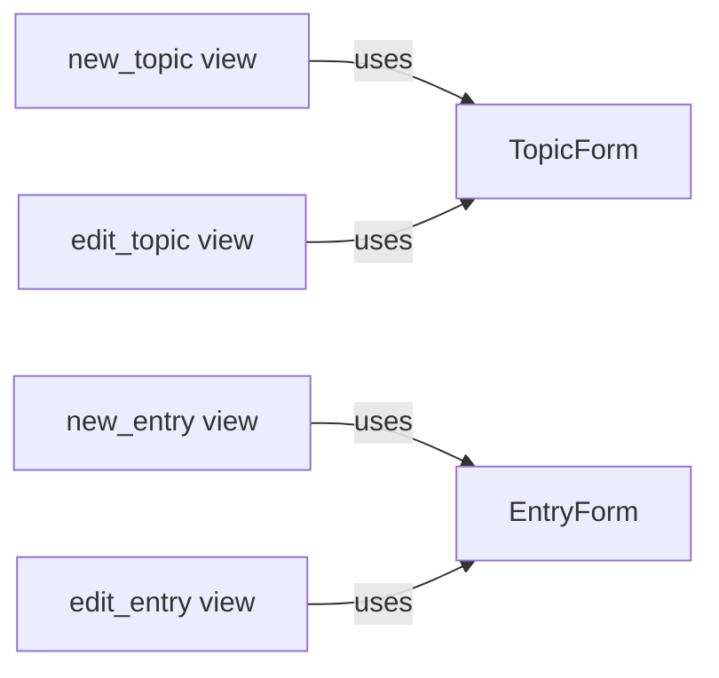

## Component Details

The Forms and Validation subsystem is responsible for handling user input through HTML forms, ensuring data quality, and providing a smooth user experience. It defines the structure, validation rules, and rendering logic for topics and entries. The core components are TopicForm and EntryForm, which define the form fields and validation logic. These forms are used by the new_topic, edit_topic, new_entry, and edit_entry views to create and modify data. The views render the forms, validate user input, and save the data to the database.

### TopicForm
Defines the structure and validation rules for creating and editing topics. It specifies the fields required for a topic, such as title, and applies validation logic to ensure the input is valid before saving to the database. It inherits from Django's Form class and customizes the form fields and validation.
- **Related Classes/Methods**: `learning_journals.forms.TopicForm`

### EntryForm
Defines the structure and validation rules for creating and editing entries. It specifies the fields required for an entry, such as text, and applies validation logic to ensure the input is valid before saving to the database. It also handles the association of an entry with a specific topic. It inherits from Django's Form class and customizes the form fields and validation.
- **Related Classes/Methods**: `learning_journals.forms.EntryForm`

### new_topic view
Handles the creation of new topics. It renders the TopicForm, validates user input, and saves the new topic to the database if the form is valid. It uses Django's generic views and form handling mechanisms.
- **Related Classes/Methods**: `learning_journals.views:new_topic`

### edit_topic view
Handles the editing of existing topics. It retrieves the topic data, populates the TopicForm with it, validates user modifications, and updates the topic in the database. It uses Django's generic views and form handling mechanisms.
- **Related Classes/Methods**: `learning_journals.views:edit_topic`

### new_entry view
Allows users to create new entries for a specific topic. It renders the EntryForm, validates user input, associates the entry with the correct topic, and saves the new entry to the database. It uses Django's generic views and form handling mechanisms.
- **Related Classes/Methods**: `learning_journals.views:new_entry`

### edit_entry view
Handles the editing of existing entries. It retrieves the entry data, populates the EntryForm, handles user modifications, validates the input, and updates the entry in the database. It uses Django's generic views and form handling mechanisms.
- **Related Classes/Methods**: `learning_journals.views:edit_entry`
