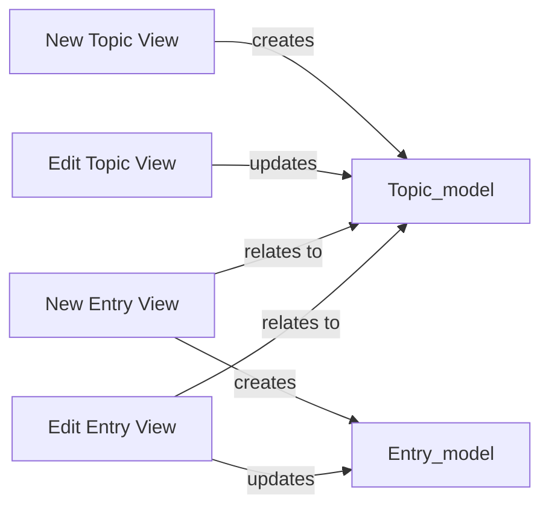

## Component Details

The Views and Controllers component manages user interactions and application presentation logic in the Learning Journal application. It handles HTTP requests, retrieves data from models, renders templates, and processes form submissions. The main flow involves receiving a request, processing it using relevant models, and rendering a response to the user. Its purpose is to orchestrate the flow of data between the user interface and the application's backend.

### New Topic View
The New Topic View handles the creation of new topics. It renders a form for creating a new topic and processes the form submission to save the new topic to the database. It uses the Topic model to create new topic instances.
- **Related Classes/Methods**: `learning_journals.views:new_topic`

### Edit Topic View
The Edit Topic View handles the editing of existing topics. It retrieves a specific topic from the database, renders a form pre-populated with the topic's data, and processes the form submission to update the topic in the database. It uses the Topic model to update existing topic instances.
- **Related Classes/Methods**: `learning_journals.views:edit_topic`

### New Entry View
The New Entry View handles the creation of new entries for a specific topic. It renders a form for creating a new entry and processes the form submission to save the new entry to the database, associating it with the correct topic. It uses the Entry model to create new entry instances and relates them to Topic instances.
- **Related Classes/Methods**: `learning_journals.views:new_entry`

### Edit Entry View
The Edit Entry View handles the editing of existing entries. It retrieves a specific entry from the database, renders a form pre-populated with the entry's data, and processes the form submission to update the entry in the database. It uses the Entry model to update existing entry instances and relates them to Topic instances.
- **Related Classes/Methods**: `learning_journals.views:edit_entry`
