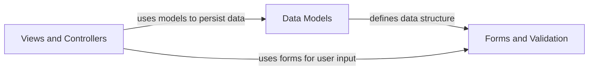

## Component Details

The Learning Journal application allows users to create and manage topics with associated entries. Users can create new topics, edit existing ones, and add entries to each topic. The application provides a user-friendly interface for interacting with the data, ensuring that users can easily record and review their learning experiences.

### Data Models
Defines the structure and behavior of the data stored in the application, including topics and entries. It provides an abstraction layer for interacting with the database and ensures data integrity.
- **Related Classes/Methods**: `learning_journals.models.Topic`, `learning_journals.models.Entry`

### Forms and Validation
Handles the creation, validation, and processing of user input through HTML forms. It defines the fields, validation rules, and rendering logic for topics and entries, ensuring data quality and a smooth user experience.
- **Related Classes/Methods**: `learning_journals.forms.TopicForm`, `learning_journals.forms.EntryForm`

### Views and Controllers
Manages the application's presentation logic and user interactions. It handles HTTP requests, retrieves data from the models, renders templates, and processes form submissions, orchestrating the flow of data between the user interface and the application's backend.
- **Related Classes/Methods**: `learning_journals.views:new_topic`, `learning_journals.views:edit_topic`, `learning_journals.views:new_entry`, `learning_journals.views:edit_entry`