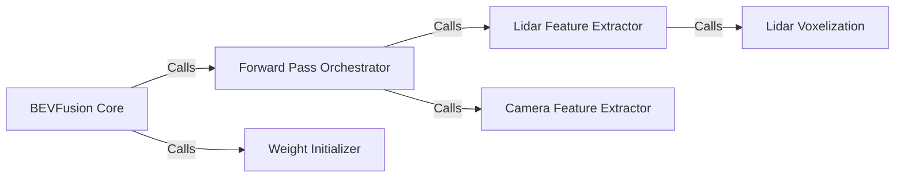

## Details

The `BEVFusion Core` subsystem is a critical part of the AI/ML Toolkit/Library, specifically designed for autonomous driving applications. It adheres to the Data Processing Pipeline and Modular Architecture patterns, focusing on performance and hardware acceleration.

### BEVFusion Core [[Expand]](./BEVFusion_Core.md)
The primary integration and fusion module responsible for unifying processed features from Lidar and Camera encoders into a rich Bird's Eye View (BEV) representation, forming the foundation for 3D object detection. It orchestrates the overall forward pass.

**Related Classes/Methods**:

- <a href="https://github.com/NVIDIA-AI-IOT/Lidar_AI_Solution/blob/master/CUDA-V2XFusion/mmdet3d/models/fusion_models/bevfusion.py#L45-L333" target="_blank" rel="noopener noreferrer">`mmdet3d.models.fusion_models.bevfusion.BEVFusion`:45-333</a>

### Forward Pass Orchestrator
Manages the sequential processing of a single input sample, coordinating the extraction of features from both Lidar and Camera modalities before their fusion. It acts as the entry point for data processing within the `BEVFusion` model's inference.

**Related Classes/Methods**:

- <a href="https://github.com/NVIDIA-AI-IOT/Lidar_AI_Solution/blob/master/CUDA-V2XFusion/mmdet3d/models/fusion_models/bevfusion.py#L45-L333" target="_blank" rel="noopener noreferrer">`mmdet3d.models.fusion_models.bevfusion.BEVFusion:forward_single`:45-333</a>

### Lidar Feature Extractor
Processes raw Lidar point cloud data to derive meaningful features suitable for BEV representation. This often involves converting sparse point clouds into a structured format.

**Related Classes/Methods**:

- <a href="https://github.com/NVIDIA-AI-IOT/Lidar_AI_Solution/blob/master/CUDA-V2XFusion/mmdet3d/models/fusion_models/bevfusion.py#L45-L333" target="_blank" rel="noopener noreferrer">`mmdet3d.models.fusion_models.bevfusion.BEVFusion:extract_lidar_features`:45-333</a>

### Camera Feature Extractor
Processes raw camera image data to extract visual features that complement the Lidar data for a comprehensive BEV representation.

**Related Classes/Methods**:

- <a href="https://github.com/NVIDIA-AI-IOT/Lidar_AI_Solution/blob/master/CUDA-V2XFusion/mmdet3d/models/fusion_models/bevfusion.py#L45-L333" target="_blank" rel="noopener noreferrer">`mmdet3d.models.fusion_models.bevfusion.BEVFusion:extract_camera_features`:45-333</a>

### Weight Initializer
Sets up the initial learnable parameters (weights) for the BEVFusion model, ensuring a stable starting point for training and consistent inference behavior.

**Related Classes/Methods**:

- <a href="https://github.com/NVIDIA-AI-IOT/Lidar_AI_Solution/blob/master/CUDA-V2XFusion/mmdet3d/models/fusion_models/bevfusion.py#L45-L333" target="_blank" rel="noopener noreferrer">`mmdet3d.models.fusion_models.bevfusion.BEVFusion:init_weights`:45-333</a>

### Lidar Voxelization
Transforms unstructured Lidar point cloud data into a regular 3D grid (voxels), which is a prerequisite for efficient processing by 3D convolutional networks.

**Related Classes/Methods**:

- <a href="https://github.com/NVIDIA-AI-IOT/Lidar_AI_Solution/blob/master/CUDA-V2XFusion/mmdet3d/models/fusion_models/bevfusion.py#L45-L333" target="_blank" rel="noopener noreferrer">`mmdet3d.models.fusion_models.bevfusion.BEVFusion:voxelize`:45-333</a>

### [FAQ](https://github.com/CodeBoarding/GeneratedOnBoardings/tree/main?tab=readme-ov-file#faq)