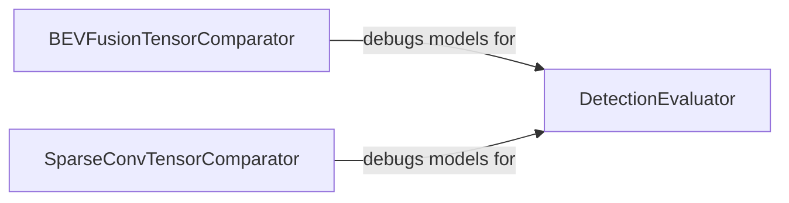

## Details

The core architecture revolves around evaluating and debugging tensor-based models, particularly in the context of 3D perception and BEVFusion. The `DetectionEvaluator` serves as the primary component for quantitative performance assessment, consuming model predictions and ground truth data to produce key metrics like mAP, recall, and precision. Complementing this evaluation, the `BEVFusionTensorComparator` and `SparseConvTensorComparator` components provide essential debugging and validation capabilities. Both comparators are designed to inspect and compare tensor outputs, with `BEVFusionTensorComparator` focusing on the BEVFusion pipeline and `SparseConvTensorComparator` specializing in 3D sparse convolutional networks. These comparators are critical for ensuring data integrity and identifying discrepancies in intermediate tensor values, thereby supporting the development and refinement of the models that `DetectionEvaluator` ultimately assesses.

### DetectionEvaluator
This component is responsible for the quantitative performance assessment of detection models. It calculates and formats standard evaluation metrics such as mean Average Precision (mAP), recall, and precision, based on the model's predictions and ground truth data. It is crucial for understanding the overall accuracy and effectiveness of the detection pipeline.

**Related Classes/Methods**:

- <a href="https://github.com/NVIDIA-AI-IOT/Lidar_AI_Solution/blob/master/CUDA-V2XFusion/evaluators/det_evaluators.py" target="_blank" rel="noopener noreferrer">`CUDA-V2XFusion.evaluators.det_evaluators`</a>

### BEVFusionTensorComparator
Provides utilities for detailed debugging and validation by comparing tensor outputs specifically within the BEVFusion context. It enables developers to inspect intermediate tensor values, identify discrepancies, and ensure data integrity throughout the BEVFusion processing pipeline.

**Related Classes/Methods**:

- <a href="https://github.com/NVIDIA-AI-IOT/Lidar_AI_Solution/blob/master/CUDA-BEVFusion/tool/compare.py" target="_blank" rel="noopener noreferrer">`CUDA-BEVFusion.tool.compare`</a>

### SparseConvTensorComparator
Similar to `BEVFusionTensorComparator`, but specialized for comparing and debugging tensor outputs generated by 3D sparse convolutional networks. This component is vital for validating the correctness of operations within sparse convolution models, which are common in 3D perception.

**Related Classes/Methods**:

- <a href="https://github.com/NVIDIA-AI-IOT/Lidar_AI_Solution/blob/master/libraries/3DSparseConvolution/tool/compare.py" target="_blank" rel="noopener noreferrer">`libraries.3DSparseConvolution.tool.compare`</a>

### [FAQ](https://github.com/CodeBoarding/GeneratedOnBoardings/tree/main?tab=readme-ov-file#faq)