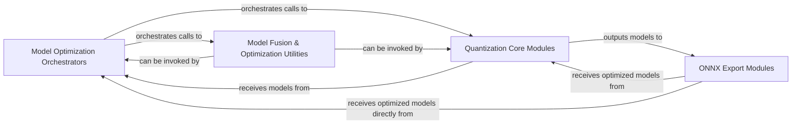

## Details

The model optimization subsystem is designed to enhance the efficiency of deep learning models through quantization and structural optimizations. The Model Optimization Orchestrators component serves as the central control, initiating and managing the entire optimization pipeline, including both Post-Training Quantization (PTQ) and Quantization-Aware Training (QAT). The Quantization Core Modules perform the fundamental task of converting floating-point operations to lower-precision quantized equivalents, with specialized handling for sparse convolutions and calibration. Complementing this, the Model Fusion & Optimization Utilities component refines the computational graph by fusing operations and applying sparse-specific optimizations. Finally, the ONNX Export Modules facilitate the deployment of these optimized models by converting them into the ONNX format, enabling efficient inference with platforms like NVIDIA TensorRT. This structured approach ensures a streamlined and effective model optimization workflow.

### Model Optimization Orchestrators
Initiates and manages the overall model optimization process, including Post-Training Quantization (PTQ) and Quantization-Aware Training (QAT). It serves as the high-level control flow for the entire optimization pipeline.

**Related Classes/Methods**:

- <a href="https://github.com/NVIDIA-AI-IOT/Lidar_AI_Solution/blob/master/CUDA-BEVFusion/qat/ptq.py#L87-L147" target="_blank" rel="noopener noreferrer">`CUDA-BEVFusion.qat.ptq.main`:87-147</a>
- <a href="https://github.com/NVIDIA-AI-IOT/Lidar_AI_Solution/blob/master/CUDA-CenterPoint/qat/det3d/torchie/apis/train.py#L273-L326" target="_blank" rel="noopener noreferrer">`CUDA-CenterPoint.qat.det3d.torchie.apis.train.train_detector_QAT`:273-326</a>

### Quantization Core Modules
Implements the core logic for quantizing model layers. This includes replacing floating-point modules with quantized equivalents, handling specific considerations for sparse convolutions during quantization, and performing calibration to determine optimal quantization parameters. This component directly performs the numerical precision reduction.

**Related Classes/Methods**:

- <a href="https://github.com/NVIDIA-AI-IOT/Lidar_AI_Solution/blob/master/CUDA-BEVFusion/qat/lean/quantize.py#L75-L122" target="_blank" rel="noopener noreferrer">`CUDA-BEVFusion.qat.lean.quantize.SparseConvolutionQunat`:75-122</a>
- <a href="https://github.com/NVIDIA-AI-IOT/Lidar_AI_Solution/blob/master/CUDA-BEVFusion/qat/lean/quantize.py#L136-L145" target="_blank" rel="noopener noreferrer">`CUDA-BEVFusion.qat.lean.quantize.quantize_sparseconv_module`:136-145</a>
- <a href="https://github.com/NVIDIA-AI-IOT/Lidar_AI_Solution/blob/master/CUDA-BEVFusion/qat/lean/quantize.py#L212-L229" target="_blank" rel="noopener noreferrer">`CUDA-BEVFusion.qat.lean.quantize.replace_to_quantization_module`:212-229</a>
- <a href="https://github.com/NVIDIA-AI-IOT/Lidar_AI_Solution/blob/master/CUDA-BEVFusion/qat/lean/quantize.py#L45-L58" target="_blank" rel="noopener noreferrer">`CUDA-BEVFusion.qat.lean.quantize.QuantConcat`:45-58</a>
- <a href="https://github.com/NVIDIA-AI-IOT/Lidar_AI_Solution/blob/master/CUDA-BEVFusion/qat/lean/quantize.py#L60-L73" target="_blank" rel="noopener noreferrer">`CUDA-BEVFusion.qat.lean.quantize.QuantAdd`:60-73</a>

### Model Fusion & Optimization Utilities
Optimizes the computational graph by fusing operations (e.g., merging batch normalization into convolution layers) and specifically handles optimizations pertinent to sparse convolution networks. This component focuses on structural and computational efficiency improvements at the graph level.

**Related Classes/Methods**:

- <a href="https://github.com/NVIDIA-AI-IOT/Lidar_AI_Solution/blob/master/CUDA-BEVFusion/qat/lean/funcs.py#L132-L146" target="_blank" rel="noopener noreferrer">`fuse_sparse_basic_block`:132-146</a>

### ONNX Export Modules
Converts the optimized (potentially quantized and fused) models into the ONNX (Open Neural Network Exchange) format. This conversion is crucial for facilitating efficient deployment with inference engines like NVIDIA TensorRT.

**Related Classes/Methods**:

- <a href="https://github.com/NVIDIA-AI-IOT/Lidar_AI_Solution/blob/master/CUDA-BEVFusion/qat/lean/exptool.py#L371-L445" target="_blank" rel="noopener noreferrer">`export_onnx`:371-445</a>

### [FAQ](https://github.com/CodeBoarding/GeneratedOnBoardings/tree/main?tab=readme-ov-file#faq)