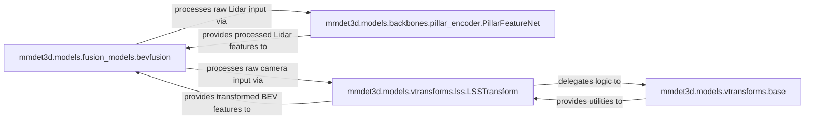

## Details

The `mmdet3d.models.fusion_models.bevfusion` component serves as the central orchestrator for multi-modal sensor fusion. It initiates parallel processing of raw Lidar input by `mmdet3d.models.backbones.pillar_encoder.PillarFeatureNet` and raw camera input by `mmdet3d.models.vtransforms.lss.LSSTransform`. `PillarFeatureNet` extracts processed Lidar features, which are then provided back to `bevfusion`. Concurrently, `LSSTransform` transforms camera inputs into Bird's Eye View (BEV) features, leveraging utilities provided by `mmdet3d.models.vtransforms.base` for its view transformation logic, and then supplies these transformed BEV features to `bevfusion`. Finally, `bevfusion` integrates these distinct Lidar and camera features to form a unified representation for downstream tasks.

### mmdet3d.models.fusion_models.bevfusion
This component acts as the primary entry point and orchestrator for the entire multi-modal feature encoding process. It receives raw Lidar and camera inputs, coordinates their parallel feature extraction, and is responsible for fusing these distinct modal features into a unified representation.

**Related Classes/Methods**:

- <a href="https://github.com/NVIDIA-AI-IOT/Lidar_AI_Solution/blob/master/CUDA-V2XFusion/mmdet3d/models/fusion_models/bevfusion.py#L45-L333" target="_blank" rel="noopener noreferrer">`mmdet3d.models.fusion_models.bevfusion.BEVFusion`:45-333</a>

### mmdet3d.models.backbones.pillar_encoder.PillarFeatureNet
Specializes in processing raw Lidar point cloud data. It performs voxelization and applies sparse convolutions to efficiently extract high-level, meaningful features from the sparse Lidar input.

**Related Classes/Methods**:

- <a href="https://github.com/NVIDIA-AI-IOT/Lidar_AI_Solution/blob/master/CUDA-V2XFusion/mmdet3d/models/backbones/pillar_encoder.py#L133-L230" target="_blank" rel="noopener noreferrer">`mmdet3d.models.backbones.pillar_encoder.PillarFeatureNet`:133-230</a>

### mmdet3d.models.vtransforms.lss.LSSTransform
Transforms 2D camera images into a 3D Bird's Eye View (BEV) representation. This involves projecting image features into a unified 3D grid, effectively creating a common spatial understanding from multiple camera perspectives.

**Related Classes/Methods**:

- <a href="https://github.com/NVIDIA-AI-IOT/Lidar_AI_Solution/blob/master/CUDA-V2XFusion/mmdet3d/models/vtransforms/lss.py#L34-L99" target="_blank" rel="noopener noreferrer">`mmdet3d.models.vtransforms.lss.LSSTransform`:34-99</a>

### mmdet3d.models.vtransforms.base
Provides fundamental methods and utilities essential for view transformations, such as `get_cam_feats`, `bev_pool`, `get_geometry`, and `get_geometry_rays`. These are reusable building blocks that ensure accurate projection and pooling of camera features into the BEV grid.

**Related Classes/Methods**:

- <a href="https://github.com/NVIDIA-AI-IOT/Lidar_AI_Solution/blob/master/CUDA-V2XFusion/mmdet3d/models/vtransforms/base.py#L63-L247" target="_blank" rel="noopener noreferrer">`mmdet3d.models.vtransforms.base.BaseTransform`:63-247</a>

### [FAQ](https://github.com/CodeBoarding/GeneratedOnBoardings/tree/main?tab=readme-ov-file#faq)