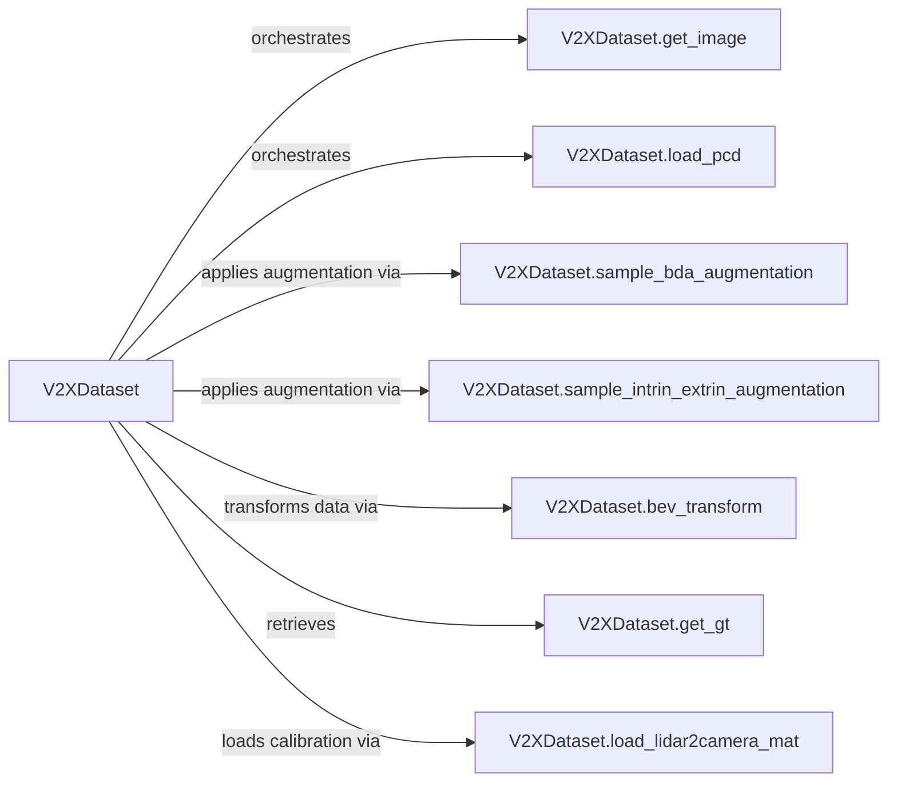

## Details

The V2XDataset subsystem is a comprehensive data pipeline designed for autonomous driving datasets, specifically handling multi-modal sensor data (Lidar and camera) and their associated ground truth. Its core functionality revolves around loading raw sensor inputs, applying various augmentation techniques to enhance data diversity and model robustness, and transforming data into a unified Bird's Eye View (BEV) representation. The subsystem meticulously manages the integration of Lidar and camera data through extrinsic calibration matrices, ensuring accurate spatial alignment. The overall flow is orchestrated by the V2XDataset class, which sequentially invokes its methods to process each data sample from raw input to a model-ready format, including the retrieval of ground truth for supervised learning. The V2XDataset subsystem forms the backbone of the data preparation pipeline for 3D object detection in autonomous driving. Centered around the V2XDataset class, this architecture efficiently manages the ingestion, augmentation, and transformation of multi-modal sensor data, including Lidar point clouds and camera images. It systematically processes raw inputs, applies crucial data augmentation techniques like geometric and intrinsic/extrinsic parameter variations, and unifies diverse sensor streams into a Bird's Eye View representation. The subsystem's robust design ensures that data is consistently prepared and aligned with ground truth annotations, providing a reliable foundation for subsequent model training and evaluation.

### V2XDataset
The central orchestrator of the entire data preprocessing pipeline. It initializes the dataset, manages sample indexing, and coordinates the loading, augmentation, and transformation of raw sensor data.

**Related Classes/Methods**:

- <a href="https://github.com/NVIDIA-AI-IOT/Lidar_AI_Solution/blob/master/CUDA-V2XFusion/mmdet3d/datasets/v2x_dataset.py#L244-L919" target="_blank" rel="noopener noreferrer">`mmdet3d.datasets.v2x_dataset.V2XDataset`:244-919</a>

### V2XDataset.get_image
Responsible for loading raw camera images and applying initial, common image-level transformations before further augmentation.

**Related Classes/Methods**:

- <a href="https://github.com/NVIDIA-AI-IOT/Lidar_AI_Solution/blob/master/CUDA-V2XFusion/mmdet3d/datasets/v2x_dataset.py" target="_blank" rel="noopener noreferrer">`mmdet3d.datasets.v2x_dataset.V2XDataset:get_image`</a>

### V2XDataset.load_pcd
Handles the reading and loading of Lidar point cloud data from its source.

**Related Classes/Methods**:

- <a href="https://github.com/NVIDIA-AI-IOT/Lidar_AI_Solution/blob/master/CUDA-V2XFusion/mmdet3d/datasets/v2x_dataset.py" target="_blank" rel="noopener noreferrer">`mmdet3d.datasets.v2x_dataset.V2XDataset:load_pcd`</a>

### V2XDataset.sample_bda_augmentation
Applies geometric augmentation techniques (e.g., scaling, rotation, translation) to bounding box data and potentially the entire scene, crucial for increasing data diversity and model robustness.

**Related Classes/Methods**:

- <a href="https://github.com/NVIDIA-AI-IOT/Lidar_AI_Solution/blob/master/CUDA-V2XFusion/mmdet3d/datasets/v2x_dataset.py" target="_blank" rel="noopener noreferrer">`mmdet3d.datasets.v2x_dataset.V2XDataset:sample_bda_augmentation`</a>

### V2XDataset.sample_intrin_extrin_augmentation
Introduces variations in camera intrinsic and extrinsic parameters to simulate different sensor placements or calibration errors, enhancing model robustness against real-world sensor inaccuracies.

**Related Classes/Methods**:

- <a href="https://github.com/NVIDIA-AI-IOT/Lidar_AI_Solution/blob/master/CUDA-V2XFusion/mmdet3d/datasets/v2x_dataset.py" target="_blank" rel="noopener noreferrer">`mmdet3d.datasets.v2x_dataset.V2XDataset:sample_intrin_extrin_augmentation`</a>

### V2XDataset.bev_transform
Transforms sensor data (Lidar point clouds and/or camera features) into a Bird's Eye View (BEV) representation, a common and often required input format for autonomous driving models.

**Related Classes/Methods**:

- <a href="https://github.com/NVIDIA-AI-IOT/Lidar_AI_Solution/blob/master/CUDA-V2XFusion/mmdet3d/datasets/v2x_dataset.py" target="_blank" rel="noopener noreferrer">`mmdet3d.datasets.v2x_dataset.V2XDataset:bev_transform`</a>

### V2XDataset.get_gt
Retrieves the ground truth annotations (e.g., object bounding boxes, semantic labels) corresponding to a given data sample, essential for supervised learning tasks.

**Related Classes/Methods**:

- <a href="https://github.com/NVIDIA-AI-IOT/Lidar_AI_Solution/blob/master/CUDA-V2XFusion/mmdet3d/datasets/v2x_dataset.py" target="_blank" rel="noopener noreferrer">`mmdet3d.datasets.v2x_dataset.V2XDataset:get_gt`</a>

### V2XDataset.load_lidar2camera_mat
Loads the extrinsic calibration matrix that defines the spatial relationship and transformation between the Lidar sensor and the camera, critical for sensor fusion.

**Related Classes/Methods**:

- <a href="https://github.com/NVIDIA-AI-IOT/Lidar_AI_Solution/blob/master/CUDA-V2XFusion/mmdet3d/datasets/v2x_dataset.py" target="_blank" rel="noopener noreferrer">`mmdet3d.datasets.v2x_dataset.V2XDataset:load_lidar2camera_mat`</a>

### [FAQ](https://github.com/CodeBoarding/GeneratedOnBoardings/tree/main?tab=readme-ov-file#faq)