```mermaid
graph LR
    Sensor_Data_Preprocessing["Sensor Data Preprocessing"]
    Multi_Modal_Feature_Encoding["Multi-Modal Feature Encoding"]
    BEVFusion_Core["BEVFusion Core"]
    3D_Object_Detection_Prediction["3D Object Detection & Prediction"]
    Model_Optimization_Deployment_Tools["Model Optimization & Deployment Tools"]
    Model_Evaluation_Validation["Model Evaluation & Validation"]
    Sensor_Data_Preprocessing -- "provides data to" --> Multi_Modal_Feature_Encoding
    Multi_Modal_Feature_Encoding -- "sends features to" --> BEVFusion_Core
    BEVFusion_Core -- "outputs features to" --> 3D_Object_Detection_Prediction
    3D_Object_Detection_Prediction -- "sends results to" --> Model_Evaluation_Validation
    3D_Object_Detection_Prediction -- "passes model to" --> Model_Optimization_Deployment_Tools
    Model_Optimization_Deployment_Tools -- "outputs models to" --> Model_Evaluation_Validation
    click Sensor_Data_Preprocessing href "https://github.com/CodeBoarding/GeneratedOnBoardings/blob/main/Lidar_AI_Solution/Sensor_Data_Preprocessing.md" "Details"
    click Multi_Modal_Feature_Encoding href "https://github.com/CodeBoarding/GeneratedOnBoardings/blob/main/Lidar_AI_Solution/Multi_Modal_Feature_Encoding.md" "Details"
    click BEVFusion_Core href "https://github.com/CodeBoarding/GeneratedOnBoardings/blob/main/Lidar_AI_Solution/BEVFusion_Core.md" "Details"
    click Model_Optimization_Deployment_Tools href "https://github.com/CodeBoarding/GeneratedOnBoardings/blob/main/Lidar_AI_Solution/Model_Optimization_Deployment_Tools.md" "Details"
    click Model_Evaluation_Validation href "https://github.com/CodeBoarding/GeneratedOnBoardings/blob/main/Lidar_AI_Solution/Model_Evaluation_Validation.md" "Details"
```

## Details

The Lidar_AI_Solution is architected as a modular, high-performance perception pipeline for autonomous systems. It begins with Sensor Data Preprocessing, which ingests and prepares raw Lidar and camera data. This data then flows into the Multi-Modal Feature Encoding component, where specialized encoders extract rich features from each sensor stream. The core of the system, the BEVFusion Core, intelligently fuses these disparate features into a unified Bird's Eye View representation. This comprehensive BEV feature map is then fed to the 3D Object Detection & Prediction module, which is responsible for identifying and localizing objects in 3D space. For deployment efficiency, the system incorporates Model Optimization & Deployment Tools, enabling quantization (PTQ/QAT) and ONNX export, leveraging hardware acceleration capabilities. Finally, the Model Evaluation & Validation component ensures the accuracy and robustness of the entire perception pipeline, providing critical feedback for development and refinement. This clear component separation facilitates understanding of data flow and allows for distinct visual boundaries in architectural diagrams.

### Sensor Data Preprocessing [[Expand]](./Sensor_Data_Preprocessing.md)
Manages the loading, augmentation, and initial transformation of raw Lidar point clouds and camera images, preparing them for feature extraction.

**Related Classes/Methods**:

- <a href="https://github.com/NVIDIA-AI-IOT/Lidar_AI_Solution/blob/master/CUDA-V2XFusion/mmdet3d/datasets/v2x_dataset.py#L244-L919" target="_blank" rel="noopener noreferrer">`mmdet3d.datasets.v2x_dataset.V2XDataset`:244-919</a>

### Multi-Modal Feature Encoding [[Expand]](./Multi_Modal_Feature_Encoding.md)
Extracts high-level features from both Lidar data (via voxelization and sparse convolutions) and camera images (transforming them into a Bird's Eye View representation).

**Related Classes/Methods**:

- <a href="https://github.com/NVIDIA-AI-IOT/Lidar_AI_Solution/blob/master/CUDA-V2XFusion/mmdet3d/models/backbones/pillar_encoder.py#L133-L230" target="_blank" rel="noopener noreferrer">`mmdet3d.models.backbones.pillar_encoder.PillarFeatureNet`:133-230</a>
- <a href="https://github.com/NVIDIA-AI-IOT/Lidar_AI_Solution/blob/master/CUDA-V2XFusion/mmdet3d/models/vtransforms/lss.py#L34-L99" target="_blank" rel="noopener noreferrer">`mmdet3d.models.vtransforms.lss.LSSTransform`:34-99</a>

### BEVFusion Core [[Expand]](./BEVFusion_Core.md)
Integrates the processed features from both Lidar and Camera encoders into a unified, rich Bird's Eye View (BEV) representation, forming the foundation for 3D object detection.

**Related Classes/Methods**:

- <a href="https://github.com/NVIDIA-AI-IOT/Lidar_AI_Solution/blob/master/CUDA-V2XFusion/mmdet3d/models/fusion_models/bevfusion.py#L45-L333" target="_blank" rel="noopener noreferrer">`mmdet3d.models.fusion_models.bevfusion.BEVFusion`:45-333</a>

### 3D Object Detection & Prediction
Utilizes the fused BEV features to predict 3D bounding boxes and other object properties, representing the primary output of the perception pipeline.

**Related Classes/Methods**:

- <a href="https://github.com/NVIDIA-AI-IOT/Lidar_AI_Solution/blob/master/CUDA-V2XFusion/mmdet3d/models/fusion_models/bevfusion.py#L45-L333" target="_blank" rel="noopener noreferrer">`mmdet3d.models.fusion_models.bevfusion.BEVFusion`:45-333</a>

### Model Optimization & Deployment Tools [[Expand]](./Model_Optimization_Deployment_Tools.md)
Provides functionalities for optimizing trained models through Post-Training Quantization (PTQ) and Quantization-Aware Training (QAT), and facilitates their conversion to the ONNX format for efficient deployment with TensorRT. This component also leverages sparse convolution optimizations.

**Related Classes/Methods**:

- <a href="https://github.com/NVIDIA-AI-IOT/Lidar_AI_Solution/blob/master/CUDA-BEVFusion/qat/ptq.py#L87-L147" target="_blank" rel="noopener noreferrer">`CUDA-BEVFusion.qat.ptq.main`:87-147</a>
- <a href="https://github.com/NVIDIA-AI-IOT/Lidar_AI_Solution/blob/master/CUDA-CenterPoint/qat/det3d/torchie/apis/train.py#L273-L326" target="_blank" rel="noopener noreferrer">`CUDA-CenterPoint.qat.det3d.torchie.apis.train.train_detector_QAT`:273-326</a>
- <a href="https://github.com/NVIDIA-AI-IOT/Lidar_AI_Solution/blob/master/CUDA-BEVFusion/qat/lean/exptool.py#L371-L445" target="_blank" rel="noopener noreferrer">`export_onnx`:371-445</a>
- <a href="https://github.com/NVIDIA-AI-IOT/Lidar_AI_Solution/blob/master/CUDA-BEVFusion/qat/lean/funcs.py#L132-L146" target="_blank" rel="noopener noreferrer">`fuse_sparse_basic_block`:132-146</a>

### Model Evaluation & Validation [[Expand]](./Model_Evaluation_Validation.md)
Offers capabilities to evaluate the performance of detection models, compare tensor outputs for debugging, and validate the overall accuracy and integrity of the perception pipeline.

**Related Classes/Methods**:

- <a href="https://github.com/NVIDIA-AI-IOT/Lidar_AI_Solution/blob/master/CUDA-V2XFusion/evaluators/det_evaluators.py#L105-L125" target="_blank" rel="noopener noreferrer">`evaluate`:105-125</a>
- <a href="https://github.com/NVIDIA-AI-IOT/Lidar_AI_Solution/blob/master/CUDA-BEVFusion/tool/compare.py#L99-L150" target="_blank" rel="noopener noreferrer">`compare_and_print`:99-150</a>

### [FAQ](https://github.com/CodeBoarding/GeneratedOnBoardings/tree/main?tab=readme-ov-file#faq)