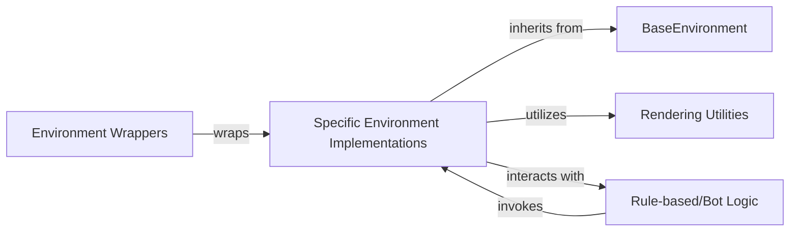

## Details

The LightZero environment subsystem is designed around a flexible and extensible architecture, centered on the `BaseEnvironment` abstract component. This component establishes a universal interface for all environments, ensuring consistent interaction with the `Policy` component. `Specific Environment Implementations` provide the concrete game or task logic, inheriting from `BaseEnvironment` to manage simulation state, process actions, and determine outcomes. To enhance or modify environment behavior without altering core logic, `Environment Wrappers` are employed, also adhering to the `BaseEnvironment` interface, allowing for modular transformations like reward shaping or observation space adjustments. For visualization and debugging, `Rendering Utilities` are utilized by `Specific Environment Implementations` to display environment states. Additionally, `Rule-based/Bot Logic` provides non-learning behaviors, enabling self-play or baseline evaluations by interacting with `Specific Environment Implementations`. This structured design facilitates the integration of diverse environments and supports various experimental setups within the LightZero framework.

### BaseEnvironment
Defines the fundamental contract and interface for all environments within LightZero. It specifies core methods like `reset`, `step`, `legal_actions`, `current_state`, `observe`, `get_done_winner`, `is_done`, `simulate_action`, and `render`. This component ensures a consistent API for interaction with the `Policy` and facilitates the integration of diverse environments.

**Related Classes/Methods**:

### Specific Environment Implementations
Provides the concrete game or task logic for a particular environment (e.g., Atari, Chess, Game 2048). It manages the internal state of the simulation, processes actions received from the `Policy`, calculates rewards, determines termination conditions, and generates observations. These implementations adhere to the `BaseEnvironment` interface.

**Related Classes/Methods**:

- <a href="https://github.com/opendilab/LightZero/blob/main/zoo/atari/envs/atari_lightzero_env.py" target="_blank" rel="noopener noreferrer">`zoo.atari.envs.atari_lightzero_env.AtariLightZeroEnv`</a>
- <a href="https://github.com/opendilab/LightZero/blob/main/zoo/board_games/chess/envs/chess_lightzero_env.py#L18-L373" target="_blank" rel="noopener noreferrer">`zoo.board_games.chess.envs.chess_lightzero_env.ChessLightZeroEnv`:18-373</a>
- <a href="https://github.com/opendilab/LightZero/blob/main/zoo/game_2048/envs/game_2048_env.py#L21-L765" target="_blank" rel="noopener noreferrer">`zoo.game_2048.envs.game_2048_env.Game2048Env`:21-765</a>

### Environment Wrappers
Modifies or enhances the behavior of an underlying `Specific Environment Implementation` without altering its core logic. This can include observation space transformations, reward shaping, frame stacking, or adding episode termination conditions. They adhere to the `BaseEnvironment` interface, allowing them to be stacked or used interchangeably with raw environments.

**Related Classes/Methods**:

- <a href="https://github.com/opendilab/LightZero/blob/main/zoo/atari/envs/atari_wrappers.py" target="_blank" rel="noopener noreferrer">`zoo.atari.envs.atari_wrappers.AtariWrappers`</a>

### Rendering Utilities
Provides functionalities for visualizing the environment's state, typically for debugging, analysis, or generating visual demonstrations of agent behavior. This includes methods to capture and display frames or create GIFs from simulation data.

**Related Classes/Methods**:

### Rule-based/Bot Logic
Implements predefined, non-learning behaviors or policies for specific environments. This is crucial for enabling self-play, evaluating learning agents against a baseline, or generating initial training data by providing a non-learning opponent or co-player.

**Related Classes/Methods**:

### [FAQ](https://github.com/CodeBoarding/GeneratedOnBoardings/tree/main?tab=readme-ov-file#faq)