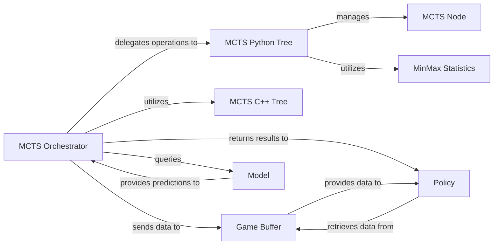

## Details

The `lzero.mcts` subsystem orchestrates Monte Carlo Tree Search (MCTS) for reinforcement learning. At its core, the `MCTS Orchestrator` drives the search process, delegating tree management to either the `MCTS Python Tree` for flexibility or the `MCTS C++ Tree` for performance-critical operations. Both tree implementations rely on the `MCTS Node` as the fundamental data structure. The `MinMax Statistics` component aids in normalizing value estimates within the tree. Game data generated during simulations is stored in the `Game Buffer`, which then feeds into the `Policy` component for training and decision-making. The `Model` is an external component that provides crucial predictions (policy and value) to guide the MCTS search.

### MCTS Orchestrator
This component is the central coordinator of the MCTS algorithm. It drives the main search loop, managing the simulation, expansion, backup, and selection phases. It delegates tree operations to the `MCTS Python Tree` and queries the `Model` for predictions.

**Related Classes/Methods**:

- <a href="https://github.com/opendilab/LightZero/blob/main/lzero/mcts/tree_search/mcts_ptree.py" target="_blank" rel="noopener noreferrer">`lzero.mcts.tree_search.mcts_ptree`</a>

### MCTS Python Tree
Manages the in-memory MCTS tree structure implemented in Python. It handles node creation, updates, UCB (Upper Confidence Bound) calculations for selection, and the application of Dirichlet noise for exploration.

**Related Classes/Methods**:

- <a href="https://github.com/opendilab/LightZero/blob/main/lzero/mcts/ptree/ptree_az.py" target="_blank" rel="noopener noreferrer">`lzero.mcts.ptree.ptree_az`</a>

### MCTS C++ Tree
Provides a performance-optimized C++ implementation for critical MCTS tree operations. This component is leveraged by the `MCTS Orchestrator` for speed-sensitive parts of the search, aligning with the "Dual MCTS Implementation" bias.

**Related Classes/Methods**:

- <a href="https://github.com/opendilab/LightZero/blob/main/lzero/mcts/ctree/ctree_alphazero/mcts_alphazero.cpp" target="_blank" rel="noopener noreferrer">`lzero.mcts.ctree.ctree_alphazero.mcts_alphazero`</a>

### MCTS Node
The fundamental data structure representing a single state or node within the MCTS search tree. Each node stores essential information such as visit counts, action values (Q-values), policy probabilities, and references to child nodes.

**Related Classes/Methods**:

- <a href="https://github.com/opendilab/LightZero/blob/main/lzero/mcts/ptree/ptree_az.py" target="_blank" rel="noopener noreferrer">`lzero.mcts.ptree.ptree_az.Node`</a>

### Game Buffer
Manages the storage and sampling of game data (e.g., states, actions, rewards, MCTS policy distributions) generated during MCTS simulations. This data is crucial for training the `Model` and `Policy`.

**Related Classes/Methods**:

- <a href="https://github.com/opendilab/LightZero/blob/main/lzero/mcts/buffer/game_buffer.py" target="_blank" rel="noopener noreferrer">`lzero.mcts.buffer.game_buffer`</a>

### MinMax Statistics
A utility component used within the MCTS tree to track the minimum and maximum observed values across the search tree. This is often used for normalizing Q-values, which can improve the stability and performance of the MCTS algorithm.

**Related Classes/Methods**:

- <a href="https://github.com/opendilab/LightZero/blob/main/lzero/mcts/ptree/minimax.py#L9-L70" target="_blank" rel="noopener noreferrer">`lzero.mcts.ptree.minimax.MinMaxStats`:9-70</a>

### Model [[Expand]](./Model.md)
An external component that provides predictions (e.g., policy logits and value estimates) for given states. The `MCTS Orchestrator` queries this `Model` to guide its search and evaluate new nodes. As an external component, it lacks internal source code references within this subsystem.

**Related Classes/Methods**: _None_

### Policy [[Expand]](./Policy.md)
An external component that receives the optimal actions or search statistics (e.g., visit counts for each action) from the `MCTS Orchestrator`. It uses this information for decision-making in the environment and for updating the `Model` based on collected game data from the `Game Buffer`. As an external component, it lacks internal source code references within this subsystem.

**Related Classes/Methods**: _None_

### [FAQ](https://github.com/CodeBoarding/GeneratedOnBoardings/tree/main?tab=readme-ov-file#faq)