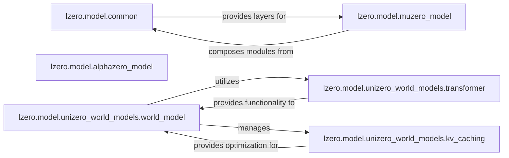

## Details

The `Model` subsystem is a crucial part of the `lzero` project, providing the neural network architectures and computational graphs required for various reinforcement learning algorithms. It is designed with a clear separation of concerns, offering both general-purpose building blocks and algorithm-specific implementations.

### lzero.model.common
This component provides a collection of fundamental, reusable neural network layers (e.g., MLP_V2, DownSample, SimNorm) and general utilities. These serve as the basic building blocks for constructing more complex models across different algorithms.

**Related Classes/Methods**:

- <a href="https://github.com/opendilab/LightZero/blob/main/lzero/model/common.py" target="_blank" rel="noopener noreferrer">`lzero.model.common`</a>

### lzero.model.alphazero_model
This component implements the specific neural network architecture tailored for AlphaZero algorithms. It typically includes a policy head for predicting move probabilities and a value head for evaluating the state.

**Related Classes/Methods**:

- <a href="https://github.com/opendilab/LightZero/blob/main/lzero/model/alphazero_model.py" target="_blank" rel="noopener noreferrer">`lzero.model.alphazero_model`</a>

### lzero.model.muzero_model
This component encapsulates the core MuZero-style neural networks, which typically include a Representation Network (encodes raw observations into a latent state), a Dynamics Network (predicts the next latent state and reward), and a Prediction Network (predicts policy and value from a latent state). It also covers variants like EfficientZero, Sampled MuZero, and Stochastic MuZero models.

**Related Classes/Methods**:

- <a href="https://github.com/opendilab/LightZero/blob/main/lzero/model/muzero_model.py" target="_blank" rel="noopener noreferrer">`lzero.model.muzero_model`</a>

### lzero.model.unizero_world_models.world_model
This component implements a comprehensive world model for UniZero, designed to learn and predict environment dynamics. It is responsible for forecasting future observations, rewards, and policies based on current states and actions.

**Related Classes/Methods**:

- <a href="https://github.com/opendilab/LightZero/blob/main/lzero/model/unizero_world_models/world_model.py" target="_blank" rel="noopener noreferrer">`lzero.model.unizero_world_models.world_model`</a>

### lzero.model.unizero_world_models.transformer
This component provides the transformer architecture, which is a critical element for handling sequential data and learning long-range dependencies within the `unizero_world_models.world_model`.

**Related Classes/Methods**:

- <a href="https://github.com/opendilab/LightZero/blob/main/lzero/model/unizero_world_models/transformer.py" target="_blank" rel="noopener noreferrer">`lzero.model.unizero_world_models.transformer`</a>

### lzero.model.unizero_world_models.kv_caching
This component manages key-value caching mechanisms specifically designed to optimize the performance of transformer operations within the `unizero_world_models.world_model`, particularly for efficient handling of long input sequences.

**Related Classes/Methods**:

- <a href="https://github.com/opendilab/LightZero/blob/main/lzero/model/unizero_world_models/kv_caching.py" target="_blank" rel="noopener noreferrer">`lzero.model.unizero_world_models.kv_caching`</a>

### [FAQ](https://github.com/CodeBoarding/GeneratedOnBoardings/tree/main?tab=readme-ov-file#faq)