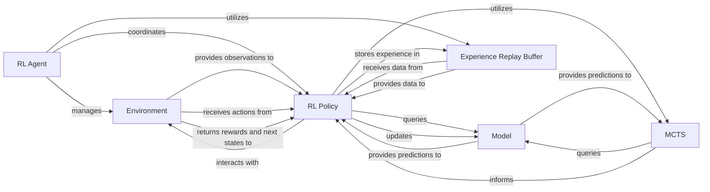

## Details

The `lzero` project implements a modular architecture for Zero-style reinforcement learning algorithms. At its core, the **RL Agent** orchestrates the entire learning pipeline, managing the interaction between the **RL Policy**, **Model**, **MCTS**, **Experience Replay Buffer**, and **Environment**. The **RL Policy** is responsible for the algorithm's logic, utilizing the **Model** for predictions and **MCTS** for informed action selection. Experiences gathered from the **Environment** are stored in the **Experience Replay Buffer**, which then feeds data back to the **RL Policy** for model updates. This cyclical interaction allows the system to continuously improve its performance through self-play and learning from accumulated experience.

### RL Agent
Manages the overall training and evaluation workflow. It initializes and coordinates interactions between the Policy, Environment, Learner, Collector, Evaluator, and Replay Buffer components. It handles experiment setup, logging, and checkpointing.

**Related Classes/Methods**:

- <a href="https://github.com/opendilab/LightZero/blob/main/lzero/agent/alphazero.py#L25-L381" target="_blank" rel="noopener noreferrer">`lzero.agent.alphazero.AlphaZeroAgent`:25-381</a>

### RL Policy
Implements the core logic of the reinforcement learning algorithm (e.g., AlphaZero, MuZero, EfficientZero). This includes defining the neural network architecture (Model), performing Monte Carlo Tree Search (MCTS) for action selection, calculating losses, and updating the model parameters during learning. It has distinct modes for collection, learning, and evaluation.

**Related Classes/Methods**:

- <a href="https://github.com/opendilab/LightZero/blob/main/lzero/policy/muzero.py#L24-L1055" target="_blank" rel="noopener noreferrer">`lzero.policy.muzero.MuZeroPolicy`:24-1055</a>

### Model [[Expand]](./Model.md)
Represents the neural network architecture used by the RL Policy. It typically includes a representation network (to encode observations into latent states), a dynamics network (to predict next states and rewards), and a prediction network (to output policy logits and value estimates).

**Related Classes/Methods**:

- <a href="https://github.com/opendilab/LightZero/blob/main/lzero/model/alphazero_model.py#L19-L206" target="_blank" rel="noopener noreferrer">`lzero.model.alphazero_model.AlphaZeroModel`:19-206</a>

### MCTS [[Expand]](./MCTS.md)
Executes the tree search algorithm to determine optimal actions. It simulates future trajectories, expands the search tree, and calculates visit counts and Q-values to guide action selection.

**Related Classes/Methods**:

- <a href="https://github.com/opendilab/LightZero/blob/main/lzero/mcts/ptree/ptree_az.py#L154-L441" target="_blank" rel="noopener noreferrer">`lzero.mcts.ptree.ptree_az.MCTS`:154-441</a>

### Experience Replay Buffer
Stores collected experience data (game segments or transitions) from the Environment. It provides mechanisms for sampling batches of data for policy learning, often incorporating prioritization schemes.

**Related Classes/Methods**:

- <a href="https://github.com/opendilab/LightZero/blob/main/lzero/mcts/buffer/game_buffer.py#L15-L640" target="_blank" rel="noopener noreferrer">`lzero.mcts.buffer.game_buffer.GameBuffer`:15-640</a>

### Environment
Represents the simulation environment with which the RL Agent and Policy interact. It provides observations, processes actions, and returns rewards and next states.

**Related Classes/Methods**:

- <a href="https://github.com/opendilab/LightZero/blob/main/lzero/envs/wrappers/lightzero_env_wrapper.py#L9-L113" target="_blank" rel="noopener noreferrer">`lzero.envs.wrappers.lightzero_env_wrapper.LightZeroEnvWrapper`:9-113</a>

### [FAQ](https://github.com/CodeBoarding/GeneratedOnBoardings/tree/main?tab=readme-ov-file#faq)