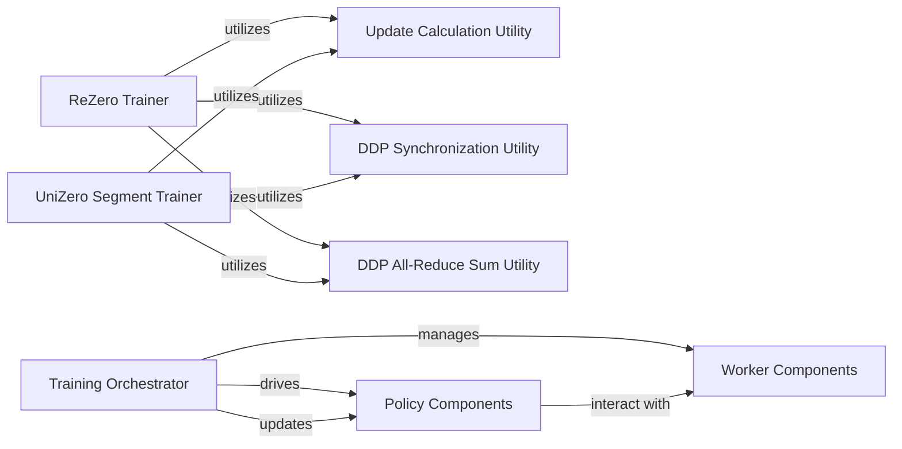

## Details

Analysis of the Training Orchestrator subsystem within the LightZero project, detailing its components, responsibilities, and interactions.

### Training Orchestrator [[Expand]](./Training_Orchestrator.md)
The overarching component that initiates and manages the entire training process for different reinforcement learning algorithms. It coordinates the interaction between policy, worker, and utility components.

**Related Classes/Methods**:

- <a href="https://github.com/opendilab/LightZero/blob/main/lzero/entry/train_rezero.py" target="_blank" rel="noopener noreferrer">`lzero.entry.train_rezero`</a>
- <a href="https://github.com/opendilab/LightZero/blob/main/lzero/entry/train_unizero_segment.py" target="_blank" rel="noopener noreferrer">`lzero.entry.train_unizero_segment`</a>
- <a href="https://github.com/opendilab/LightZero/blob/main/lzero/entry/utils.py" target="_blank" rel="noopener noreferrer">`lzero.entry.utils`</a>

### ReZero Trainer
The main entry point and orchestrator for the ReZero algorithm's training loop. It sets up the environment, policy, and workers, and drives the training iterations.

**Related Classes/Methods**:

- <a href="https://github.com/opendilab/LightZero/blob/main/lzero/entry/train_rezero.py#L23-L206" target="_blank" rel="noopener noreferrer">`lzero.entry.train_rezero.train_rezero`:23-206</a>

### UniZero Segment Trainer
The main entry point and orchestrator for the UniZero segment training process. Similar to ReZero Trainer, it manages the specific training flow for UniZero.

**Related Classes/Methods**:

- <a href="https://github.com/opendilab/LightZero/blob/main/lzero/entry/train_unizero_segment.py#L28-L230" target="_blank" rel="noopener noreferrer">`lzero.entry.train_unizero_segment.train_unizero_segment`:28-230</a>

### Update Calculation Utility
A utility function used by the trainers to determine the number of policy updates to perform per data collection step, crucial for efficient training.

**Related Classes/Methods**:

- <a href="https://github.com/opendilab/LightZero/blob/main/lzero/entry/utils.py#L44-L92" target="_blank" rel="noopener noreferrer">`lzero.entry.utils.calculate_update_per_collect`:44-92</a>

### DDP Synchronization Utility
A utility function for synchronizing processes in a Distributed Data Parallel (DDP) training setup, ensuring consistent state across multiple training nodes.

**Related Classes/Methods**:

- <a href="https://github.com/opendilab/LightZero/blob/main/lzero/entry/utils.py#L21-L27" target="_blank" rel="noopener noreferrer">`lzero.entry.utils.ddp_synchronize`:21-27</a>

### DDP All-Reduce Sum Utility
A utility function for performing an all-reduce sum operation across DDP processes, typically used for aggregating gradients or statistics in distributed training.

**Related Classes/Methods**:

- <a href="https://github.com/opendilab/LightZero/blob/main/lzero/entry/utils.py#L29-L42" target="_blank" rel="noopener noreferrer">`lzero.entry.utils.ddp_all_reduce_sum`:29-42</a>

### Policy Components
Represents various policy implementations (e.g., AlphaZero, MuZero policies) that are configured, activated, and updated by the Training Orchestrator. These components encapsulate the decision-making logic.

**Related Classes/Methods**:

- <a href="https://github.com/opendilab/LightZero/blob/main/lzero/policy/alphazero.py" target="_blank" rel="noopener noreferrer">`lzero.policy.alphazero`</a>
- <a href="https://github.com/opendilab/LightZero/blob/main/lzero/policy/muzero.py" target="_blank" rel="noopener noreferrer">`lzero.policy.muzero`</a>

### Worker Components
Represents components responsible for interacting with the environment, collecting data, and evaluating policies (e.g., AlphaZero collector, MuZero evaluator). These are managed and coordinated by the Training Orchestrator.

**Related Classes/Methods**:

- <a href="https://github.com/opendilab/LightZero/blob/main/lzero/worker/alphazero_collector.py" target="_blank" rel="noopener noreferrer">`lzero.worker.alphazero_collector`</a>
- <a href="https://github.com/opendilab/LightZero/blob/main/lzero/worker/muzero_evaluator.py" target="_blank" rel="noopener noreferrer">`lzero.worker.muzero_evaluator`</a>

### [FAQ](https://github.com/CodeBoarding/GeneratedOnBoardings/tree/main?tab=readme-ov-file#faq)