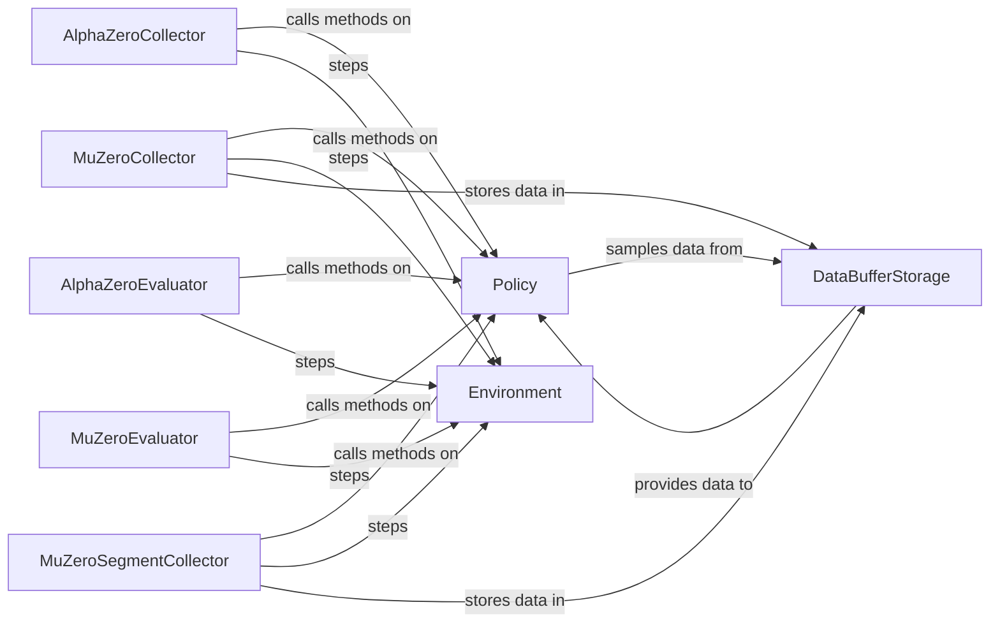

## Details

The `lzero` training and evaluation subsystem orchestrates the interaction between reinforcement learning agents and their environments. At its core, `Collector` components gather experience by having a `Policy` interact with an `Environment`, storing the resulting data in a `DataBufferStorage`. Concurrently, `Evaluator` components assess the `Policy`'s performance against the `Environment`. The `Policy` itself is the central decision-making unit, learning from the data provided by the `DataBufferStorage` to improve its action selection within the `Environment`. This cyclical process of data collection, storage, learning, and evaluation drives the agent's development.

### AlphaZeroCollector
Collects training data specifically for AlphaZero algorithms. It interacts with the `Policy` to get actions and the `Environment` to execute steps and observe outcomes.

**Related Classes/Methods**:

- <a href="https://github.com/opendilab/LightZero/blob/main/lzero/worker/alphazero_collector.py" target="_blank" rel="noopener noreferrer">`lzero.worker.alphazero_collector`</a>

### AlphaZeroEvaluator
Evaluates the performance of AlphaZero policies by interacting with the `Policy` and `Environment` in an evaluation setting.

**Related Classes/Methods**:

- <a href="https://github.com/opendilab/LightZero/blob/main/lzero/worker/alphazero_evaluator.py" target="_blank" rel="noopener noreferrer">`lzero.worker.alphazero_evaluator`</a>

### MuZeroCollector
Collects training data for MuZero algorithms, including handling trajectory padding and priority computation. It interacts with the `Policy`, `Environment`, and stores data in the `DataBufferStorage`.

**Related Classes/Methods**:

- <a href="https://github.com/opendilab/LightZero/blob/main/lzero/worker/muzero_collector.py" target="_blank" rel="noopener noreferrer">`lzero.worker.muzero_collector`</a>

### MuZeroEvaluator
Evaluates the performance of MuZero policies by interacting with the `Policy` and `Environment` in an evaluation setting.

**Related Classes/Methods**:

- <a href="https://github.com/opendilab/LightZero/blob/main/lzero/worker/muzero_evaluator.py" target="_blank" rel="noopener noreferrer">`lzero.worker.muzero_evaluator`</a>

### MuZeroSegmentCollector
A specialized collector for MuZero, optimized for segmented data collection, interacting with the `Policy`, `Environment`, and `DataBufferStorage`.

**Related Classes/Methods**:

- <a href="https://github.com/opendilab/LightZero/blob/main/lzero/worker/muzero_segment_collector.py" target="_blank" rel="noopener noreferrer">`lzero.worker.muzero_segment_collector`</a>

### Policy [[Expand]](./Policy.md)
Represents the agent's decision-making logic, providing actions based on observations. It is a key dependency for all `Collector` and `Evaluator` components, and interacts with the `DataBufferStorage` during learning.

**Related Classes/Methods**:

- <a href="https://github.com/opendilab/LightZero/blob/main/lzero/policy/muzero.py#L24-L1055" target="_blank" rel="noopener noreferrer">`lzero.policy.muzero.MuZeroPolicy`:24-1055</a>

### Environment
Simulates the world or task the agent interacts with, providing observations and rewards in response to actions. It is a key dependency for all `Collector` and `Evaluator` components.

**Related Classes/Methods**:

- <a href="https://github.com/opendilab/LightZero/blob/main/lzero/envs/wrappers/lightzero_env_wrapper.py#L9-L113" target="_blank" rel="noopener noreferrer">`lzero.envs.wrappers.lightzero_env_wrapper.LightZeroEnvWrapper`:9-113</a>

### DataBufferStorage
Stores collected data (e.g., trajectories, transitions) for training purposes, often acting as a replay buffer. It is a dependency for MuZero-specific collectors and provides data to the `Policy` for learning.

**Related Classes/Methods**:

- <a href="https://github.com/opendilab/LightZero/blob/main/lzero/mcts/buffer/game_buffer.py#L15-L640" target="_blank" rel="noopener noreferrer">`lzero.mcts.buffer.game_buffer.GameBuffer`:15-640</a>

### [FAQ](https://github.com/CodeBoarding/GeneratedOnBoardings/tree/main?tab=readme-ov-file#faq)