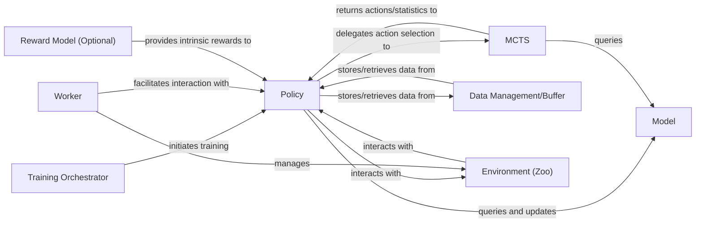

## Details

The LightZero project implements a modular reinforcement learning framework centered around a Policy component. This Policy drives the learning process by interacting with a Model for state representation and prediction, and utilizing MCTS for advanced decision-making. The Training Orchestrator oversees the entire training and evaluation workflow, while Worker components efficiently manage parallel interactions between the Policy and various Environment (Zoo) instances for data collection. A Data Management/Buffer handles the storage and retrieval of experience data, and an optional Reward Model can enhance learning through intrinsic rewards. This architecture promotes clear separation of concerns, enabling flexible experimentation with different RL algorithms and environments.

### Policy [[Expand]](./Policy.md)
The central decision-maker and learning agent; it queries the Model for predictions (e.g., state representation, value, policy) and updates the Model's parameters during the learning phase.

**Related Classes/Methods**: _None_

### Model [[Expand]](./Model.md)
A passive data structure and computational graph used by the Policy for neural network computations (predictions, value estimations).

**Related Classes/Methods**: _None_

### MCTS [[Expand]](./MCTS.md)
Performs tree searches, often querying the Model for predictions to guide its search, and then returns optimal actions or statistics back to the Policy.

**Related Classes/Methods**: _None_

### Data Management/Buffer
Stores and provides experience data for the Policy's learning updates.

**Related Classes/Methods**: _None_

### Training Orchestrator [[Expand]](./Training_Orchestrator.md)
Initiates and manages the overall training process, primarily by activating and configuring the Policy.

**Related Classes/Methods**: _None_

### Worker [[Expand]](./Worker.md)
Manages interactions between the Policy and various Environment (Zoo) instances, facilitating parallel data collection and evaluation runs.

**Related Classes/Methods**: _None_

### Environment (Zoo) [[Expand]](./Environment_Zoo_.md)
Provides the simulation context, receiving actions from the Policy (via Worker) and returning new states, rewards, and termination signals.

**Related Classes/Methods**: _None_

### Reward Model (Optional)
Provides intrinsic rewards to the Policy, influencing its learning and exploration strategies.

**Related Classes/Methods**: _None_

### [FAQ](https://github.com/CodeBoarding/GeneratedOnBoardings/tree/main?tab=readme-ov-file#faq)