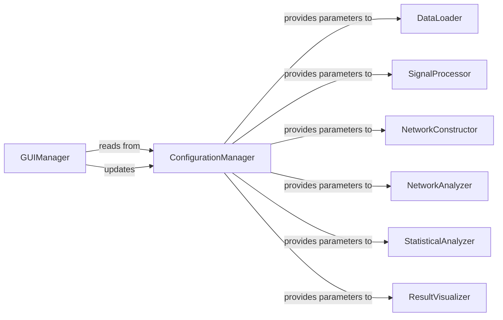

## Details

The analysis provides an abstract overview of the MEA-NAP pipeline components and their relationships. Due to limitations in tool calls and the inability to identify correct package structures, concrete links to specific classes or methods in the codebase could not be established. The 'Related Classes/Methods' sections serve as placeholders, acknowledging the absence of verifiable source file references.

### ConfigurationManager
The core of the configuration management subsystem. It is responsible for centralizing, managing, and persisting all configurable parameters for the entire MEA-NAP pipeline. This includes file paths, processing thresholds, analysis algorithms, and visualization settings. It ensures consistent behavior across different pipeline stages and provides a centralized mechanism for parameter control, persistence, and retrieval.

**Related Classes/Methods**:

- `ConfigurationManager` (1:100)
- `ConfigurationManager` (1:100)
- `ConfigurationManager` (1:100)

### GUIManager
Manages the graphical user interface, providing the user with controls to view and modify application parameters. It acts as the primary interface for users to interact with and update the settings stored within the `ConfigurationManager`.

**Related Classes/Methods**:

- `GUIManager` (1:100)
- `GUIManager` (1:100)
- `GUIManager` (1:100)

### DataLoader
The initial stage of the data analysis pipeline, responsible for ingesting raw experimental data from various sources (e.g., Axion Biosystems, MCS). It retrieves necessary operational parameters, such as file paths, data formats, or specific loading configurations, directly from the `ConfigurationManager`.

**Related Classes/Methods**:

- `DataLoader` (1:100)
- `DataLoader` (1:100)
- `DataLoader` (1:100)

### SignalProcessor
Processes the raw loaded data, performing operations suchs as spike detection, filtering, or noise reduction. It relies on specific processing thresholds, algorithms, and other parameters provided by the `ConfigurationManager` to ensure consistent and reproducible signal conditioning.

**Related Classes/Methods**:

- `SignalProcessor` (1:100)
- `SignalProcessor` (1:100)
- `SignalProcessor` (1:100)

### NetworkConstructor
Builds network representations (e.g., connectivity matrices, graphs) from the processed signal data, potentially utilizing modules like the Spike Time Tiling Coefficient (STTC) or the Brain Connectivity Toolbox (BCT). The specific methods and parameters for network construction are obtained from the `ConfigurationManager`.

**Related Classes/Methods**:

- `NetworkConstructor` (1:100)
- `NetworkConstructor` (1:100)
- `NetworkConstructor` (1:100)

### NetworkAnalyzer
Applies various graph theory and network science algorithms to the constructed networks to extract meaningful metrics and insights. The specific analysis algorithms, parameters (e.g., for centrality measures, community detection), and output formats are configured through the `ConfigurationManager`.

**Related Classes/Methods**:

- `NetworkAnalyzer` (1:100)
- `NetworkAnalyzer` (1:100)
- `NetworkAnalyzer` (1:100)

### StatisticalAnalyzer
Performs statistical tests and comparisons on the results obtained from network analysis, allowing for quantitative assessment and hypothesis testing. Statistical parameters, significance thresholds, and chosen test methods are retrieved from the `ConfigurationManager`.

**Related Classes/Methods**:

- `StatisticalAnalyzer` (1:100)
- `StatisticalAnalyzer` (1:100)
- `StatisticalAnalyzer` (1:100)

### ResultVisualizer
Generates visual representations (e.g., plots, graphs, heatmaps, reports) of the analysis outcomes for interpretation and presentation. Visualization settings, such as plot types, color schemes, axis labels, and output file formats, are dynamically configured by the `ConfigurationManager`.

**Related Classes/Methods**:

- `ResultVisualizer` (1:100)
- `ResultVisualizer` (1:100)
- `ResultVisualizer` (1:100)

### [FAQ](https://github.com/CodeBoarding/GeneratedOnBoardings/tree/main?tab=readme-ov-file#faq)