```mermaid
graph LR
    Data_Ingestion_Module["Data Ingestion Module"]
    Signal_Processing_Module["Signal Processing Module"]
    Network_Construction_Module["Network Construction Module"]
    Network_Analysis_Module["Network Analysis Module"]
    Statistical_Analysis_Module["Statistical Analysis Module"]
    Visualization_Reporting_Module["Visualization/Reporting Module"]
    User_Interface_GUI_Module["User Interface (GUI) Module"]
    Configuration_Management_Module["Configuration Management Module"]
    Data_Ingestion_Module -- "passes data to" --> Signal_Processing_Module
    Configuration_Management_Module -- "provides configuration to" --> Data_Ingestion_Module
    Signal_Processing_Module -- "sends spike data to" --> Network_Construction_Module
    Configuration_Management_Module -- "provides parameters to" --> Signal_Processing_Module
    Network_Construction_Module -- "sends networks to" --> Network_Analysis_Module
    Configuration_Management_Module -- "provides parameters to" --> Network_Construction_Module
    Network_Analysis_Module -- "sends results to" --> Statistical_Analysis_Module
    Network_Analysis_Module -- "sends results to" --> Visualization_Reporting_Module
    Statistical_Analysis_Module -- "sends findings to" --> Visualization_Reporting_Module
    Visualization_Reporting_Module -- "displays output via" --> User_Interface_GUI_Module
    User_Interface_GUI_Module -- "interacts with" --> Configuration_Management_Module
    Configuration_Management_Module -- "interacts with" --> User_Interface_GUI_Module
    User_Interface_GUI_Module -- "triggers operations in" --> Data_Ingestion_Module
    User_Interface_GUI_Module -- "triggers operations in" --> Signal_Processing_Module
    User_Interface_GUI_Module -- "triggers operations in" --> Network_Construction_Module
    User_Interface_GUI_Module -- "triggers operations in" --> Network_Analysis_Module
    User_Interface_GUI_Module -- "triggers operations in" --> Statistical_Analysis_Module
    Configuration_Management_Module -- "provides parameters to" --> Network_Analysis_Module
    Configuration_Management_Module -- "provides parameters to" --> Statistical_Analysis_Module
    Configuration_Management_Module -- "provides parameters to" --> Visualization_Reporting_Module
    click Data_Ingestion_Module href "https://github.com/CodeBoarding/GeneratedOnBoardings/blob/main/MEA-NAP/Data_Ingestion_Module.md" "Details"
    click Signal_Processing_Module href "https://github.com/CodeBoarding/GeneratedOnBoardings/blob/main/MEA-NAP/Signal_Processing_Module.md" "Details"
    click Network_Construction_Module href "https://github.com/CodeBoarding/GeneratedOnBoardings/blob/main/MEA-NAP/Network_Construction_Module.md" "Details"
    click Network_Analysis_Module href "https://github.com/CodeBoarding/GeneratedOnBoardings/blob/main/MEA-NAP/Network_Analysis_Module.md" "Details"
    click Statistical_Analysis_Module href "https://github.com/CodeBoarding/GeneratedOnBoardings/blob/main/MEA-NAP/Statistical_Analysis_Module.md" "Details"
    click Visualization_Reporting_Module href "https://github.com/CodeBoarding/GeneratedOnBoardings/blob/main/MEA-NAP/Visualization_Reporting_Module.md" "Details"
    click User_Interface_GUI_Module href "https://github.com/CodeBoarding/GeneratedOnBoardings/blob/main/MEA-NAP/User_Interface_GUI_Module.md" "Details"
    click Configuration_Management_Module href "https://github.com/CodeBoarding/GeneratedOnBoardings/blob/main/MEA-NAP/Configuration_Management_Module.md" "Details"
```

## Details

The project's architecture is designed as a modular monolith, emphasizing a clear pipeline for scientific data analysis.

### Data Ingestion Module [[Expand]](./Data_Ingestion_Module.md)
Responsible for loading raw neurophysiological data from various proprietary formats, such as those from Axion Biosystems and MCS. It acts as the initial entry point for data into the analysis pipeline, handling format parsing and initial data preparation.

**Related Classes/Methods**:

- `data_ingestion/axion_loader.py` (1:1)
- `data_ingestion/mcs_loader.py` (1:1)
- `data_ingestion/data_parser.py` (1:1)

### Signal Processing Module [[Expand]](./Signal_Processing_Module.md)
Performs initial pre-processing of raw neural signals, including filtering, noise reduction, and crucial spike detection algorithms to extract neural events (spike data). This module prepares the data for subsequent network construction.

**Related Classes/Methods**:

- `signal_processing/filter.py` (1:1)
- `signal_processing/spike_detector.py` (1:1)
- `signal_processing/preprocessor.py` (1:1)

### Network Construction Module [[Expand]](./Network_Construction_Module.md)
Constructs neural networks from processed spike data, applying methods like the Spike Time Tiling Coefficient (STTC) to infer connectivity between neurons or regions.

**Related Classes/Methods**:

- `network_construction/sttc_calculator.py` (1:1)
- `network_construction/graph_builder.py` (1:1)

### Network Analysis Module [[Expand]](./Network_Analysis_Module.md)
Applies graph theory and network science algorithms (e.g., from Brain Connectivity Toolbox) to analyze the properties and characteristics of the constructed neural networks.

**Related Classes/Methods**:

- `network_analysis/bct_wrapper.py` (1:1)
- `network_analysis/metrics.py` (1:1)

### Statistical Analysis Module [[Expand]](./Statistical_Analysis_Module.md)
Performs statistical tests and analyses on the results from network analysis to determine significance and draw conclusions, ensuring scientific validity.

**Related Classes/Methods**:

- `statistical_analysis/stats_engine.py` (1:1)
- `statistical_analysis/hypothesis_testing.py` (1:1)

### Visualization/Reporting Module [[Expand]](./Visualization_Reporting_Module.md)
Generates visual representations (plots, graphs) and comprehensive reports of the processed data, network structures, and analysis results for user interpretation and documentation.

**Related Classes/Methods**:

- `visualization/plotter.py` (1:1)
- `visualization/reporter.py` (1:1)

### User Interface (GUI) Module [[Expand]](./User_Interface_GUI_Module.md)
Provides a graphical user interface for users to configure analysis parameters, initiate data processing, monitor pipeline progress, and view results interactively.

**Related Classes/Methods**:

- `gui/main_window.py` (1:1)
- `gui/config_panel.py` (1:1)
- `gui/results_viewer.py` (1:1)

### Configuration Management Module [[Expand]](./Configuration_Management_Module.md)
Manages and provides centralized access to system-wide and module-specific configuration parameters, ensuring consistent behavior and allowing for flexible adjustments across the entire analysis pipeline.

**Related Classes/Methods**:

- `config/settings.py` (1:1)
- `config/config_loader.py` (1:1)

### [FAQ](https://github.com/CodeBoarding/GeneratedOnBoardings/tree/main?tab=readme-ov-file#faq)