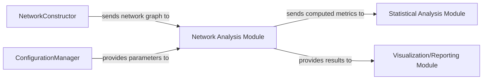

## Details

One paragraph explaining the functionality which is represented by this graph. What the main flow is and what is its purpose.

### NetworkConstructor
This component is responsible for constructing the neural network graph from raw or preprocessed data. It takes input data and applies specific algorithms or rules to define nodes (e.g., brain regions) and edges (e.g., connections between regions), forming the network structure that will be subsequently analyzed.

**Related Classes/Methods**:

- `network_constructor.m` (1:1)

### ConfigurationManager
This component is responsible for managing and providing configuration parameters and settings to other modules within the system. It ensures that the Network Analysis Module and potentially other components receive the necessary parameters (e.g., algorithm selection, thresholds) for their operations, promoting flexibility and reusability.

**Related Classes/Methods**:

- `configuration_manager.m` (1:1)

### Network Analysis Module [[Expand]](./Network_Analysis_Module.md)
This module is responsible for applying advanced graph theory algorithms, primarily leveraging the Brain Connectivity Toolbox (BCT), to analyze the neural networks constructed in the preceding pipeline stage. Its core function is to compute a comprehensive set of network metrics, including but not limited to centrality measures, clustering coefficients, characteristic path length, and community structure. These metrics are crucial for characterizing the topological properties and organizational principles of the neural networks, providing quantitative insights into their functional architecture.

**Related Classes/Methods**:

- `network_analysis_module.m` (1:1)
- `bct_integration_utils.m` (1:1)
- `network_metrics_calculator.m` (1:1)

### Statistical Analysis Module [[Expand]](./Statistical_Analysis_Module.md)
This component receives computed network metrics from the Network Analysis Module and performs statistical evaluations. Its responsibilities include hypothesis testing, comparative analysis between different network states or groups, and identifying statistically significant patterns or differences in the network properties.

**Related Classes/Methods**:

- `statistical_analysis_module.m` (1:1)

### Visualization/Reporting Module [[Expand]](./Visualization_Reporting_Module.md)
This component is responsible for presenting the results of the network analysis and statistical evaluations in an understandable and insightful manner. It generates visualizations (e.g., network graphs, heatmaps, charts) and comprehensive reports, allowing users to interpret the complex network metrics and findings.

**Related Classes/Methods**:

- `visualization_reporting_module.m` (1:1)

### [FAQ](https://github.com/CodeBoarding/GeneratedOnBoardings/tree/main?tab=readme-ov-file#faq)