```mermaid
graph LR
    Data_Ingestion_Loading_Module["Data Ingestion/Loading Module"]
    Signal_Processing_Module["Signal Processing Module"]
    Network_Construction_Module["Network Construction Module"]
    Network_Analysis_Module["Network Analysis Module"]
    Statistical_Analysis_Module["Statistical Analysis Module"]
    Visualization_Reporting_Module["Visualization/Reporting Module"]
    User_Interface_GUI_["User Interface (GUI)"]
    Configuration_Management["Configuration Management"]
    Data_Ingestion_Loading_Module -- "sends raw data to" --> Signal_Processing_Module
    Configuration_Management -- "provides parameters to" --> Data_Ingestion_Loading_Module
    Signal_Processing_Module -- "sends processed spike data to" --> Network_Construction_Module
    Network_Construction_Module -- "sends constructed network structures to" --> Network_Analysis_Module
    Configuration_Management -- "provides parameters to" --> Network_Construction_Module
    Network_Analysis_Module -- "sends analysis results to" --> Statistical_Analysis_Module
    Statistical_Analysis_Module -- "sends statistical findings to" --> Visualization_Reporting_Module
    Visualization_Reporting_Module -- "sends data for display to" --> User_Interface_GUI_
    User_Interface_GUI_ -- "sends user inputs to" --> Configuration_Management
    Configuration_Management -- "provides parameters to" --> Signal_Processing_Module
    Configuration_Management -- "provides parameters to" --> Network_Analysis_Module
    Configuration_Management -- "provides parameters to" --> Statistical_Analysis_Module
    click Signal_Processing_Module href "https://github.com/CodeBoarding/GeneratedOnBoardings/blob/main/MEA-NAP/Signal_Processing_Module.md" "Details"
    click Network_Construction_Module href "https://github.com/CodeBoarding/GeneratedOnBoardings/blob/main/MEA-NAP/Network_Construction_Module.md" "Details"
    click Network_Analysis_Module href "https://github.com/CodeBoarding/GeneratedOnBoardings/blob/main/MEA-NAP/Network_Analysis_Module.md" "Details"
    click Statistical_Analysis_Module href "https://github.com/CodeBoarding/GeneratedOnBoardings/blob/main/MEA-NAP/Statistical_Analysis_Module.md" "Details"
    click Visualization_Reporting_Module href "https://github.com/CodeBoarding/GeneratedOnBoardings/blob/main/MEA-NAP/Visualization_Reporting_Module.md" "Details"
```

## Details

One paragraph explaining the functionality which is represented by this graph. What the main flow is and what is its purpose.

### Data Ingestion/Loading Module
Responsible for loading raw neural data from various proprietary formats (e.g., Axion Biosystems, MCS data loaders) into a standardized, in-memory representation suitable for subsequent processing. This module handles file parsing and initial data validation.

**Related Classes/Methods**: _None_

### Signal Processing Module [[Expand]](./Signal_Processing_Module.md)
Performs pre-processing on the raw neural data, including filtering, noise reduction, spike detection, and spike sorting. Its primary output is clean, processed spike train data ready for network inference.

**Related Classes/Methods**: _None_

### Network Construction Module [[Expand]](./Network_Construction_Module.md)
Builds network representations, typically connectivity matrices, from the processed neural data. This module infers functional or structural connections between neural elements, often utilizing the Spike Time Tiling Coefficient (STTC) to establish relationships based on spike timing. It translates temporal spike patterns into a graph-theoretic structure.

**Related Classes/Methods**: _None_

### Network Analysis Module [[Expand]](./Network_Analysis_Module.md)
Analyzes the constructed network representations using various graph theory metrics and algorithms (e.g., from the Brain Connectivity Toolbox - BCT). This includes calculating measures like node degree, clustering coefficient, path length, and modularity to characterize network topology.

**Related Classes/Methods**: _None_

### Statistical Analysis Module [[Expand]](./Statistical_Analysis_Module.md)
Performs statistical tests and comparisons on the network analysis results. This module can compare network metrics across different experimental conditions, identify significant differences, and assess the robustness of findings.

**Related Classes/Methods**: _None_

### Visualization/Reporting Module [[Expand]](./Visualization_Reporting_Module.md)
Generates visual representations (e.g., network plots, heatmaps, statistical charts) and comprehensive reports of the processed data, constructed networks, analysis results, and statistical findings. It aims to present complex data in an intuitive and interpretable manner.

**Related Classes/Methods**: _None_

### User Interface (GUI)
Provides a graphical interface for users to interact with the entire pipeline. This includes configuring analysis parameters, initiating data processing, monitoring progress, and viewing results. It acts as the primary point of user interaction for the desktop application.

**Related Classes/Methods**: _None_

### Configuration Management
Centralizes and manages all configurable parameters and settings for the entire pipeline, such as file paths, processing thresholds, STTC parameters, and analysis options. It ensures consistency, reproducibility, and ease of modification across different analysis runs.

**Related Classes/Methods**: _None_

### [FAQ](https://github.com/CodeBoarding/GeneratedOnBoardings/tree/main?tab=readme-ov-file#faq)