```mermaid
graph LR
    Signal_Processing_Module["Signal Processing Module"]
    Filtering_Sub_component["Filtering Sub-component"]
    Noise_Reduction_Sub_component["Noise Reduction Sub-component"]
    Spike_Detection_Sub_component["Spike Detection Sub-component"]
    Data_Ingestion_Module["Data Ingestion Module"]
    Network_Construction_Module["Network Construction Module"]
    Configuration_Management["Configuration Management"]
    Data_Ingestion_Module -- "sends raw data to" --> Signal_Processing_Module
    Configuration_Management -- "provides parameters to" --> Signal_Processing_Module
    Signal_Processing_Module -- "sends processed data to" --> Network_Construction_Module
    Signal_Processing_Module -- "sends signals to" --> Filtering_Sub_component
    Filtering_Sub_component -- "sends filtered data to" --> Noise_Reduction_Sub_component
    Noise_Reduction_Sub_component -- "sends noise-reduced data to" --> Spike_Detection_Sub_component
    Spike_Detection_Sub_component -- "sends detected spikes to" --> Signal_Processing_Module
    click Signal_Processing_Module href "https://github.com/CodeBoarding/GeneratedOnBoardings/blob/main/MEA-NAP/Signal_Processing_Module.md" "Details"
    click Data_Ingestion_Module href "https://github.com/CodeBoarding/GeneratedOnBoardings/blob/main/MEA-NAP/Data_Ingestion_Module.md" "Details"
    click Network_Construction_Module href "https://github.com/CodeBoarding/GeneratedOnBoardings/blob/main/MEA-NAP/Network_Construction_Module.md" "Details"
```

## Details

The Signal Processing Module is a critical component within the Scientific Data Analysis Pipeline, acting as the initial pre-processing stage for raw neural signals. Its architectural importance lies in transforming noisy, continuous raw data into clean, discrete neural events (spikes), which are essential for subsequent network construction and analysis. This module ensures data quality and prepares it for meaningful scientific interpretation.

### Signal Processing Module [[Expand]](./Signal_Processing_Module.md)
The primary module responsible for orchestrating the pre-processing of raw neural signals. It integrates filtering, noise reduction, and spike detection to produce clean spike event data.

**Related Classes/Methods**:

- `signal_processing/__init__.py` (1:100)
- `signal_processing/main.py` (1:100)

### Filtering Sub-component
An internal sub-component of the Signal Processing Module dedicated to applying various digital filters (e.g., band-pass, low-pass) to raw neural signals. Its purpose is to isolate relevant frequency bands and remove unwanted signal components, preparing the data for noise reduction.

**Related Classes/Methods**:

- `signal_processing/filtering.py` (1:100)

### Noise Reduction Sub-component
An internal sub-component within the Signal Processing Module focused on implementing algorithms to reduce electrical interference, baseline drift, and other noise sources from the filtered neural signals. This enhances the signal-to-noise ratio, crucial for accurate spike detection.

**Related Classes/Methods**:

- `signal_processing/noise_reduction.py` (1:100)

### Spike Detection Sub-component
An internal sub-component of the Signal Processing Module responsible for identifying and extracting discrete neural events (spikes) from the cleaned signal. It employs various algorithms (e.g., thresholding, template matching) to precisely pinpoint spike occurrences, generating the primary output of the Signal Processing Module.

**Related Classes/Methods**:

- `signal_processing/spike_detection.py` (1:100)

### Data Ingestion Module [[Expand]](./Data_Ingestion_Module.md)
An external module responsible for loading raw neural data from various proprietary formats (e.g., Axion Biosystems, MCS data loaders) into a standardized format for the pipeline. It acts as the entry point for all raw experimental data.

**Related Classes/Methods**:

- `data_ingestion/loader.py` (1:100)

### Network Construction Module [[Expand]](./Network_Construction_Module.md)
An external module that receives processed spike data from the Signal Processing Module. Its core function is to apply connectivity inference methods, such as the Spike Time Tiling Coefficient (STTC), to build neural connectivity networks.

**Related Classes/Methods**:

- `network_construction/builder.py` (1:100)

### Configuration Management
An external, cross-cutting concern that provides a centralized system for managing and distributing parameters, settings, and thresholds. This ensures consistency and reproducibility across all modules, including the specific parameters required for filtering, noise reduction, and spike detection.

**Related Classes/Methods**:

- `config/manager.py` (1:100)

### [FAQ](https://github.com/CodeBoarding/GeneratedOnBoardings/tree/main?tab=readme-ov-file#faq)