```mermaid
graph LR
    Data_Ingestion_Loading_Module["Data Ingestion/Loading Module"]
    Signal_Processing_Module["Signal Processing Module"]
    Network_Construction_Module["Network Construction Module"]
    Network_Analysis_Module["Network Analysis Module"]
    Statistical_Analysis_Module["Statistical Analysis Module"]
    Visualization_Reporting_Module["Visualization/Reporting Module"]
    User_Interface_GUI_["User Interface (GUI)"]
    Configuration_Management["Configuration Management"]
    Data_Ingestion_Loading_Module -- "provides raw data to" --> Signal_Processing_Module
    Configuration_Management -- "provides configuration to" --> Data_Ingestion_Loading_Module
    Signal_Processing_Module -- "provides processed signals to" --> Network_Construction_Module
    Network_Construction_Module -- "provides constructed networks to" --> Network_Analysis_Module
    Network_Analysis_Module -- "provides processed network metrics and analysis results to" --> Statistical_Analysis_Module
    Statistical_Analysis_Module -- "sends summarized statistical findings and significant results to" --> Visualization_Reporting_Module
    Visualization_Reporting_Module -- "displays visualizations and reports via" --> User_Interface_GUI_
    User_Interface_GUI_ -- "sends user commands and configurations to" --> Configuration_Management
    Configuration_Management -- "provides configuration to" --> Statistical_Analysis_Module
    click Signal_Processing_Module href "https://github.com/CodeBoarding/GeneratedOnBoardings/blob/main/MEA-NAP/Signal_Processing_Module.md" "Details"
    click Network_Construction_Module href "https://github.com/CodeBoarding/GeneratedOnBoardings/blob/main/MEA-NAP/Network_Construction_Module.md" "Details"
    click Network_Analysis_Module href "https://github.com/CodeBoarding/GeneratedOnBoardings/blob/main/MEA-NAP/Network_Analysis_Module.md" "Details"
    click Statistical_Analysis_Module href "https://github.com/CodeBoarding/GeneratedOnBoardings/blob/main/MEA-NAP/Statistical_Analysis_Module.md" "Details"
    click Visualization_Reporting_Module href "https://github.com/CodeBoarding/GeneratedOnBoardings/blob/main/MEA-NAP/Visualization_Reporting_Module.md" "Details"
```

## Details

Analysis of MATLAB codebase components and their relationships, with inferred source code mappings.

### Data Ingestion/Loading Module
Responsible for securely loading raw electrophysiological data from diverse proprietary formats (e.g., Axion Biosystems, MCS). It ensures data integrity and prepares the raw input for subsequent processing stages.

**Related Classes/Methods**: _None_

### Signal Processing Module [[Expand]](./Signal_Processing_Module.md)
Performs essential pre-processing on the raw electrophysiological signals, including filtering, spike detection, and artifact removal, to produce clean, usable data for network construction.

**Related Classes/Methods**: _None_

### Network Construction Module [[Expand]](./Network_Construction_Module.md)
Builds network representations, such as connectivity matrices, from the processed electrophysiological signals, potentially leveraging specialized methods like the Spike Time Tiling Coefficient (STTC).

**Related Classes/Methods**:

- `adjacency_plot_und` (1:1)
- `distance_wei` (1:1)

### Network Analysis Module [[Expand]](./Network_Analysis_Module.md)
Applies advanced graph theory and network science algorithms (e.g., from the Brain Connectivity Toolbox) to analyze the constructed networks, deriving various network metrics and properties relevant to neuroscience.

**Related Classes/Methods**:

- `betweenness_bin` (1:1)
- `clustering_coef_bu` (1:1)
- `eigenvector_centrality_und` (1:1)

### Statistical Analysis Module [[Expand]](./Statistical_Analysis_Module.md)
Conducts rigorous statistical tests and comparisons on the network metrics and other derived data. This module is essential for assessing the statistical significance of findings, identifying robust trends, and drawing scientifically sound conclusions from the analysis results, thereby supporting the project's neuroscience and cellular neurophysiology domain.

**Related Classes/Methods**:

- `SEM_calc` (1:1)
- `tInterval_calc` (1:1)

### Visualization/Reporting Module [[Expand]](./Visualization_Reporting_Module.md)
Generates intuitive visual representations (e.g., plots, graphs) and comprehensive reports of the analysis results, including network structures, derived metrics, and statistically significant findings, for user interpretation and documentation.

**Related Classes/Methods**:

- `lineExamples` (1:1)
- `showCase` (1:1)
- `tableExamples` (1:1)

### User Interface (GUI)
Provides an interactive graphical interface, enabling users to intuitively control the data analysis pipeline, configure parameters, initiate analyses, and view results.

**Related Classes/Methods**:

- `AdvancedSettings` (1:1)

### Configuration Management
Centralizes and manages all configurable parameters and settings for the entire analysis pipeline, ensuring consistency, reproducibility, and allowing users to customize analysis behaviors.

**Related Classes/Methods**:

- `AdvancedSettings` (1:1)

### [FAQ](https://github.com/CodeBoarding/GeneratedOnBoardings/tree/main?tab=readme-ov-file#faq)