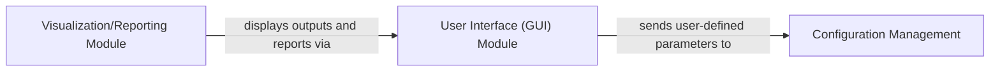

## Details

One paragraph explaining the functionality which is represented by this graph. What the main flow is and what is its purpose.

### User Interface (GUI) Module [[Expand]](./User_Interface_GUI_Module.md)
The User Interface (GUI) Module serves as the primary point of interaction for users with the scientific data analysis application. It provides a graphical environment for users to configure various analysis parameters, initiate data processing workflows, monitor the progress of ongoing analyses, and view the generated results, reports, and visualizations. It acts as the control center, translating user input into system commands and presenting processed information back to the user.

**Related Classes/Methods**: _None_

### Configuration Management
The Configuration Management component is responsible for handling all user-defined parameters, system settings, and analysis configurations. This includes parameters for data loading, preprocessing, algorithm selection, and output generation. It ensures that settings are persistently stored, can be loaded for reproducibility, and are correctly applied to the data processing workflows. Given the project's apparent MATLAB foundation, this would likely involve MATLAB scripts (`.m` files) that define and manage configuration structures and parameters.

**Related Classes/Methods**: _None_

### Visualization/Reporting Module [[Expand]](./Visualization_Reporting_Module.md)
The Visualization/Reporting Module is responsible for generating graphical representations of processed data and compiling comprehensive reports. This includes plots, charts, statistical summaries, and other visual aids that help users interpret the analysis results. It takes processed data from the analysis core and transforms it into user-friendly formats. The presence of a `python` directory containing `compile_plots.py` and `feature-schematic-figures` suggests that some aspects of visualization and reporting, particularly the generation of specific figures or post-processing of results, might be handled by Python scripts. However, core visualization capabilities could also reside within MATLAB `.m` files.

**Related Classes/Methods**:

- <a href="https://github.com/SAND-Lab/MEA-NAP/blob/main/python/compile_plots.py#L1-L1" target="_blank" rel="noopener noreferrer">`compile_plots` (1:1)</a>

### [FAQ](https://github.com/CodeBoarding/GeneratedOnBoardings/tree/main?tab=readme-ov-file#faq)