```mermaid
graph LR
    Data_Ingestion_Loading_Module["Data Ingestion/Loading Module"]
    Signal_Processing_Module["Signal Processing Module"]
    Network_Construction_Module["Network Construction Module"]
    Network_Analysis_Module["Network Analysis Module"]
    Statistical_Analysis_Module["Statistical Analysis Module"]
    Visualization_Reporting_Module["Visualization/Reporting Module"]
    User_Interface_GUI_["User Interface (GUI)"]
    Configuration_Management["Configuration Management"]
    Data_Ingestion_Loading_Module -- "provides raw data to" --> Signal_Processing_Module
    Signal_Processing_Module -- "provides processed signals to" --> Network_Construction_Module
    Signal_Processing_Module -- "provides processed signals to" --> Visualization_Reporting_Module
    Network_Construction_Module -- "provides network structures to" --> Network_Analysis_Module
    Network_Construction_Module -- "provides network structures to" --> Visualization_Reporting_Module
    Network_Analysis_Module -- "provides analysis results to" --> Statistical_Analysis_Module
    Network_Analysis_Module -- "provides analysis results to" --> Visualization_Reporting_Module
    Statistical_Analysis_Module -- "provides statistical summaries to" --> Visualization_Reporting_Module
    Visualization_Reporting_Module -- "displays outputs to" --> User_Interface_GUI_
    User_Interface_GUI_ -- "interacts with" --> Configuration_Management
    Configuration_Management -- "interacts with" --> User_Interface_GUI_
    Configuration_Management -- "provides configurations to" --> Data_Ingestion_Loading_Module
    Configuration_Management -- "provides configurations to" --> Signal_Processing_Module
    Configuration_Management -- "provides configurations to" --> Network_Construction_Module
    Configuration_Management -- "provides configurations to" --> Network_Analysis_Module
    Configuration_Management -- "provides configurations to" --> Statistical_Analysis_Module
    Configuration_Management -- "provides configurations to" --> Visualization_Reporting_Module
    click Signal_Processing_Module href "https://github.com/CodeBoarding/GeneratedOnBoardings/blob/main/MEA-NAP/Signal_Processing_Module.md" "Details"
    click Network_Construction_Module href "https://github.com/CodeBoarding/GeneratedOnBoardings/blob/main/MEA-NAP/Network_Construction_Module.md" "Details"
    click Network_Analysis_Module href "https://github.com/CodeBoarding/GeneratedOnBoardings/blob/main/MEA-NAP/Network_Analysis_Module.md" "Details"
    click Statistical_Analysis_Module href "https://github.com/CodeBoarding/GeneratedOnBoardings/blob/main/MEA-NAP/Statistical_Analysis_Module.md" "Details"
    click Visualization_Reporting_Module href "https://github.com/CodeBoarding/GeneratedOnBoardings/blob/main/MEA-NAP/Visualization_Reporting_Module.md" "Details"
```

## Details

The project is primarily in MATLAB (.m files), and direct source code retrieval for specific functions is not possible with the available Python tools. Therefore, the 'referenced_source_code' entries for each component are based on inferred file paths/directories from the project structure, with generic qualified names and placeholder line numbers. The logical architecture and component responsibilities remain valid at an abstract level.

### Data Ingestion/Loading Module
Handles the loading and initial parsing of raw experimental data from various proprietary formats (e.g., Axion Biosystems, MCS). It ensures data is in a usable format for subsequent processing.

**Related Classes/Methods**:

- `Data Ingestion/Loading Module (inferred)` (1:1)

### Signal Processing Module [[Expand]](./Signal_Processing_Module.md)
Processes raw electrophysiological signals, including filtering, noise reduction, and spike detection, to prepare data for network construction and analysis.

**Related Classes/Methods**:

- `Signal Processing Module (inferred)` (1:1)
- `Signal Processing Module (inferred)` (1:1)

### Network Construction Module [[Expand]](./Network_Construction_Module.md)
Builds network structures (e.g., connectivity matrices) from processed signal data using methods like Spike Time Tiling Coefficient (STTC), representing neuronal interactions.

**Related Classes/Methods**:

- `Network Construction Module (inferred)` (1:1)
- `Network Construction Module (inferred)` (1:1)

### Network Analysis Module [[Expand]](./Network_Analysis_Module.md)
Applies graph theory and network science algorithms (e.g., using Brain Connectivity Toolbox - BCT) to analyze the constructed network structures, deriving metrics like centrality, clustering, and path length.

**Related Classes/Methods**:

- `Network Analysis Module (inferred)` (1:1)
- `Network Analysis Module (inferred)` (1:1)

### Statistical Analysis Module [[Expand]](./Statistical_Analysis_Module.md)
Performs statistical tests and generates summaries on the results from network analysis, identifying significant findings and patterns relevant to the scientific questions.

**Related Classes/Methods**:

- `Statistical Analysis Module (inferred)` (1:1)

### Visualization/Reporting Module [[Expand]](./Visualization_Reporting_Module.md)
This module is responsible for transforming processed data, analysis results, and network structures into insightful visual outputs and comprehensive reports. It acts as the primary interface for users to interpret the findings of the data analysis pipeline, providing insights through graphical representations. Internal Sub-Components & Responsibilities: Plotting Engine, Figure Management, Report Generation. Key Responsibilities: Generate plots for raw data, processed signals, and spike trains; Visualize constructed network structures and their topological properties; Graphically present results from network and statistical analyses; Compile comprehensive, multi-page reports integrating textual descriptions with generated visuals.

**Related Classes/Methods**:

- `Visualization/Reporting Module (inferred)` (1:1)
- `Visualization/Reporting Module (inferred)` (1:1)

### User Interface (GUI)
Provides an interactive graphical interface for users to configure analyses, trigger pipeline execution, monitor progress, and view results.

**Related Classes/Methods**:

- `User Interface (GUI) (inferred)` (1:1)

### Configuration Management
Centralizes and manages all application settings, analysis parameters, and pipeline configurations, ensuring consistency, reproducibility, and ease of modification.

**Related Classes/Methods**:

- `Configuration Management (inferred)` (1:1)

### [FAQ](https://github.com/CodeBoarding/GeneratedOnBoardings/tree/main?tab=readme-ov-file#faq)