```mermaid
graph LR
    Data_Ingestion_Module["Data Ingestion Module"]
    Signal_Processing_Module["Signal Processing Module"]
    Network_Construction_Module["Network Construction Module"]
    Network_Analysis_Module["Network Analysis Module"]
    Statistical_Analysis_Module["Statistical Analysis Module"]
    Visualization_Reporting_Module["Visualization/Reporting Module"]
    User_Interface_GUI_Module["User Interface (GUI) Module"]
    Configuration_Management_Module["Configuration Management Module"]
    Data_Ingestion_Module -- "feeds raw data to" --> Signal_Processing_Module
    Signal_Processing_Module -- "provides processed signals to" --> Network_Construction_Module
    Signal_Processing_Module -- "provides processed signals for visualization to" --> Visualization_Reporting_Module
    Network_Construction_Module -- "delivers network structures to" --> Network_Analysis_Module
    Network_Analysis_Module -- "supplies analysis results to" --> Statistical_Analysis_Module
    Network_Analysis_Module -- "supplies analysis results to" --> Visualization_Reporting_Module
    Statistical_Analysis_Module -- "provides statistical findings to" --> Visualization_Reporting_Module
    User_Interface_GUI_Module -- "triggers data loading in" --> Data_Ingestion_Module
    User_Interface_GUI_Module -- "triggers processing in" --> Signal_Processing_Module
    User_Interface_GUI_Module -- "triggers network building in" --> Network_Construction_Module
    User_Interface_GUI_Module -- "triggers analysis in" --> Network_Analysis_Module
    User_Interface_GUI_Module -- "displays results from" --> Visualization_Reporting_Module
    User_Interface_GUI_Module -- "interacts with" --> Configuration_Management_Module
    Configuration_Management_Module -- "provides settings to" --> Data_Ingestion_Module
    Configuration_Management_Module -- "provides settings to" --> Signal_Processing_Module
    Configuration_Management_Module -- "provides settings to" --> Network_Construction_Module
    Configuration_Management_Module -- "provides settings to" --> Network_Analysis_Module
    Configuration_Management_Module -- "provides settings to" --> Statistical_Analysis_Module
    click Data_Ingestion_Module href "https://github.com/CodeBoarding/GeneratedOnBoardings/blob/main/MEA-NAP/Data_Ingestion_Module.md" "Details"
    click Signal_Processing_Module href "https://github.com/CodeBoarding/GeneratedOnBoardings/blob/main/MEA-NAP/Signal_Processing_Module.md" "Details"
    click Network_Construction_Module href "https://github.com/CodeBoarding/GeneratedOnBoardings/blob/main/MEA-NAP/Network_Construction_Module.md" "Details"
    click Network_Analysis_Module href "https://github.com/CodeBoarding/GeneratedOnBoardings/blob/main/MEA-NAP/Network_Analysis_Module.md" "Details"
    click Statistical_Analysis_Module href "https://github.com/CodeBoarding/GeneratedOnBoardings/blob/main/MEA-NAP/Statistical_Analysis_Module.md" "Details"
    click Visualization_Reporting_Module href "https://github.com/CodeBoarding/GeneratedOnBoardings/blob/main/MEA-NAP/Visualization_Reporting_Module.md" "Details"
    click User_Interface_GUI_Module href "https://github.com/CodeBoarding/GeneratedOnBoardings/blob/main/MEA-NAP/User_Interface_GUI_Module.md" "Details"
    click Configuration_Management_Module href "https://github.com/CodeBoarding/GeneratedOnBoardings/blob/main/MEA-NAP/Configuration_Management_Module.md" "Details"
```

## Details

The feedback highlights a lack of specific source code references for the identified components. Upon reviewing the project's file structure, it's evident that the project is primarily developed in MATLAB, indicated by the `.m` file extensions. This context is crucial as the available tools (`getPythonSourceCode`, `getPackageDependencies`, `getClassHierarchy`) are designed for Python projects and cannot directly retrieve MATLAB source code or package dependencies. Therefore, instead of providing direct source code references (which is not feasible with the current tools for a MATLAB project), I will update the analysis by mapping the abstract components to the most probable directories or files within the provided file structure. This approach addresses the spirit of the feedback by providing more concrete locations within the project, even if direct source code retrieval is not possible. The architectural components and their relationships remain valid at a high level, as the feedback primarily concerns the lack of specific code references rather than the architectural design itself.

### Data Ingestion Module [[Expand]](./Data_Ingestion_Module.md)
Responsible for loading raw neurophysiological data from various proprietary formats, such as those from Axion Biosystems and MCS. It acts as the initial entry point for data into the analysis pipeline, handling format parsing and initial data preparation.

**Related Classes/Methods**: _None_

### Signal Processing Module [[Expand]](./Signal_Processing_Module.md)
Performs initial pre-processing of raw neural signals. This includes spike detection, filtering, noise reduction, and other transformations necessary to prepare data for subsequent network construction. It leverages methods like the Spike Time Tiling Coefficient (STTC) for event-based processing.

**Related Classes/Methods**: _None_

### Network Construction Module [[Expand]](./Network_Construction_Module.md)
Builds network representations, typically connectivity matrices, from the processed neural data. This module infers functional or structural connections between neural elements, often utilizing the Spike Time Tiling Coefficient (STTC) to establish relationships based on spike timing.

**Related Classes/Methods**: _None_

### Network Analysis Module [[Expand]](./Network_Analysis_Module.md)
Applies advanced graph theory algorithms from the Brain Connectivity Toolbox (BCT) to analyze the constructed neural networks. It computes various network metrics such as centrality, clustering coefficients, path length, and community structure to characterize network properties and organization.

**Related Classes/Methods**: _None_

### Statistical Analysis Module [[Expand]](./Statistical_Analysis_Module.md)
Conducts statistical tests and comparisons on the network metrics and other derived data. This module is crucial for assessing the significance of findings, identifying trends, and drawing robust scientific conclusions from the analysis results.

**Related Classes/Methods**: _None_

### Visualization/Reporting Module [[Expand]](./Visualization_Reporting_Module.md)
Generates various visual outputs, including plots, figures, and comprehensive reports, to effectively present raw data, processed signals, network structures, and the results of network and statistical analyses. It provides insights through graphical representations.

**Related Classes/Methods**: _None_

### User Interface (GUI) Module [[Expand]](./User_Interface_GUI_Module.md)
Provides a graphical interface for users to interact with the application. This includes configuring analysis parameters, initiating data processing workflows, monitoring progress, and viewing the generated results and visualizations.

**Related Classes/Methods**: _None_

### Configuration Management Module [[Expand]](./Configuration_Management_Module.md)
Manages and stores application-wide settings, analysis parameters, and file paths. It ensures consistent behavior across different pipeline stages and provides a centralized mechanism for parameter control and persistence.

**Related Classes/Methods**: _None_

### [FAQ](https://github.com/CodeBoarding/GeneratedOnBoardings/tree/main?tab=readme-ov-file#faq)