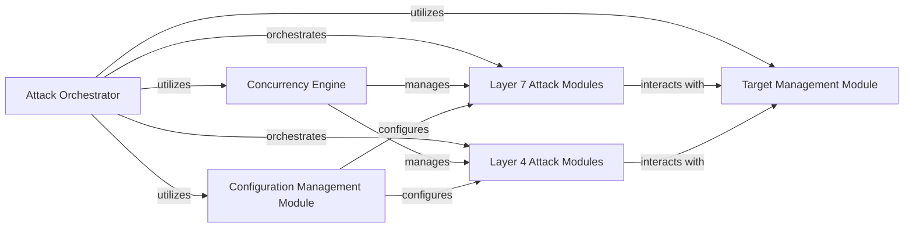

## Details

One paragraph explaining the functionality which is represented by this graph. What the main flow is and what is its purpose.

### Attack Orchestrator
Orchestrates and coordinates the overall attack process.

**Related Classes/Methods**: _None_

### Concurrency Engine
Manages and optimizes the concurrent execution of attack tasks.

**Related Classes/Methods**: _None_

### Configuration Management Module
Handles the loading, parsing, and management of configuration settings.

**Related Classes/Methods**: _None_

### Target Management Module
Manages the list of target systems, including their status and relevant information.

**Related Classes/Methods**: _None_

### Layer 7 Attack Modules
Implements various Layer 7 (Application Layer) attack techniques.

**Related Classes/Methods**: _None_

### Layer 4 Attack Modules
Implements various Layer 4 (Transport Layer) attack techniques.

**Related Classes/Methods**: _None_

### [FAQ](https://github.com/CodeBoarding/GeneratedOnBoardings/tree/main?tab=readme-ov-file#faq)